# 第七章 构型结构设计与 URDF 导出
> 📌 **概述**：本章介绍机械臂构型、结构与关节电机的设计考虑，再说明 CAD 装配信息如何对应 URDF 中的连杆、关节和坐标关系。最后在 SolidWorks 中建立参考几何体，完成模型导出与检查，为后续正逆运动学计算和仿真准备一致的模型。

机械臂可用于搬运、装配、检测以及工具操作。不同应用对运动范围、末端姿态、负载和精度的要求不同，但设计时都需要解决两个基本问题：机械结构能否满足使用要求，以及如何把结构信息交给计算与控制程序。

本章从这些共同问题出发，介绍设计方法，并以 JoyArm 的模型演示建模与导出流程。下图展示了模型查看界面：改变关节角，可以观察对应连杆及其后续部件的运动。

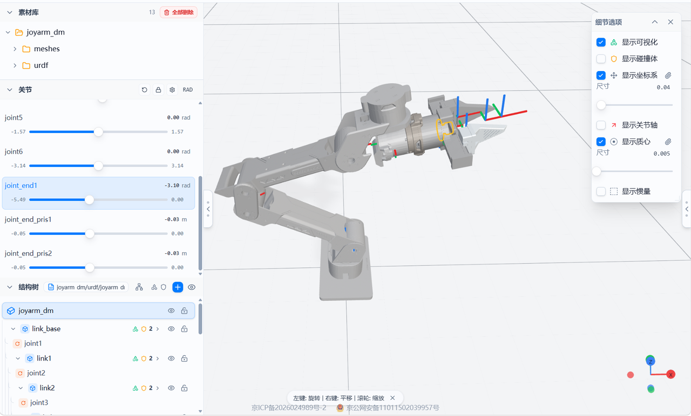

完成本章实践后，应能够把装配体中的连接关系、关节轴线和物理属性整理为 URDF，检查模型运动，并理解这些数据如何用于后续计算。模型外观可见只是第一步，还需要核对坐标、方向和物理属性。

**阅读说明：** 第 1～3 节介绍构型、结构和电机选型；已有 CAD 装配体的读者，可以从第 4 节了解数据关系，再进入第 5 节操作。坐标系和相对位姿的基础见[第二章](chapt2_fkine.md)。导出实践需要 SolidWorks、SW2URDF 插件和完整装配文件，不要求先连接实机。

---

## 1 构型设计

### 1.1 应用需求与设计指标

构型设计首先需要明确末端的运动要求。例如，搬运需要覆盖取放区域，装配需要满足工具的接近方向，检测需要让传感器到达指定位置并保持合适朝向。这些是应用示例，并不限定机械臂只能执行其中某一项任务。

工程设计中，可先把应用要求整理为能够检查的指标，再选择运动链和尺寸。下表给出了常见的对应关系。

| 需求内容 | 设计指标 | 对方案的影响 |
|:---:|:---:|:---:|
| 末端需要覆盖哪些区域 | 工作空间与臂展 | 基座位置、连杆长度及轴线布局 |
| 工具需要怎样接近目标 | 位置与姿态要求 | 自由度和关节排列 |
| 工具及工件有多重，是否存在接触力 | 负载、质心位置与外力 | 关节转矩、支撑与结构强度 |
| 动作需要多快完成 | 速度、加速度与工作节拍 | 电机选型与轨迹安排 |
| 允许多大运动误差 | 定位精度与重复定位精度 | 结构刚度、传动间隙及标定 |

同样的负载，离关节轴越远，可能产生越大的重力矩；同样的起终点，更短的动作时间可能需要更大的加速度。因此，不能只用一个负载数值或臂展数值决定整机方案。

### 1.2 自由度与运动链选择

[第一章](chapt1_intro.md)已经介绍机械臂的主要构型。本章聚焦串联旋转关节方案：关节与连杆依次连接，每个关节用 R 表示，六个、七个旋转关节组成的运动链分别记为 6R、7R。

完整的空间位姿包含三个位置变量和三个姿态变量。在关节布局适当且非奇异的条件下，六个独立关节能够提供六维位姿控制所需的运动能力。增加到七个关节后，对六维末端任务便具有冗余自由度，可在维持末端位姿的同时调整部分臂身姿态。

| 方案 | 主要特点 | 需要权衡的内容 |
|:---:|:---:|:---:|
| 6R | 以六个关节实现空间位姿控制 | 受限于工作空间、限位和奇异位形，并非所有目标位姿都可达 |
| 7R | 可利用冗余自由度调整臂身姿态 | 增加质量、成本及求解和规划的复杂度 |

选择 6R 还是 7R，需要结合障碍物、安装空间和姿态要求判断。额外关节可以增加调整余地，但不保证在所有场景中都能避障；还需要检查连杆之间及与环境的碰撞。

关节数量确定运动变量的数量，轴线排列则决定这些变量怎样共同改变末端位姿，因此还要继续选择关节轴线布局。

### 1.3 关节轴线布局

比较串联机械臂时，除了外形，还应观察相邻转轴的方向。这里对比两种局部布局：**相邻轴交替垂直**与**连续三轴平行**。下图只表示三个关节的轴向关系，不表示完整机械臂，也不表示它们的市场占比。

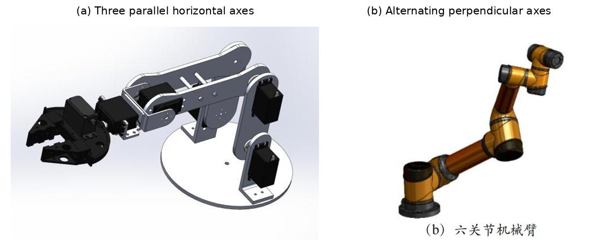


相邻轴交替垂直时，各关节可以提供不同方向的转动，连杆连接处也需要适应这些方向变化。连续三轴平行时，固定其上游关节后，这一段运动可按平面转动关系理解，更容易直观分析连杆的伸展与折叠；轴向偏置仍需纳入实际几何模型。

| 布局 | 运动特点 | 结构设计中的关注点 |
|:---:|:---:|:---:|
| 相邻轴交替垂直 | 依次引入不同方向的转动 | 不同朝向模组的安装、连接件空间与运动干涉 |
| 连续三轴平行 | 这一段的转动轴方向一致，便于分析伸展与折叠 | 轴间距离、沿轴偏置及折叠时的连杆间隙 |

连续三轴平行构型已在 UR 系列机械臂中得到工程验证，可作为机械臂构型设计的可靠起点，但具体参数仍需根据实际需求确定。

> 📌 **术语区分**：轴线“平行”描述的是关节轴的方向关系，机械臂仍然可以是串联结构。“末三轴相交”描述另一种轴线几何条件，不等同于相邻轴交替垂直。

平行轴布局本身不意味着整机只能在平面内运动：基座及其余关节会改变这一段的空间位置和方向。但也不能仅凭布局判断工作空间一定更大、承载一定更强或没有奇异性。

形成候选方案后，可先用简化连杆检查典型目标位姿、关节余量与碰撞。[第二章](chapt2_fkine.md)的正运动学和工作空间、[第三章](chapt3_ikine.md)的逆运动学以及[第四章](chapt4_jacobian.md)的奇异性分析，都是验证构型的工具。确认运动范围后，再细化支撑、连接与装配结构。

---

## 2 结构设计

### 2.1 载荷、强度与刚度

构型确定轴线和连杆之间的几何关系，结构设计则要使这些部件能够承载并保持所需精度。工具、工件和连杆自重，以及加减速和接触产生的载荷，会沿关节、连杆传递到基座。


**强度**反映结构抵抗破坏的能力，**刚度**反映结构抵抗变形的能力。即使材料没有损坏，连杆弯曲或连接处变形也可能使末端偏离目标位置，因此两者都需要检查。

可以用一个简化例子理解刚度。将一根连杆视为等截面悬臂梁：一端固定，另一端承受横向集中力 $F$，长度为 $L$。

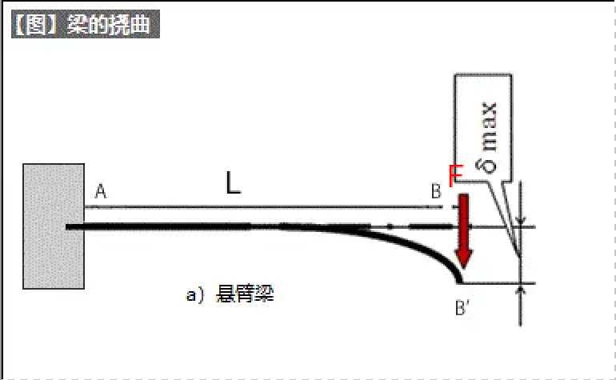


在小变形、线弹性条件下，忽略梁自重和剪切变形，末端挠度大小为：

$$
\delta=\frac{FL^3}{3EI}
$$

其中，$E$ 为材料的弹性模量，$I$ 为截面对弯曲轴的截面二次矩，$EI$ 表示抗弯刚度。$I$ 取决于截面形状和弯曲方向，不是动力学中的质量转动惯量。

保持载荷、材料和截面不变，若长度从 $L$ 增加到 $2L$，挠度变为原来的 $2^3=8$ 倍。这说明增加臂展时，必须同时检查受力变形，不能只确认几何上能够到达目标。

这个例子用于说明影响趋势，不能直接代替整机计算。实际机械臂还存在关节柔性、连接间隙、分布载荷和不同姿态，需要按真实支撑与载荷条件检查。

### 2.2 连杆轻量化与关节支撑

提高刚度并不只有加厚零件一种方法。材料、截面形状和支撑位置都会改变受力变形；增加的质量又会成为上游关节的负担。因此，轻量化需要与强度、刚度一起考虑。

例如，可以先确定连杆两端的安装区域与主要载荷传递路径，再考虑中间截面的形状或减重孔。改变结构后，应重新检查连接区、孔边和整体变形，不能仅以去掉多少材料评价设计效果。

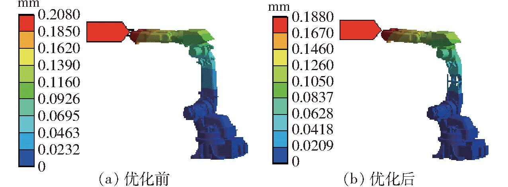


关节模组的固定端连接上一级结构，输出端连接下一级结构。电机提供驱动力矩，轴承与支撑结构则负责约束运动并传递径向力、轴向力和倾覆力矩。电机转矩满足要求，不等于关节支撑已经满足承载要求。

设计中还可以比较关节附近布置驱动部件与远置驱动：前者连接直接，后者可能减少运动末端质量，但会增加传动机构和装配工作。具体方案要结合质量分布、空间、传动刚度和维护要求选择。

### 2.3 加工、装配与走线

结构设计还要满足制造与使用条件。零件在 CAD 中能够连接，并不保证加工方便、螺钉能够拧紧或电机可以独立更换。应在装配体阶段检查加工方式、安装顺序和工具操作空间。

| 检查内容 | 具体关注点 |
|:---:|:---:|
| 加工 | 材料与工艺是否匹配，安装面与轴孔精度是否能够实现 |
| 装配与维护 | 轴、轴承和模组的安装顺序，紧固工具与拆换空间 |
| 运动干涉 | 伸展、折叠和转腕时，连杆、紧固件和环境是否发生碰撞 |
| 走线 | 线缆弯曲余量、固定位置，以及夹挤、摩擦和缠绕风险 |

线缆应随关节运动检查，不能只看零位下长度是否足够。对候选结构，可以先使用模组的外形和质量建立装配模型，再根据下一节的电机选型结果更新安装尺寸和质量分布。

---

## 3 关节电机选型

### 3.1 关节执行器与主要参数

在初步构型和结构方案的基础上，还需要为关节选择执行器。对旋转关节而言，电机提供驱动力矩，使下一级连杆转动；编码器反馈位置，驱动器根据指令控制电机。关节模组常把这些部件与减速器集成在一起。


看参数表时，先找到数据对应的是**电机轴端还是关节输出端**。连杆接在输出端，我们需要用输出端能够提供的转矩和速度，与任务需求比较。

可以先围绕三个实际问题阅读参数：

| 你想知道的问题 | 先看哪些参数 | 怎样理解 |
|:---:|:---:|:---:|
| 能否一直托住物体？ | 额定或允许连续转矩及其条件 | 持续工作能力受转速、散热等条件影响 |
| 启动时能否加速？ | 峰值转矩及允许持续时间 | 短时间能达到，不代表能够一直保持 |
| 动作能否按时完成？ | 输出转速、转矩—转速曲线 | 要在需要的速度下，仍有足够转矩 |

质量也必须一起看。腕部换上更重的电机，肩部不仅要搬工件，还要把这个新增重量一起抬起来。

### 3.2 减速比与输出特性

电机可能转得很快，但轴端转矩不足。减速器通过降低输出转速，获得更大的输出转矩。设减速比为 $i$，电机轴端转速为 $\omega_m$、转矩为 $\tau_m$，传动效率为 $\eta$，则初步估算为：

$$
\omega_j=\frac{\omega_m}{i},\qquad
\tau_j\approx\eta i\tau_m
$$

例如，假设电机转速为 1000 r/min、转矩为 1 N·m，使用减速比 10、效率 0.9 的减速器，输出约为 100 r/min、9 N·m。若在相同输入和效率假设下把减速比增至 20，输出约为 50 r/min、18 N·m。

这样就能理解取舍：更大的减速比可能让关节更有力，同时也可能使动作达不到预定速度。实际选型还要满足减速器本身的承载与转速限制。

> 📌 如果模组参数已经给出了输出端转矩，就直接使用该数值，不能再次乘减速比。

### 3.3 静态转矩与负载估算

先不考虑加速，让机械臂在某个姿态托住物体。对于图中的水平关节轴，工件重力产生的力矩大小为：

$$
\tau_{\mathrm{load}}=mgd
$$

这里 $m$ 是工件质量，$g$ 取 $9.81\ \mathrm{m/s^2}$，$d$ 是该姿态下重力对关节轴的有效力臂。它不一定等于连杆长度；在图示的平面情形中，可以从侧视图读出轴心到重力作用线的水平距离。


下面以搬运工件作为独立计算示例，不代表整机的预定任务。假设工件质量为 0.5 kg，对肩部关节的重力力臂为 0.40 m，则：

$$
\tau_{\mathrm{load}}=0.5\times9.81\times0.40\approx1.96\ \mathrm{N\cdot m}
$$

但肩部电机还要支撑下游的连杆、关节模组和夹爪。把这些部件分别作为质量集中在质心的物体，计算各自的力矩，再按方向相加。下面假设各项重力矩方向相同：

| 下游部件 | 质量（kg） | 重力力臂（m） | 重力矩（N·m） |
|:---:|:---:|:---:|:---:|
| 连杆及关节模组 | 1.20 | 0.20 | 约 2.354 |
| 夹爪与转接件 | 0.30 | 0.35 | 约 1.030 |
| 工件 | 0.50 | 0.40 | 约 1.962 |
| 合计 | — | — | 约 5.346 |

若本例取裕量系数 $K=1.5$，需要的连续输出转矩初估为 $1.5\times5.346\approx8.02\ \mathrm{N\cdot m}$。这可以用于筛选候选电机，不能据此认定整机已经满足任务。

反过来，假设某候选关节在该工况下允许连续输出 12 N·m，其余条件不变，可估计这个姿态下的工件质量上限：

$$
m_{\max}=\frac{\tau_{\mathrm{avail}}/K-\tau_{\mathrm{self}}}{gd}
=\frac{12/1.5-3.384}{9.81\times0.40}\approx1.18\ \mathrm{kg}
$$

这些质量、力臂和裕量都是算例假设，1.18 kg 也只是该关节在指定姿态下的静态估算结果。若分子已经小于零，意味着连自身重量的裕量要求都不满足，应调整候选方案。

> 💡 **先猜再算**：工件重量不变，力臂从 0.40 m 变成 0.20 m，它产生的重力矩减半。但其他部件的重力矩要根据各自位置重新计算，不能把总转矩直接减半。

### 3.4 电机选型与迭代校核

工程上可以先从腕部向基座逐级估算：腕部候选模组确定后，其质量成为肘部的下游载荷；肘部候选确定后，再把它计入肩部。每一级都应使用自己的关节轴和质心位置，不能把肩部的力臂复制给其他关节。

尤其是绕竖直轴转动的基座关节，重力可能不产生绕该轴的驱动力矩，但启动和制动仍需要转矩。一般空间姿态下，需要计算各部件力矩在关节轴上的分量，不能全部套用同一个平面公式。

初选完成后，把候选部件的质量、质心和惯量更新到模型中，根据应用要求安排轨迹，再通过动力学计算或仿真检查整个动作。

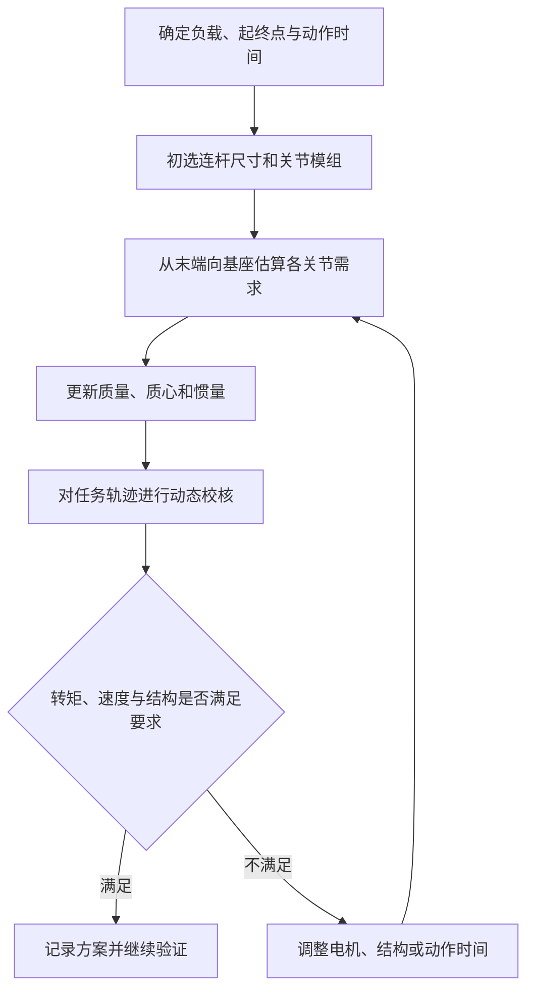
```mermaid
flowchart TD
    A[确定负载、起终点与动作时间] --> B[初选连杆尺寸和关节模组]
    B --> C[从末端向基座估算各关节需求]
    C --> D[更新质量、质心和惯量]
    D --> E[对任务轨迹进行动态校核]
    E --> F{转矩、速度与结构是否满足要求}
    F -->|满足| G[记录方案并继续验证]
    F -->|不满足| H[调整电机、结构或动作时间]
    H --> C
```

检查时要看转矩峰值及持续时间、持续工作工况，以及转矩和转速是否同时落在允许范围内。不能只看带正负号的平均转矩，因为正负值可能抵消，却没有消除电机发热。

若腕部电机增重 0.2 kg，在肩部的重力力臂为 0.4 m 时，仅新增静态重力矩就约为 $0.2\times9.81\times0.4=0.785\ \mathrm{N\cdot m}$，还没有计入运动时的惯性影响。因此，更换电机后需要重新检查上游关节。

本章完成静态初选并建立这条迭代思路，完整动力学计算见[第八章](chapt8_dyn.md)。接下来需要把 CAD 中的轴线、质量等信息交给程序，这正是机器人描述文件的作用。

---

## 4 CAD 与 URDF 模型描述

### 4.1 URDF 的作用与信息来源

CAD 装配体告诉我们零件的形状、尺寸和配合关系。要计算末端工具的位姿，程序还需要知道：哪些部件一起运动，它们按什么顺序连接，每个关节在哪里、绕什么方向转。

**URDF（Unified Robot Description Format，统一机器人描述格式）**用 XML 把这些信息组织起来。它也可以引用外观与碰撞网格，记录质量和惯量。后续的运动学程序读取关节关系，显示工具读取外观，动力学程序读取物理属性。

URDF 本身不会求解逆运动学，也不会自动生成控制器；它给这些程序提供共同的机器人模型。SolidWorks 导出插件的作用，是把装配体中已有的信息提取出来，减少手工输入。

### 4.2 连杆分组与 link 属性

一根前臂可能由两块侧板、几个连接件和许多螺钉组成。它们在 CAD 中是多个零件，但运动时彼此不发生相对运动，就可以视为同一个刚性部件组，在 URDF 中称为 `link`。

判断分组时，可以暂时固定其他关节，只让一个关节转动。关节两侧发生相对运动的零件，应分到不同的 link；固定在同一侧、始终一起运动的零件归为一组。


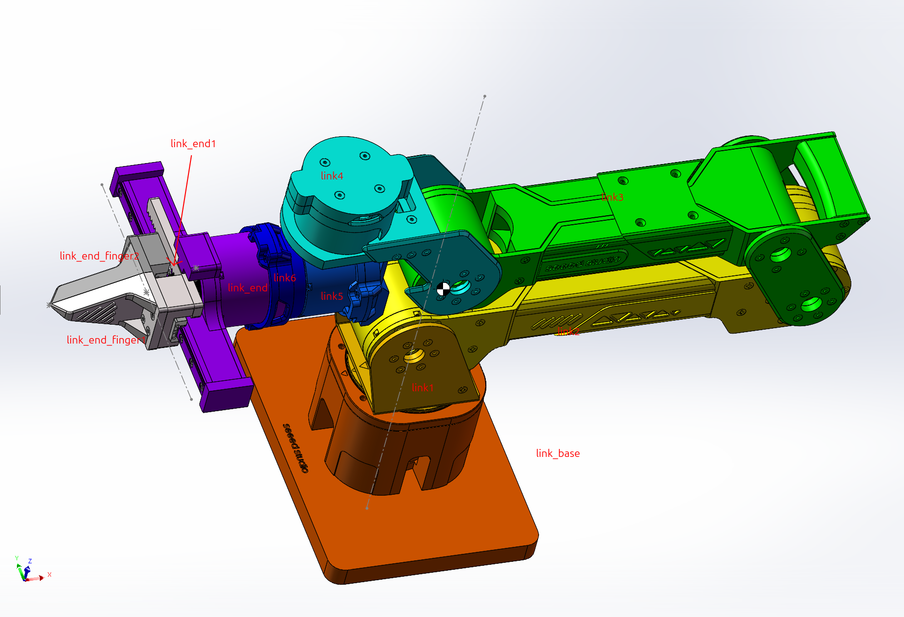

这也是为什么不能把整个电机装配体不加判断地分给一个 link：如果其中既有固定端又有随输出端旋转的零件，就需要按真实运动关系分组。

一个 link 可以分别记录：外观 `visual`、碰撞几何 `collision` 和物理属性 `inertial`。外观用于显示；碰撞几何可以更简洁，以降低检测开销；物理属性包含质量、质心和惯性张量。

### 4.3 关节连接与运动树

两个 link 之间的连接称为 `joint`。关节类型决定子 link 相对父 link 可以怎样运动。SW2URDF 的 `Joint Type` 下拉菜单包含以下选项：

| 选项 | 含义与运动方式 | 配置要点 | 典型用途 |
|:---:|:---:|:---:|:---:|
| `Automatically Detect`（自动识别） | 由插件根据装配体中的配合关系推断关节类型；这是插件选项，不是 URDF 的关节类型。 | 导出后检查实际生成的 `type`、运动轴与限位；本教程已明确各节点的运动方式，建议手动选择。 | 辅助识别装配体中的关节 |
| `continuous`（连续旋转） | 绕一条固定轴旋转，角度没有上、下限，可连续转过多圈；具有 1 个旋转自由度。 | 设置 `axis`，角度单位为弧度；不设置角度的 `lower`、`upper`，仍需设置速度与力矩限制。 | 可连续旋转的车轮或转盘 |
| `revolute`（有限旋转） | 绕一条固定轴在规定角度范围内旋转；具有 1 个旋转自由度。 | 设置 `axis` 和 `limit`，角度上、下限单位为弧度。 | 本体 `joint1`～`joint6`、夹爪驱动关节 `joint_end1` |
| `prismatic`（直线移动） | 沿一条固定轴在规定行程内平移，不产生相对旋转；具有 1 个平移自由度。 | 设置 `axis` 和 `limit`，位移上、下限单位为米。 | 两侧手指关节 `joint_end_pris1`、`joint_end_pris2` |
| `fixed`（固定连接） | 父、子 link 的相对位置和方向保持不变；具有 0 个自由度。 | 用 `origin` 设置固定变换，不需要运动轴或运动限位。 | 夹爪安装关节 `joint_end`、两个工具参考系的固定关节 |

`continuous` 不表示“转动范围恰好为一圈”，而是没有角度上、下限。即使电机本身可以连续旋转，只要机构或线缆限制了实际转角，就应使用 `revolute` 并填写对应限位。`fixed` 表示两个 link 之间没有相对运动；父 link 运动时，子 link 仍会随它一起运动。


<div style="display: flex; align-items: center; gap: 16px;">
  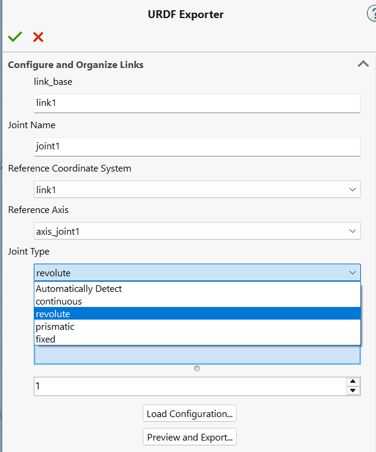
  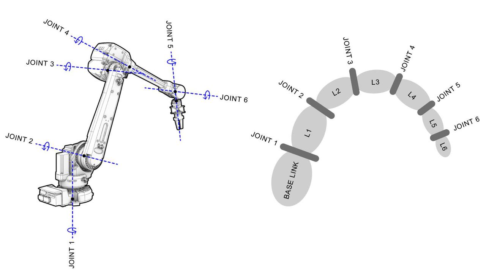
</div>

例如 `joint3` 连接 `link2` 与 `link3`：靠近基座的一侧是父连杆 `parent`，下一侧是子连杆 `child`。按这个关系继续连接，例如六轴本体可以形成以下运动链：

```text
link_base
└── joint1 → link1
    └── joint2 → link2
        └── joint3 → link3
            └── joint4 → link4
                └── joint5 → link5
                    └── joint6 → link6
```

> 💡 只改变 `joint3`，你预计哪些部件会动？`link3` 以及它后面的腕部、工具会随之运动，`link_base`、`link1`、`link2` 应保持原位。这可以直接用来检查导出分组。

### 4.4 关节轴线与连杆坐标系

仅知道连接顺序还不够，程序还要知道关节的位置。先在 CAD 中找出真实旋转轴：选择与输出轴同轴的圆柱面、轴孔或已有装配轴线，创建一条参考轴。

接着在零件上固定一把“三维尺子”，也就是连杆坐标系。它的原点决定从哪里量，坐标轴决定向哪个方向量。转轴给出一条直线，但不能单独决定沿这条线的原点位置，也不能决定 X 轴朝向，所以还需要装配基准和建系规则。

本章沿用[第二章](chapt2_fkine.md)的 MDH 建系约定，使坐标系能够与前文运动学对应。相邻轴平行时，需要选定公共法线；相交时可用交点定位；异面时利用最短公共法线定位。实际点击哪个参考面和参考点，在第 5 节说明。

**URDF 本身不要求使用 MDH 坐标系。** 本项目保持一致，是为了让 CAD 测量、URDF 和前文计算可以逐项核对。导出时不必重新推导 MDH 公式，但需要按照约定把原点和方向放对。

建立坐标系之前，要先确定装配体的零位。这里的零位是“关节角记为零时的姿态”，不一定是机械臂完全伸直的姿态。编码器读数与这个约定可以存在偏置，但必须记录对应关系。

#### 4.4.1 关节空间与电机空间的正方向

本教程在建系和导出时统一关节角与电机反馈角的正方向，使电机反馈角增大时，对应的关节角也增大，避免在控制程序中额外增加逐关节换向。零位偏置、单位和减速比换算仍需按实际接口处理，它们与正方向约定是不同的问题。

定义电机正转轴向前，必须明确观察方向：按电机资料规定的观察端，确认输出端相对定子的逆时针转动对应反馈角增大，再用右手定则确定该正转轴向。不能以屏幕上的逆时针直接判断，也不能混用电机转子角与减速器输出角。

对于连接 `link(i-1)` 与 `linki` 的 `jointi`，关节运动描述的是子连杆相对父连杆的转动。定子安装在哪一侧，决定它与电机相对转动的对应关系：

| 定子安装位置 | 子连杆相对父连杆的运动 | 关节坐标系 Z 轴正向 |
|:---:|:---:|:---:|
| 上一个连杆 `link(i-1)` | 输出端带动子连杆，相对运动与电机正转一致 | 取电机正转轴向 |
| 同序号连杆 `linki`，输出端连接父连杆 | 子连杆随定子运动，相对运动与输出端相对定子的转动相反 | 取电机正转轴向的反方向 |

这里的反向来自父、子连杆的相对运动关系，并不要求把电机反馈值取负。将关节 Z 轴按上表设置，并使导出的旋转轴沿本地正 Z，即 `<axis xyz="0 0 1" />`，就能在模型中表达电机角增大时的实际运动方向。

### 4.5 关节位置与轴向表示

以 `joint3` 为例，`link3` 原点沿父坐标系 `link2` 的 X 方向偏移 264 mm，即 0.264 m。


对应的零位变换为：

```xml
<origin xyz="0.264 0 0" rpy="3.141592653589793 0 -2.9226" />
```

`xyz` 是零位关节原点在**父 link 坐标系**中的位置，单位为 m。`rpy` 表示零位时的相对朝向，单位为 rad，由 CAD 坐标系之间的方向确定，不是运行时的关节角。

本体关节的正方向已与本地正 Z 统一，因此使用：

```xml
<axis xyz="0 0 1" />
```

`axis` 用**关节坐标系**表达运动轴。右手拇指指向正 Z，四指弯曲方向就是关节角增大的方向。


加入父子关系及限位后，关节配置为：

```xml
<joint name="joint3" type="revolute">
  <parent link="link2" />
  <child link="link3" />
  <origin xyz="0.264 0 0" rpy="3.141592653589793 0 -2.9226" />
  <axis xyz="0 0 1" />
  <limit lower="-3.14" upper="0" effort="27" velocity="5" />
</joint>
```

运行时，程序先按 `origin` 确定零位关系，再施加绕 `axis` 的关节转动。`limit` 中的 `lower`、`upper` 表示角度范围，`effort` 和 `velocity` 分别表示力矩与速度限制，旋转关节的单位为 rad、N·m 和 rad/s。

### 4.6 工具参考系

使用工具时，需要明确实际作用的位置，例如夹爪的夹持中心或加工工具的作用点，因此需要定义 **TCP（Tool Center Point，工具中心点）**及其参考坐标系。只要该参考系相对末连杆固定，就可以通过固定关节连接，程序便能从基座一路计算到工具中心。

但“叫作 `tcp`”不意味着这个 link 必须没有质量。要先看模型怎样分组：如果它只是参考系，可以是空 link；如果它同时承载实际工具的几何和惯性，就需要保留这些真实属性。任何工具质量都应被计入一次，不能遗漏或重复。

同样，是否描述夹爪开合取决于任务：计算本体到固定工具参考点的位姿，与模拟手指运动和接触，所需关节关系不同。如果要模拟抓取过程，应保留相应活动部件，并确认仿真工具支持其约束。不能仅为方便导出就把实际需要的运动删掉。

本章最终导出的模型将继续用于后续计算。用于正逆运动学时，首先要核对关节几何、限位及末端参考系；用于动力学仿真时，还要确认质量、质心、惯量和碰撞属性，并在仿真环境中配置驱动与接触等条件。

### 4.7 质量、质心与惯性张量

关节轴线和连杆尺寸告诉程序机械臂怎样运动，但要计算电机需要输出多大转矩，还需要知道各个 link 有多重、质量分布在哪里。第五节导出时填写的质量和惯性属性，就是为这类计算准备的数据。

#### 4.7.1 质量与质心

**质量**表示一个 link 所包含部件的总质量。这里的 link 可能由壳体、连接件、紧固件等多个零件组成，导出时需要按已经确定的零件分组汇总，单位为 kg。

**质心**表示质量分布的中心。在均匀重力场中，可以把整个 link 的重力等效为作用在质心上的力。第三节计算重力矩时使用的力臂，应根据质心到关节轴的几何关系确定，而不是默认取连杆长度的一半。

例如，同样长、同样重的两根连杆，其中一根的重部件集中在远离关节的一端，它的质心就更靠外。在相同水平姿态下，这根连杆对关节产生的重力矩更大。因此，只有质量数值还不足以计算重力影响。

连杆坐标系原点用于描述运动关系，质心用于描述质量分布，两者不必重合。改变连杆坐标系，只会改变质心的坐标表示，不会改变质心在实体中的位置。

#### 4.7.2 转动惯量与惯性张量

质量相同的部件，转动起来也可能需要不同的力矩。把质量集中在转轴附近，通常比把相同质量分散到远处更容易加速转动。**转动惯量**描述质量分布对绕指定轴转动的影响，既与质量有关，也与质量到该轴的距离有关。

对于空间刚体，需要描述绕不同方向转动的惯性及其耦合，因而使用一个 $3\times3$ 的对称矩阵，称为**惯性张量**：

$$
\boldsymbol{I}=\begin{bmatrix}
I_{xx} & I_{xy} & I_{xz}\\
I_{xy} & I_{yy} & I_{yz}\\
I_{xz} & I_{yz} & I_{zz}
\end{bmatrix}
$$

三个对角项表示绕参考坐标轴的转动惯量；非对角项描述该坐标系下质量分布带来的耦合。矩阵对称，因此 URDF 只需保存六个独立数值，单位均为 $\mathrm{kg\cdot m^2}$。这里的惯量与第二节悬臂梁公式中的截面二次矩不同，后者只描述截面几何。

惯性张量必须同时说明**计算中心和坐标轴方向**。URDF 的惯性张量以质心为中心，并在 `inertial` 所定义的坐标轴下表达。旋转坐标轴后，即使实体不变，矩阵分量也可能改变；采用主惯性轴时非对角项为零，但一般连杆坐标轴未必是主惯性轴，不能为了简化而直接删除非对角项。

#### 4.7.3 URDF 中的惯性属性

下面是一段独立示例，表示质量为 1 kg 的均匀长方体，三个边长沿惯性坐标轴分别为 0.20、0.10、0.10 m。假设质心位于 link 原点沿 X 方向 0.10 m 处，惯性坐标轴与 link 坐标轴平行：

```xml
<!-- 放在对应 link 内；数值为示例，不是实际机械臂参数 -->
<inertial>
  <origin xyz="0.10 0 0" rpy="0 0 0" />
  <mass value="1.0" />
  <inertia ixx="0.001666667" ixy="0" ixz="0"
           iyy="0.004166667" iyz="0" izz="0.004166667" />
</inertial>
```

| 字段 | 含义 | CAD 中需要取得的信息 |
|:---:|:---:|:---:|
| `mass value` | link 总质量，单位 kg | 该零件组的质量 |
| `inertial/origin xyz` | 质心在 link 坐标系中的位置，单位 m | 相对于所选连杆坐标系的质心坐标 |
| `inertial/origin rpy` | 惯性坐标系相对 link 坐标系的朝向，单位 rad | 报告惯量时采用的坐标轴方向 |
| `inertia` 的六个分量 | 以质心为中心、在惯性坐标系下表达的惯性张量 | 同一计算中心、同一轴向下的惯量数据 |

这里的 `origin` 位于 `inertial` 内，用于定位质心和惯性坐标系；第 4.5 节的 `joint/origin` 用于描述关节连接。两个标签名称相同，所属对象和用途不同。字段定义可对照 [ROS 官方物理属性教程](https://docs.ros.org/en/humble/Tutorials/URDF/Adding-Physical-and-Collision-Properties-to-a-URDF-Model.html)。

#### 4.7.4 从 CAD 质量属性到导出参数

CAD 根据零件几何、材料密度或指定质量属性计算这些数据。因此，导出前先核对 link 的零件分组，再检查材料和质量设置。外购电机若只有外壳模型，不能把外壳包围的体积当作实心材料，也不能认为可视外形已经包含了内部部件的质量分布。

查看质量属性时，要确认报告的是质心处的惯量，还是某个指定坐标系原点处的惯量，以及它使用哪组坐标轴。若计算中心不同，需要平行轴变换；若轴向不同，需要旋转变换。使用导出器时也要核对结果，手工补录时尤其不能把不同参考条件下的数值直接拼在一起。某些 CAD 报告的惯性积符号约定也可能与张量非对角项不同，应按报告定义和导出器转换规则核实。

还要检查单位：例如 $1\ \mathrm{kg\cdot mm^2}=10^{-6}\ \mathrm{kg\cdot m^2}$。在前述 `link2` 坐标系方向调整后，应重新导出对应的质心坐标、惯性坐标系与张量分量，保持它们描述的是同一实体质量分布。

第五节操作时，就可以按“零件分组 → 材料与质量 → 质心位置 → 惯量参考系与单位”的顺序检查。具体动力学方程及这些属性如何进入关节转矩计算，见[第八章](chapt8_dyn.md)。

---

## 5 本章实践：使用 SolidWorks 导出并验收 JoyArm URDF

这一节把前面的对应关系落实到操作：先整理装配体，再建立轴、点和坐标系，最后将它们交给导出器。每完成一个阶段，就保存一次并检查结果。

### 5.1 准备文件与软件

#### 5.1.1 确认使用同一套模型资料

准备完整的机械臂与夹爪总装、子装配体和零件文件，保留相互引用的目录关系。打开总装后检查缺失引用和错误配合，重建并另存导出副本。确认夹爪固定本体、驱动齿轮、两侧手指及齿条齐全，旋转与导轨配合正确。

下面的本体节点统一写作 `link_base`、`link1`～`link6`、`joint1`～`joint6`，末端使用 `link_end`、`link_end1`、`link_end_finger1/2`，工具参考系使用 `frame_end_tcp` 和 `frame_end_fingertip`。配置时保持节点名称一致。

运行后续程序前，确认加载的模型路径、末端参考系名称和关节顺序与导出结果一致。

#### 5.1.2 安装并启用导出插件

SW2URDF 用于将 SolidWorks 装配体转换为 URDF 模型。安装前，在[插件发布页](https://github.com/ros/solidworks_urdf_exporter/releases)选择与 SolidWorks 版本兼容的安装包。

| 步骤 | 说明 | 操作图片 |
|:---:|:---:|:---:|
| 1. 获取插件 | 在https://wiki.ros.org/sw_urdf_exporter  中找到下载入口，下载 `SW2URDFSetup.exe`。下载前应确认插件版本与所用 SolidWorks 版本兼容。 |  |
| 2. 本地安装 | 关闭 SolidWorks，运行下载的安装程序，按照安装向导完成安装。 |  |
| 3. 在 SolidWorks 中激活 | 重新打开 SolidWorks，依次进入“工具 → 插件（Add-Ins）”，找到 SolidWorks to URDF Exporter，并勾选“活动插件”。如需启动时自动加载，可同时勾选“启动”。 |  |

激活后打开一个装配体，确认“工具”菜单中出现 `Export as URDF` 命令。如果没有出现，应重新检查插件是否安装成功并已启用。

#### 5.1.3 保存零位与分组依据

固定基座，将六个本体关节调整到约定零位。夹爪采用闭合零位：电机7角度和两侧手指位移均设为 0。保存该装配配置，后续创建参考几何体和导出时均使用这一姿态。

按第 4.2 节的方法划分实体零件：夹爪固定本体归入 `link_end`，电机7转子及驱动齿轮归入 `link_end1`，两侧手指和对应齿条分别归入 `link_end_finger1/2`。检查每个实体只属于一个 link。


**本阶段检查：** 总装能够完整重建；零位可以恢复；每个实体部件只有一个归属。夹爪按第 5.5.2 节分为固定本体、旋转驱动部件和两侧平移手指，不全部并入 `link6`。

#### 5.1.4 设置材料与等效密度

导出前需要为实体设置可信的材料和密度。铝合金等材料可以根据具体牌号查询密度，再在 SolidWorks 材料属性中选择或填写。电机、减速器和打印件的内部结构、填充率及材料组合较复杂，不能仅凭外形指定一种实体材料。对此可先称量实体质量，再结合 CAD 模型体积计算等效密度：

$$
\rho_{\mathrm{eq}}=\frac{m_{\mathrm{measured}}}{V_{\mathrm{CAD}}}
$$

其中，$m_{\mathrm{measured}}$ 为实测质量，单位为 kg；$V_{\mathrm{CAD}}$ 为 CAD 实体体积，单位为 $\mathrm{m^3}$；等效密度 $\rho_{\mathrm{eq}}$ 的单位为 $\mathrm{kg/m^3}$。注意应使用“质量除以体积”，不能写成体积除以重量。

| 步骤 | 操作说明 | 操作图片 |
|:---:|:---:|:---:|
| 1. 称量实体质量 | 将需要设置等效密度的电机、减速器或打印件单独称重，记录质量及单位。称量组合件时，CAD 中也应使用同一组零件的总体积。 | 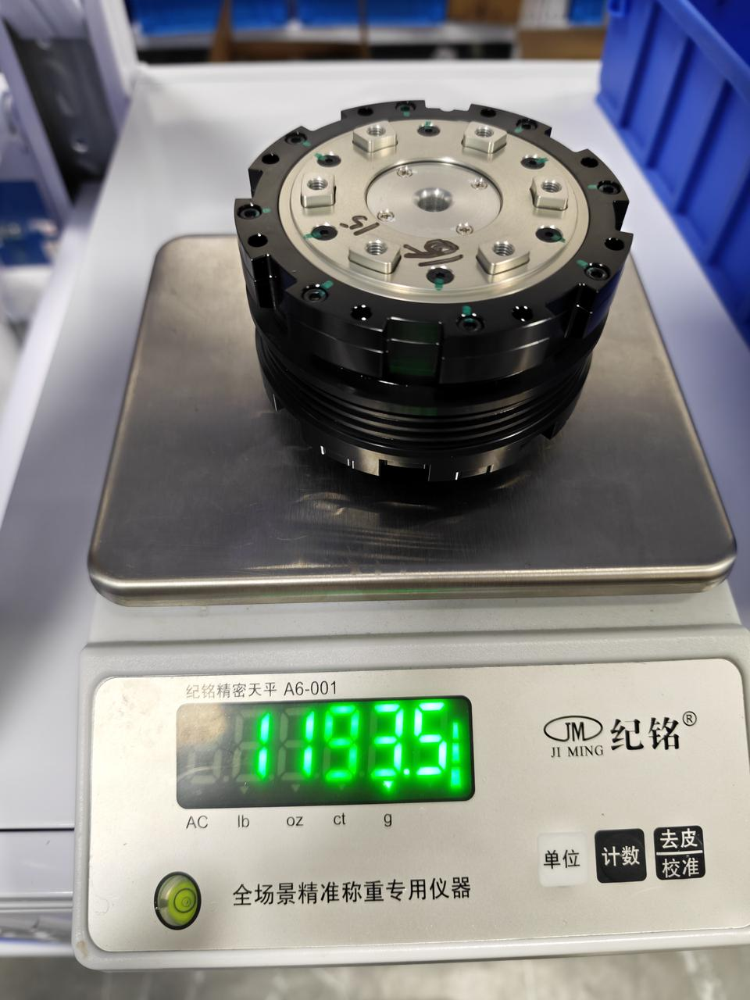 |
| 2. 读取 CAD 体积 | 在 SolidWorks 中打开对应零件或组合件，进入“评估 → 质量属性”，读取体积并换算为 $\mathrm{m^3}$。 | 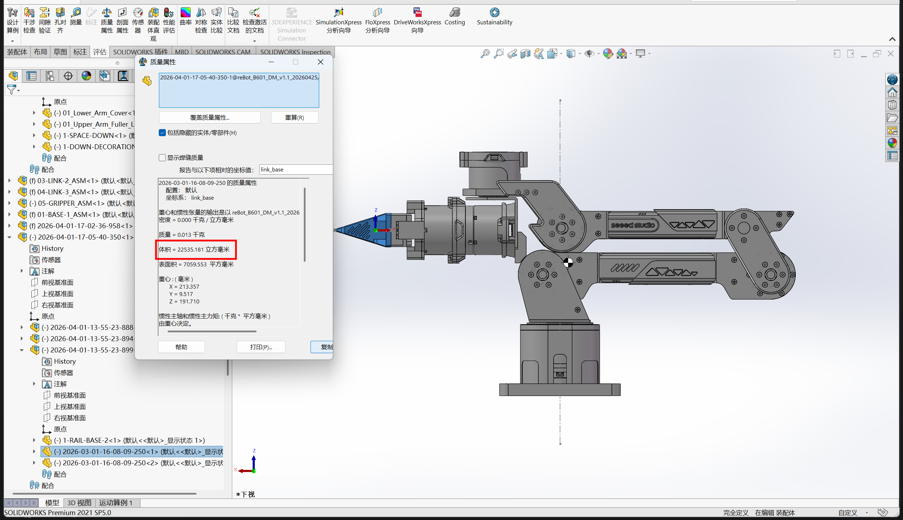 |
| 3. 计算并设置等效密度 | 使用实测质量除以 CAD 体积，统一单位后得到等效密度。编辑材料，在材料属性中填写计算得到的密度，并将该材料应用到对应零件。不要只在质量属性窗口中覆盖质量，因为 SW2URDF 导出时不会使用该覆盖值。 | 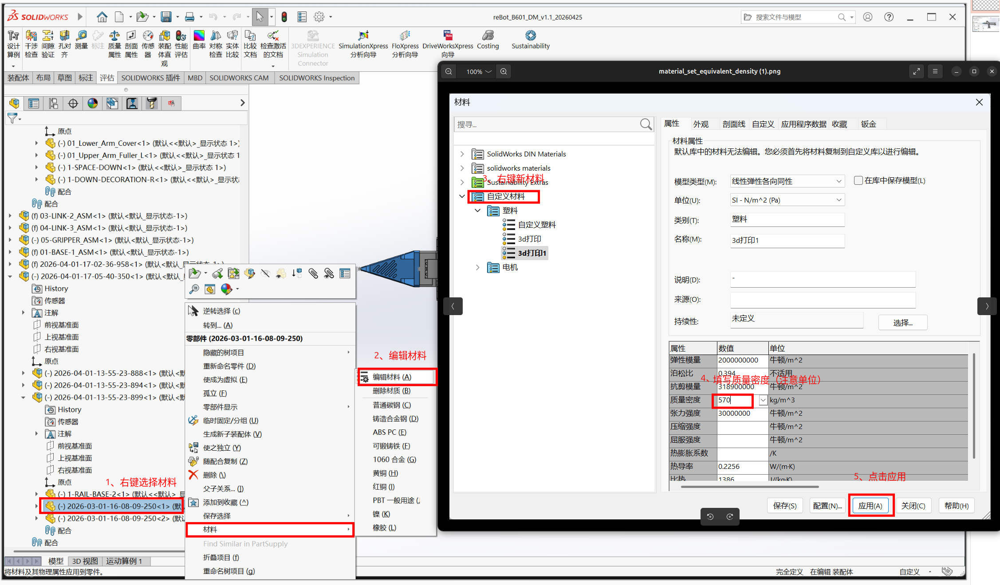 |
| 4. 核对质量属性 | 重新打开“质量属性”，确认计算质量与实测质量一致，并检查单位和零件范围。 |  |

等效密度可以使导出的总质量与实物一致，但电机等部件的内部质量分布通常不是均匀的，因此由外形和等效密度计算出的质心与惯量仍是近似值。需要进行动力学计算时，应优先使用厂家提供的质心和惯量数据，或通过测量进一步校核。

### 5.2 找到并命名本体与夹爪的关节轴

#### 5.2.1 建立六个本体关节的基准轴

先以 `joint1` 为例创建基准轴，其余本体关节按相同步骤操作。

| 步骤 | 说明 | 操作图片 |
|:---:|:---:|:---:|
| 1. 找到转轴几何特征 | 找到第一关节输出轴上与实际转轴同轴的圆柱面或圆锥面。若被外壳遮挡，暂时隐藏遮挡零件。 |  |
| 2. 打开基准轴工具 | 在顶部“装配体”选项卡中，点击“参考几何体”的下拉菜单，选择“基准轴”。后续创建基准面、点和坐标系，也从“参考几何体”菜单进入。 |  |
| 3. 选择参考面 | 在基准轴属性面板中选择“圆柱/圆锥面”，再选中对应的圆柱面或圆锥面，确认预览轴与真实关节转轴同轴后完成创建。 |  |
| 4. 命名基准轴 | 将第一条轴命名为 `axis_joint1`，再从基座向末端依次创建并命名 `axis_joint2`～`axis_joint6`。 |  |

选择参考面时，确认它与真实转轴同轴，不要选择偏离转轴的螺钉孔。完成后显示全部基准轴，检查各轴对应的关节。


**最终效果：**


#### 5.2.2 建立夹爪旋转轴与两侧平移轴

夹爪需要电机7的一根旋转基准轴和两侧手指的两根平移基准轴，从“装配体 → 参考几何体 → 基准轴”进入。

| 步骤 | 说明 | 操作图片 |
|:---:|:---:|:---:|
| 1. 建立电机7旋转轴 | 选择电机输出轴或驱动齿轮轴的同轴圆柱面，确认轴线穿过传动中心，命名为 `axis_joint_end1`。正方向沿 `link_end` 的正 X。 | 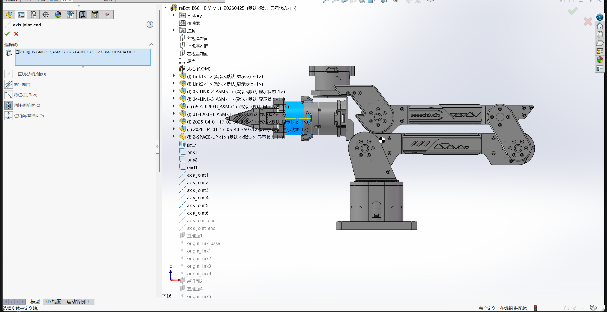 |
| 2. 建立第一侧平移轴 | 利用第一侧导轨中心线，或两相交基准面的交线创建轴，命名为 `axis_joint_end_pris1`。正方向沿 `link_end` 的正 Y。 | 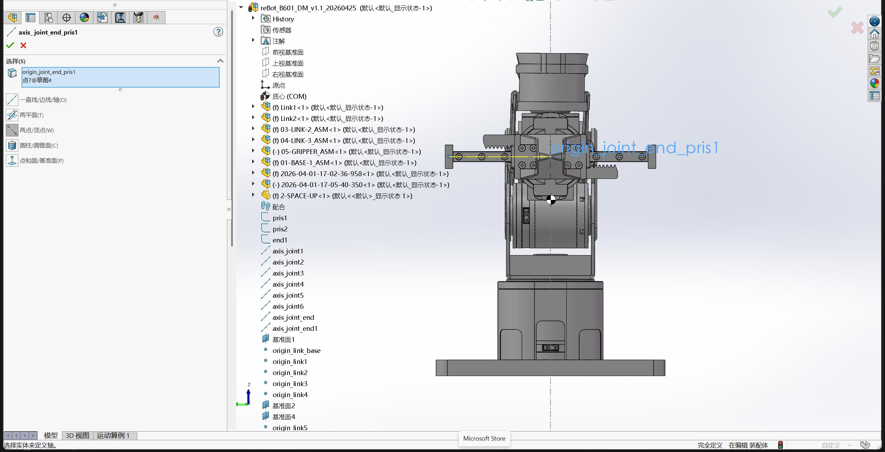 |
| 3. 建立第二侧平移轴 | 退出“孤立”后对另一侧重复操作，命名为 `axis_joint_end_pris2`。正方向沿 `link_end` 的负 Y。 | 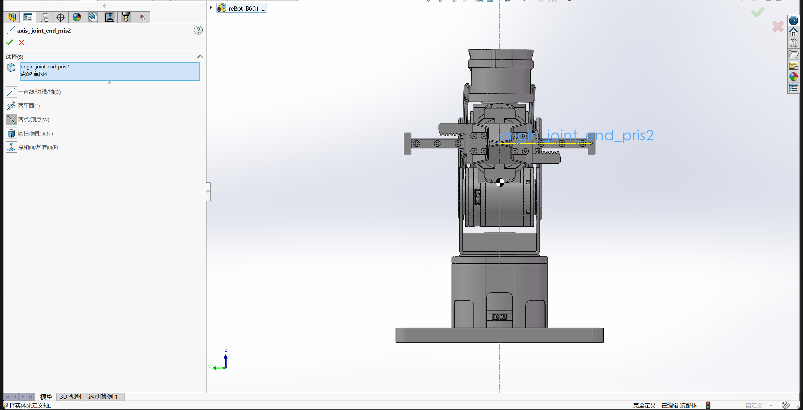 |

两侧平移轴与各自导轨中心线重合，方向相反。关节配置时选择对应轴，并与第 5.5.2 节的同号 `mimic` 倍率配合。

**本阶段检查：** 六个本体关节和三个夹爪活动关节各有一根命名轴；旋转轴与真实转轴同轴，平移轴与导轨中心线重合。保存装配体。

### 5.3 确定坐标系原点

#### 5.3.1 建立三个定位基准面

进入“装配体 → 参考几何体 → 基准面”，依次建立以下三个基准面，用于本体原点和夹爪工具参考点的定位。

| 步骤 | 说明 | 操作图片 |
|:---:|:---:|:---:|
| 1. 建立 `基准面1` | 第一参考选择 `axis_joint2`，设为“重合”；第二参考选择基座方向参考面，设为“平行”。确认平面包含该轴后创建并命名，用于定位 `origin_link1`。 |  |
| 2. 建立 `基准面2` | 第一参考选择 `axis_joint6`，设为“重合”；第二参考选择基座方向参考面，设为“平行”。确认位置后创建并命名，用于定位 `origin_link5`。 |  |
| 3. 建立 `基准面3` | 第一参考选择夹爪的几何中点，设为“重合”；第二参考选择夹爪方向参考面，设为“平行”。确认位置后创建并命名，用于辅助定位夹持中心。 |  |

第一参考确定平面经过的位置，第二参考确定朝向。建立后显示三个基准面，检查名称、位置和约束，再继续创建原点。

#### 5.3.2 建立基座与六个连杆原点

进入“装配体 → 参考几何体 → 点”，按下表选择几何参考，创建后立即命名。

| 步骤 | 操作说明 | 操作图片 |
|:---:|:---:|:---:|
| 1. 确定基座原点 | 装配体 → 参考几何体 → 点 → 选取基座底面安装面中心 → 圆弧中心 → 确定 |  |
| 2. 确定 `origin_link1` 原点 | 选择 `axis_joint1` 和 `基准面1` → 选择“交叉点” → 确定 |  |
| 3. 确定 `origin_link2` 原点 | 选择 `axis_joint2` 和 `上视基准面` → 选择“交叉点” → 确定 |  |
| 4. 确定 `origin_link3` 原点 | 选择 `axis_joint3` 和 `上视基准面` → 选择“交叉点” → 确定 |  |
| 5. 确定 `origin_link4` 原点 | 选择 `axis_joint4` 和 `上视基准面` → 选择“交叉点” → 确定 |  |
| 6. 确定 `origin_link5` 原点 | 选择 `axis_joint5` 和 `基准面2` → 选择“交叉点” → 确定 |  |
| 7. 确定 `origin_link6` 原点 | 选择 `axis_joint5` 和 `axis_joint6` → 选择“交叉点” → 确定；按本章约定，该点与 `origin_link5` 重合 |  |

“上视基准面”是装配体的定位基准。完成本体原点后，继续建立夹爪原点和工具参考点，再统一检查全部原点。

#### 5.3.3 建立夹爪各部件的原点

进入“参考几何体 → 点”，在夹爪闭合零位下建立参考点。参考被遮挡时可使用“孤立”；没有可选交点时，先建立辅助面。

| 步骤 | 说明 | 操作图片 |
|:---:|:---:|:---:|
| 1. 建立固定本体原点 | 选择夹爪电机底部法兰盘的中心轴与底面的交点，命名为 `origin_link_end`。 |  |
| 2. 建立传动中心原点 | 定位齿轮齿条传动中心，即驱动齿轮旋转中心，确认点位于 `axis_joint_end1` 上，命名为 `origin_link_end1`。 | 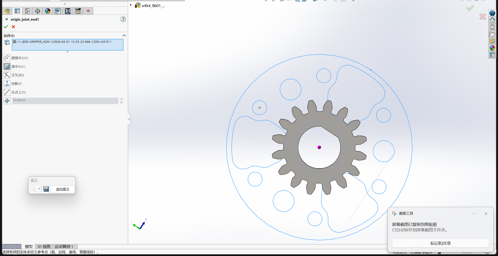 |
| 3. 建立第一侧手指原点 | 选择第一侧夹持面与导轨中心线的交点，命名为 `origin_link_end_finger1`。该点随手指移动。 | 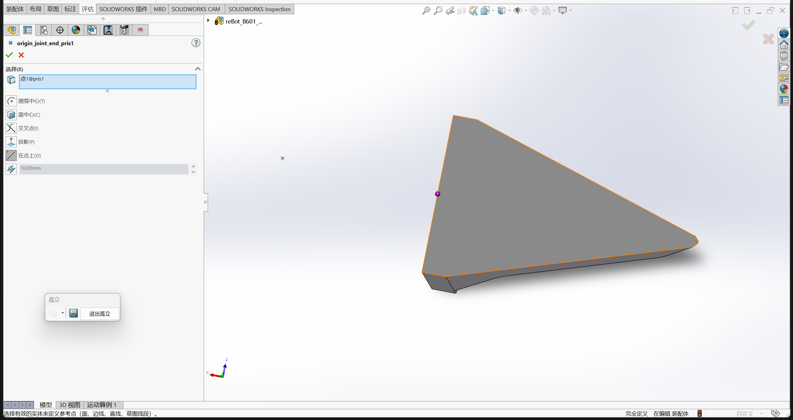 |
| 4. 建立第二侧手指原点 | 对另一侧重复操作，命名为 `origin_link_end_finger2`，检查两侧原点的对称关系。 | 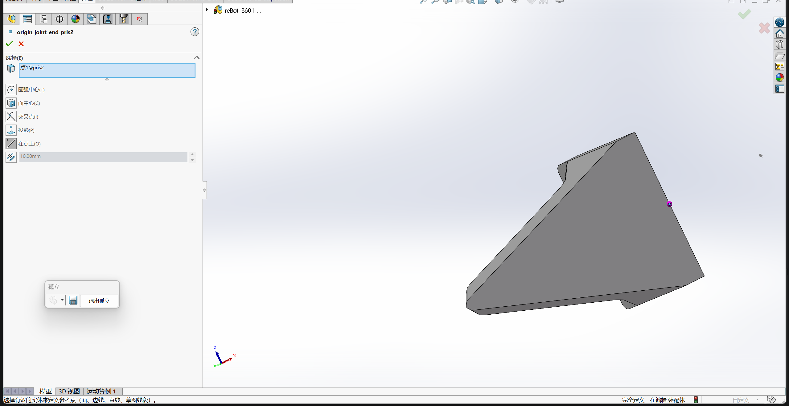 |

#### 5.3.4 确定夹持中心与闭合指尖参考点

TCP 对应夹持物体时的约定中心。保持夹爪闭合零位，按有效夹持面与装配对称面定位。

| 步骤 | 说明 | 操作图片 |
|:---:|:---:|:---:|
| 1. 建立夹持中心点 | 利用 `基准面3`、夹持面及对称基准定位夹持中心，进入“参考几何体 → 点”，命名为 `origin_frame_end_tcp`。 |  |
| 2. 建立闭合指尖点 | 在夹爪闭合时的指尖参考位置建立点，命名为 `origin_frame_end_fingertip`。 | 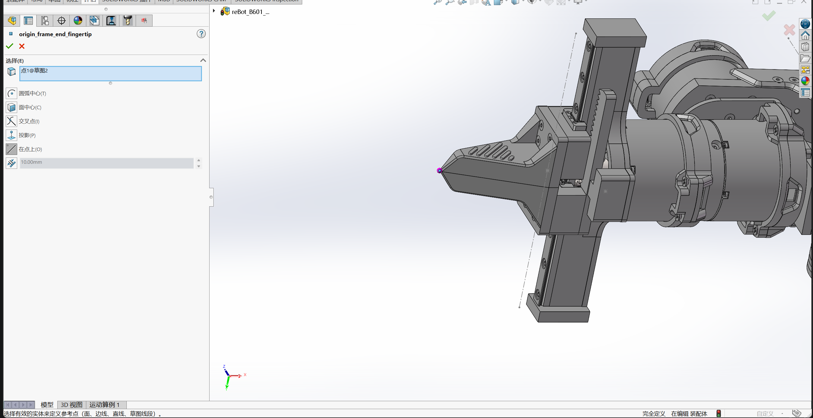 |

两个工具参考系固定到 `link_end`，闭合指尖参考点不随当前手指开合移动。记录两点相对 `link_end` 的位置。

| 步骤 | 操作说明 | 操作图片 |
|:---:|:---:|:---:|
| 检查全部原点 | 显示本体、夹爪和工具的全部参考点，对照建系约定检查名称、位置和几何来源。 |  |

**本阶段检查：** 各原点有明确的几何来源，保存原点建立完成的配置。

### 5.4 建立连杆坐标系

#### 5.4.1 先把一个坐标系建立完整

| 步骤 | 说明 | 操作图片 |
|:---:|:---:|:---:|
| 1. 建立基座坐标系 | 进入“参考几何体 → 坐标系”，原点选择 `origin_link_base`，Z 向上、X 沿基座前向，命名为 `link_base`。 |  |
| 2. 建立 link3 坐标系 | 原点选择 `origin_link3`，Z 选择 `axis_joint3`，X 使用从 `origin_link3` 指向 `origin_link4` 的公共法线参考，检查右手系并命名。 |  |

使用已命名的关节轴与原点连线作为方向参考。若使用零件边作为参考，确认它与目标方向平行。

#### 5.4.2 建立其余本体、夹爪与工具坐标系

| 坐标系 | 原点 | Z 轴线 | X 方向的确定依据 | 操作图片 |
|:---:|:---:|:---:|:---:|:---:|
| `link1` | `origin_link1` | `axis_joint1` | 第一、第二轴的公共法线，按前文约定选向 |  |
| `link2` | `origin_link2` | `axis_joint2`；电机2定子安装在子连杆 `link2`，输出端连接父连杆 `link1`，因此正 Z 与电机输出轴的正转轴向相反 | 第二轴指向第三轴的公共法线 |  |
| `link3` | `origin_link3` | `axis_joint3` | 第三轴指向第四轴的公共法线 |  |
| `link4` | `origin_link4` | `axis_joint4` | 第四、第五轴的公共法线 |  |
| `link5` | `origin_link5` | `axis_joint5` | 第五、第六轴所成平面的法向，正向沿用第二章约定 |  |
| `link6` | 与 `origin_link5` 重合 | `axis_joint6` | 零位时沿 `link5` 的正 X |  |

相交轴的法向有两个相反方向，选择时按约定的正向设置。末连杆的方向按安装基准确定。

**Z 轴正方向的确定：** 先按电机资料确定输出轴的正转方向（反馈角增大的方向），右手四指沿正转方向弯曲，拇指所指为输出轴的正转轴向。再按定子的安装位置设置本体关节的正 Z：

| 电机定子安装位置 | Z 轴正方向 |
|:---:|:---:|
| 父连杆，输出端连接子连杆 | 与电机输出轴的正转轴向相同 |
| 子连杆，输出端连接父连杆 | 与电机输出轴的正转轴向相反 |

在 SolidWorks 中选择对应关节轴，按上表检查 Z 轴箭头，必要时点击“反转方向”。这样本体关节正方向与电机反馈角增大的方向一致，六个关节均使用 `axis="0 0 1"`。注意，输出轴的正转轴向由转动方向确定，不一定是轴伸出电机的一侧。

夹爪各坐标系的正 Z 统一朝上，负 Z 朝下；电机7和手指的运动轴另按旋转轴及导轨方向设置。

> 📌 **方向约定**：“朝前、朝上”以夹爪装配基准为依据，不随观察视角改变。所有坐标系采用右手系。`link6` 的 X 与 `link5` 的 X 对齐指零位建系关系；`joint6` 转动后，`link6` 随转子运动。夹爪驱动轴按实际电机轴向设置，不要求沿 `link_end1` 的 Z。

**建立夹爪与工具参考系**

从“参考几何体 → 坐标系”进入。零位时以下坐标系均采用 `link_end` 的方向：X 朝前，Z 朝上，Y 按右手系确定。

| 步骤 | 说明 | 操作图片 |
|:---:|:---:|:---:|
| 1. 建立固定本体坐标系 | 原点选择 `origin_link_end`，用装配基准设置 X、Z 正向，命名为 `link_end`。 | 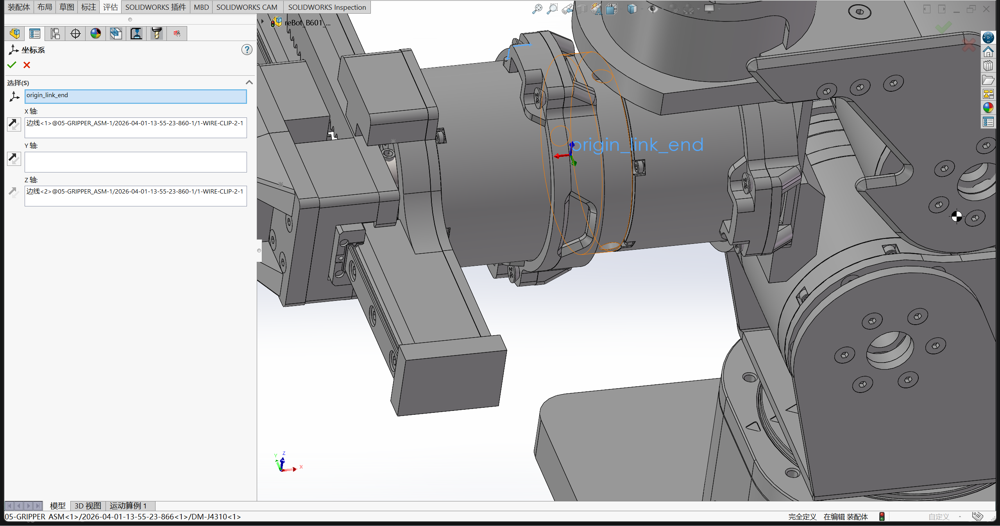 |
| 2. 建立驱动齿轮坐标系 | 原点选择 `origin_link_end1`，方向使用与 `link_end` 相同的参考，命名为 `link_end1`。运动轴另选电机7轴，沿本地 X。 | 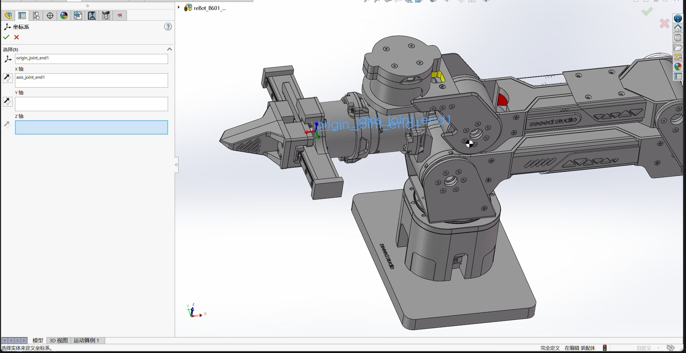 |
| 3. 建立第一侧手指坐标系 | 原点选择 `origin_link_end_finger1`，方向与 `link_end` 相同，命名为 `link_end_finger1`。 | 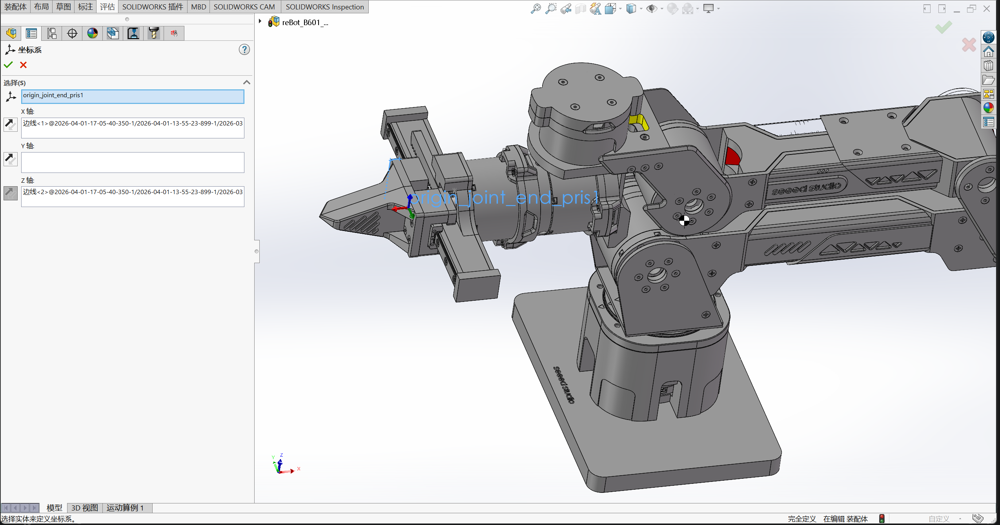 |
| 4. 建立第二侧手指坐标系 | 原点选择 `origin_link_end_finger2`，方向与 `link_end` 相同，命名为 `link_end_finger2`。 | 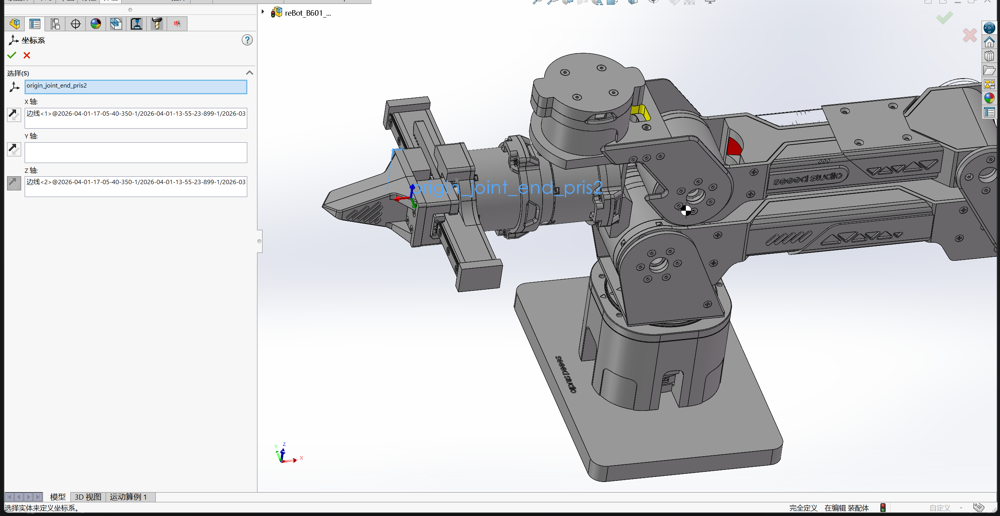 |
| 5. 建立夹持中心坐标系 | 原点选择 `origin_frame_end_tcp`，方向与 `link_end` 相同，命名为 `frame_end_tcp`。 |  |
| 6. 建立闭合指尖坐标系 | 原点选择 `origin_frame_end_fingertip`，方向与 `link_end` 相同，命名为 `frame_end_fingertip`。 | 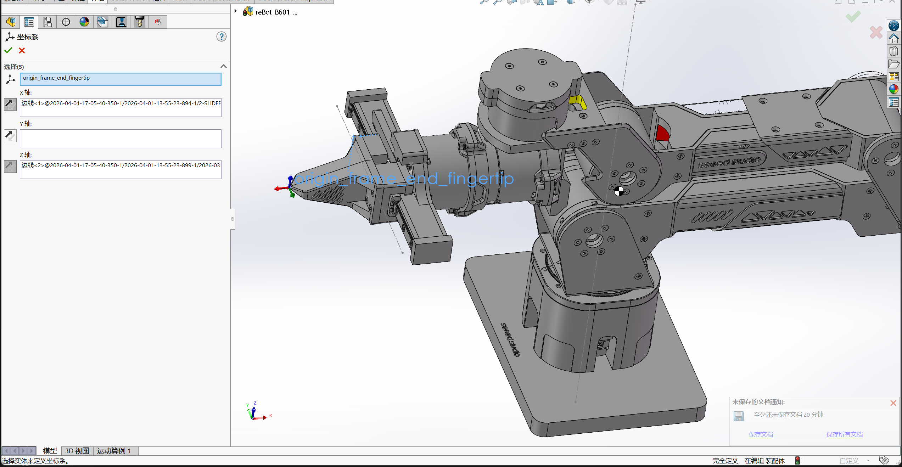 |

夹爪运动时，驱动齿轮坐标系旋转、两侧手指坐标系平移，两个工具参考系相对 `link_end` 保持固定。保存坐标系完成的配置。

显示全部坐标系，逐一检查原点是否位于前一步创建的参考点。本体坐标系的 Z 轴与对应关节轴重合；夹爪坐标系按统一的前向和上向设置，运动轴另外选择对应基准轴。


**本阶段检查：** 本体关节正 Z 与电机反馈角增大时的实际相对转动方向一致；夹爪驱动和导轨轴分别按实际运动方向设置。完成后保存“坐标系完成”的配置。

### 5.5 在 SW2URDF 中配置运动树

#### 5.5.1 选择本体的零件组与参考几何体

打开 `Export as URDF`，从根连杆开始配置。根名称填写 `link_base`，参考坐标系选择 `link_base`，选择全部固定基座零件。

对于 `link3`，在树中选择父节点 `link2` 并添加子节点，依次填写：

| 界面项目 | 填写或选择 | 它在 URDF 中决定什么 |
|:---:|:---:|:---:|
| Link Name | `link3` | 子 link 的名称 |
| Joint Name | `joint3` | 连接该 link 的关节名称 |
| Reference Coordinate System | `link3` | 该节点的参考坐标系，供计算相对变换 |
| Reference Axis | `axis_joint3` | 关节转轴及方向 |
| Joint Type | `revolute` | 有限范围的旋转关节 |
| 零件选择区 | 属于 `link3` 的全部实体 | 网格与物理属性的分组来源 |


其余本体节点使用相同方法，按下表核对父子关系：

| 子 link | 父 link | Joint Name | 坐标系 | 参考轴 |
|:---:|:---:|:---:|:---:|:---:|
| `link1` | `link_base` | `joint1` | `link1` | `axis_joint1` |
| `link2` | `link1` | `joint2` | `link2` | `axis_joint2` |
| `link3` | `link2` | `joint3` | `link3` | `axis_joint3` |
| `link4` | `link3` | `joint4` | `link4` | `axis_joint4` |
| `link5` | `link4` | `joint5` | `link5` | `axis_joint5` |
| `link6` | `link5` | `joint6` | `link6` | `axis_joint6` |

逐个点选节点，检查高亮零件是否符合原先的分组。若某个壳体被选到两个 link，后续可能显示重叠，也可能重复计算质量，应在这里修正。


#### 5.5.2 接入末端夹爪与工具参考系

本体配置到 `link6` 后，继续建立夹爪分支。`link6` 只包含电机6的转子及其法兰盘；通过 `joint_end` 将夹爪固定本体 `link_end` 接到 `link6`。

| 步骤 | 说明 | 操作图片 |
|:---:|:---:|:---:|
| 1. 添加夹爪固定本体 | 选择父节点 `link6`，添加 `link_end`；Joint Name 为 `joint_end`，类型为 `fixed`，参考坐标系为 `link_end`，选择电机7定子、连接件及其余非活动部件。 | 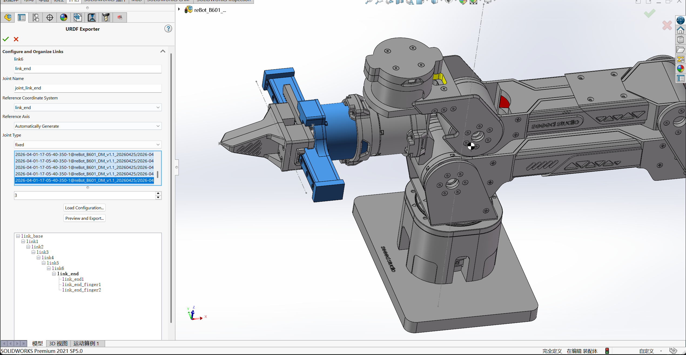 |
| 2. 添加电机7驱动节点 | 选择父节点 `link_end`，添加 `link_end1`；关节为 `joint_end1`、类型为 `revolute`，选择同名坐标系及 `axis_joint_end1`，分配转子与齿轮。 | 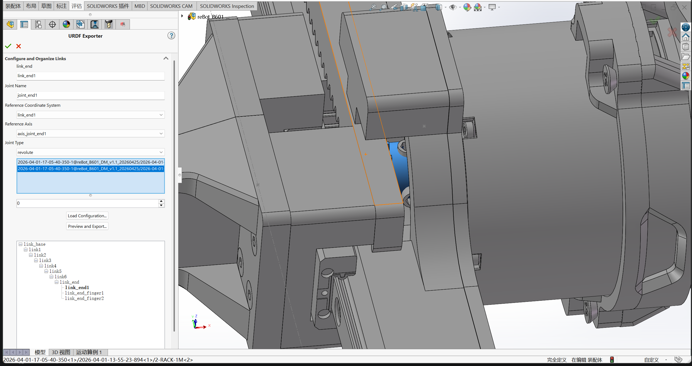 |
| 3. 添加第一侧手指 | 在 `link_end` 下添加 `link_end_finger1`；关节为 `joint_end_pris1`、类型为 `prismatic`，选择同名坐标系及 `axis_joint_end_pris1`，分配手指与齿条。 | 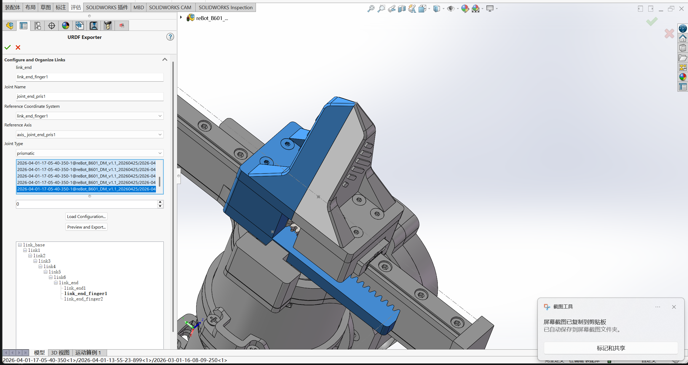 |
| 4. 添加第二侧手指 | 在 `link_end` 下添加 `link_end_finger2`；关节为 `joint_end_pris2`、类型为 `prismatic`，选择同名坐标系及 `axis_joint_end_pris2`，分配另一侧手指与齿条。 | 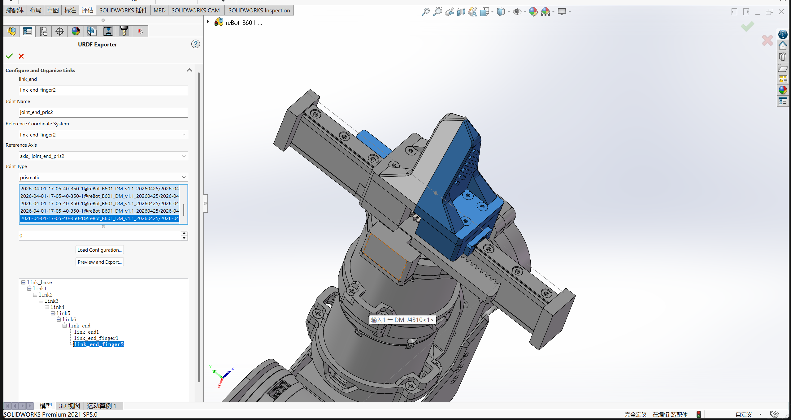 |
| 5. 添加夹持中心参考系 | 插件中跳过该空参考节点；导出后按第 5.6 节“导出后补充工具参考系”手动添加。 |  |
| 6. 添加闭合指尖参考系 | 插件中跳过该空参考节点；导出后按第 5.6 节“导出后补充工具参考系”手动添加。 |  |

```text
link6
└── joint_end (fixed) → link_end
    ├── joint_end1 (revolute，电机7) → link_end1
    ├── joint_end_pris1 (prismatic，mimic joint_end1) → link_end_finger1
    ├── joint_end_pris2 (prismatic，mimic joint_end1) → link_end_finger2
    ├── joint_frame_end_tcp (fixed) → frame_end_tcp
    └── joint_frame_end_fingertip (fixed) → frame_end_fingertip
```

两侧手指通过 `mimic` 关联电机7，导出的标签为：

```xml
<mimic joint="joint_end1" multiplier="0.00842" offset="0" />
```

手指位移满足 $q_{finger}=0.00842q_{end1}$，倍率单位为 m/rad。两侧倍率同号、轴向相反，实现对称开合。

| 步骤 | 说明 | 操作图片 |
|:---:|:---:|:---:|
| 设置两侧手指的 mimic | 在关节属性界面中依次配置两侧平移关节：勾选“Mimic Other Joint”，关联 `joint_end1`，设置倍率 `0.00842` 和偏置 `0`。 |  |

**本阶段检查：** 六轴本体连续连接；夹爪分支的父子关系、运动轴和 `mimic` 配置正确；两个工具参考节点留待导出后手动添加。保存导出配置。

### 5.6 检查参数并导出

点击 `Preview and Export`，按“关节参数 → 连杆质量属性 → 导出”的顺序检查。

**1. 检查轴向与运动限制**

逐个选择本体关节，检查关节类型、参考坐标系及 `Axis`。本教程本体各关节的本地 Z 轴与转轴对齐，因此轴向应为 `(0, 0, 1)`，即 x、y、z 分别为 `0`、`0`、`1`。若不一致，应返回检查所选基准轴及坐标系方向。

在同一界面的 `Limit` 区域检查 `lower`、`upper`（位置下限与上限）、`effort`（力/力矩限制）和 `velocity`（速度限制）。图中数值仅作为界面示例，实际限制按对应关节与硬件填写。

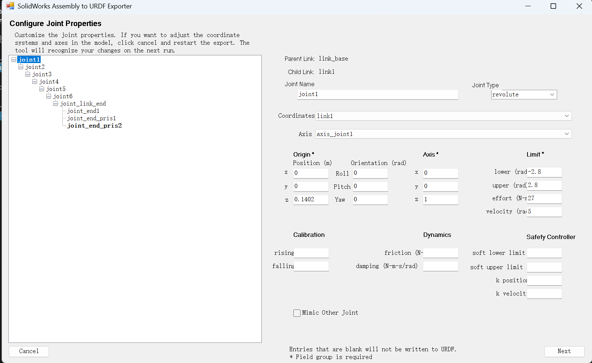

旋转关节使用 rad、rad/s、N·m，平移关节使用 m、m/s、N；CAD 长度由 mm 换算为 m 时除以 1000，角度换算为：

$$
\theta_{\mathrm{rad}}=\theta_{\mathrm{deg}}\frac{\pi}{180}
$$

以下参数读取自配套模型 `joyarm_code/joyarm_core/robot_model/joyarm_dm/urdf/joyarm_dm.urdf`，检查时按对应关节逐项核对：

| 关节 | 类型 | 位置范围（lower～upper） | 速度上限（velocity） | 力／力矩上限（effort） |
|:---:|:---:|:---:|:---:|:---:|
| `joint1` | `revolute` | -2.8～2.8 rad | 5 rad/s | 27 N·m |
| `joint2` | `revolute` | -3.14～0 rad | 5 rad/s | 27 N·m |
| `joint3` | `revolute` | -3.14～0 rad | 5 rad/s | 27 N·m |
| `joint4` | `revolute` | -1.57～1.57 rad | 20 rad/s | 7 N·m |
| `joint5` | `revolute` | -1.57～1.57 rad | 20 rad/s | 7 N·m |
| `joint6` | `revolute` | -3.14～3.14 rad | 20 rad/s | 7 N·m |
| `joint_end1` | `revolute` | -5.49～0 rad | 20 rad/s | 7 N·m |
| `joint_end_pris1` | `prismatic` | -0.04625～0 m | 0.08 m/s | 7 N |
| `joint_end_pris2` | `prismatic` | -0.04625～0 m | 0.08 m/s | 7 N |

`joint_end`、`joint_frame_end_tcp` 和 `joint_frame_end_fingertip` 为固定关节，不设置运动限位。

夹爪关节按各自方向检查：`joint_end1` 为 `revolute`，本地轴沿 X，角度范围为 `-5.49`～`0` rad；两侧手指为 `prismatic`，位移范围均为 `-0.04625`～`0` m，本地轴分别沿正 Y、负 Y。另确认夹爪安装关节 `joint_end` 为 `fixed`，父节点为 `link6`、子节点为 `link_end`，零位变换正确。

**2. 检查两侧手指的 mimic 设置**

依次选择 `joint_end_pris1` 和 `joint_end_pris2`，勾选 `Mimic Other Joint`，将 `Joint to Mimic` 设为 `joint_end1`，`Multiplier` 设为 `0.00842`，`Offset` 设为 `0`。两侧倍率同号、轴向相反，实现对称开合。

| 关节 | 操作图片 |
|:---:|:---:|
| 第一侧手指 `joint_end_pris1` | 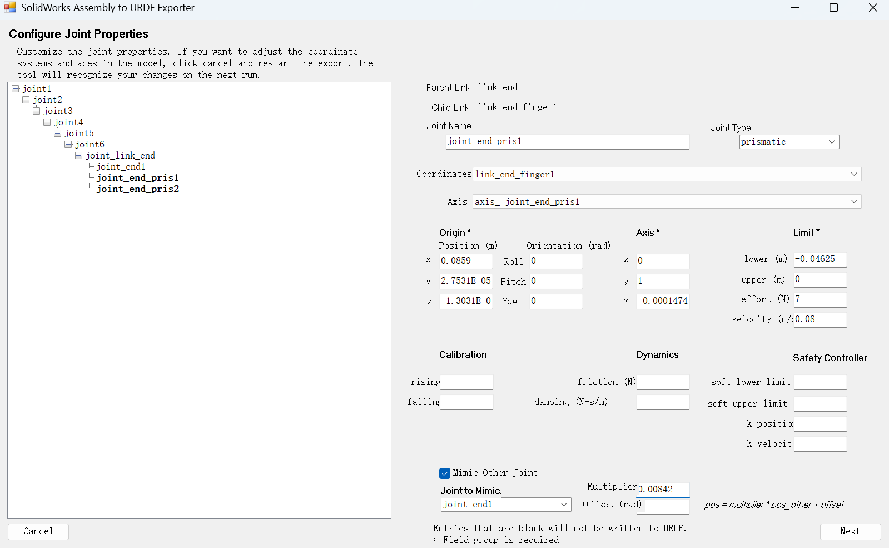 |
| 第二侧手指 `joint_end_pris2` | 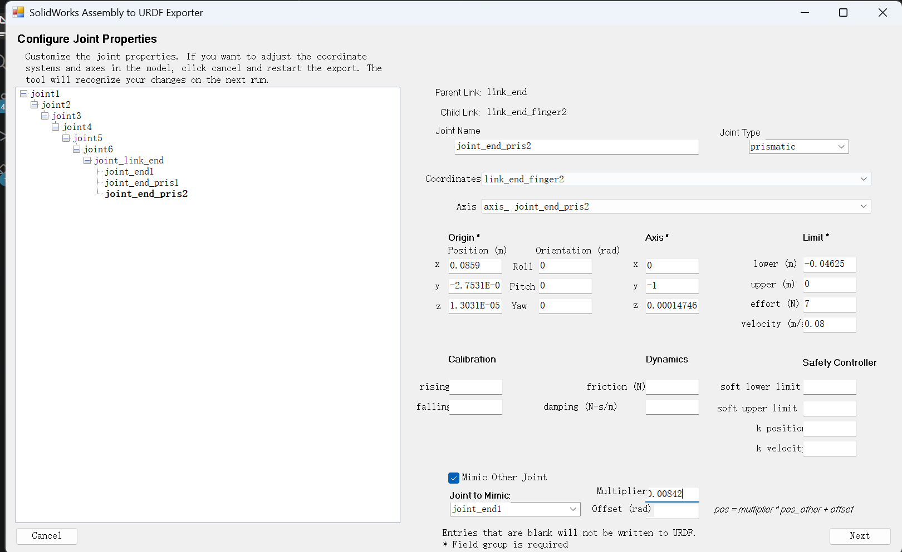 |

`mimic` 只定义位置关联，两侧关节的限位、速度与力限制仍需分别设置。

**3. 检查质量属性并导出**

点击 `Next` 进入连杆属性界面，逐个选择 link，将 `Mass (kg)` 与第 4.7 节的质量评估结果对照。若不一致，先检查该 link 是否多选、漏选或重复分配零件，再检查材料与密度设置。同时核对质心、惯量及碰撞几何，确认外购模组使用可信的质量属性。

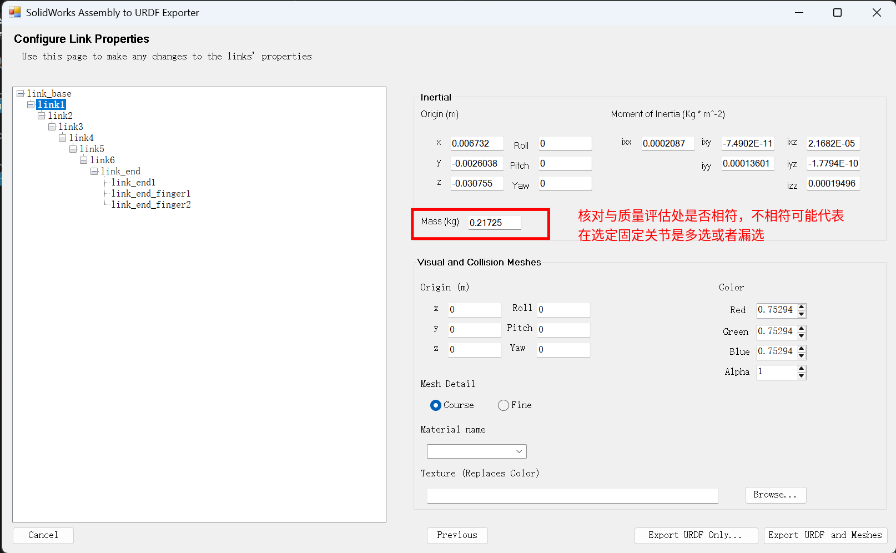

检查时区分 `link_end` 的固定本体、`link_end1` 的转子与齿轮，以及两侧手指与齿条，避免实体重复计入。两个空工具参考系不承载实体质量，留待导出后添加。

确认参数后，点击 `Export URDF and Meshes`，选择导出目录，保存 URDF 与各实体网格。

导出目录应包含 URDF 和对应网格，例如：

```text
JoyArm_dm_v1_1_mdh_description/
├── urdf/
│   └── JoyArm_dm_v1_1_mdh.urdf
└── meshes/
    ├── link_base.STL
    ├── link1.STL
    ├── ...
    ├── link_end.STL
    ├── link_end1.STL
    ├── link_end_finger1.STL
    └── link_end_finger2.STL
```

目录名和网格名称以实际导出结果为准；移动模型时保留 URDF 与网格的完整目录关系。

**导出后补充工具参考系**

两个空工具参考节点不在插件中配置。导出后，打开 URDF 文件，在末尾的 `</robot>` 标签之前手动添加以下内容：

```xml
<!-- ============================ frame_end_tcp =========================== -->
<link name="frame_end_tcp" />
<joint name="joint_frame_end_tcp" type="fixed">
  <origin xyz="0.12510 0 0" rpy="0 0 0" />
  <parent link="link_end" />
  <child link="frame_end_tcp" />
</joint>

<!-- ======================= frame_end_fingertip =========================== -->
<link name="frame_end_fingertip" />
<joint name="joint_frame_end_fingertip" type="fixed">
  <origin xyz="0.15071 0 -0.00001" rpy="0 0 0" />
  <parent link="link_end" />
  <child link="frame_end_fingertip" />
</joint>
```

上述 `xyz` 为本模型中相对 `link_end` 坐标系的位置，单位为米；`rpy="0 0 0"` 表示两个参考系的方向与 `link_end` 一致。空 link 不添加 `visual`、`collision` 或 `inertial`，固定关节不添加 `axis`。更换夹爪或调整参考点后，需重新测量并更新对应的 `xyz`。

**补充后检查：** 打开导出的 URDF，确认 `frame_end_tcp` 和 `frame_end_fingertip` 各定义一次，对应关节均为 `fixed`，父 link 均为 `link_end`；核对上述 `xyz` 和 `rpy` 后保存文件。重新导出模型后，需再次补充这两个参考系。随后按第 5.7 节加载模型，检查它们的位置与随动关系。

### 5.7 加载模型并检查

将导出的 URDF 与网格加载到 [URDF Studio](https://urdf.enkeebot.com/) （将整个文件夹拖进页面即可加载）或本地模型查看器，检查以下内容：

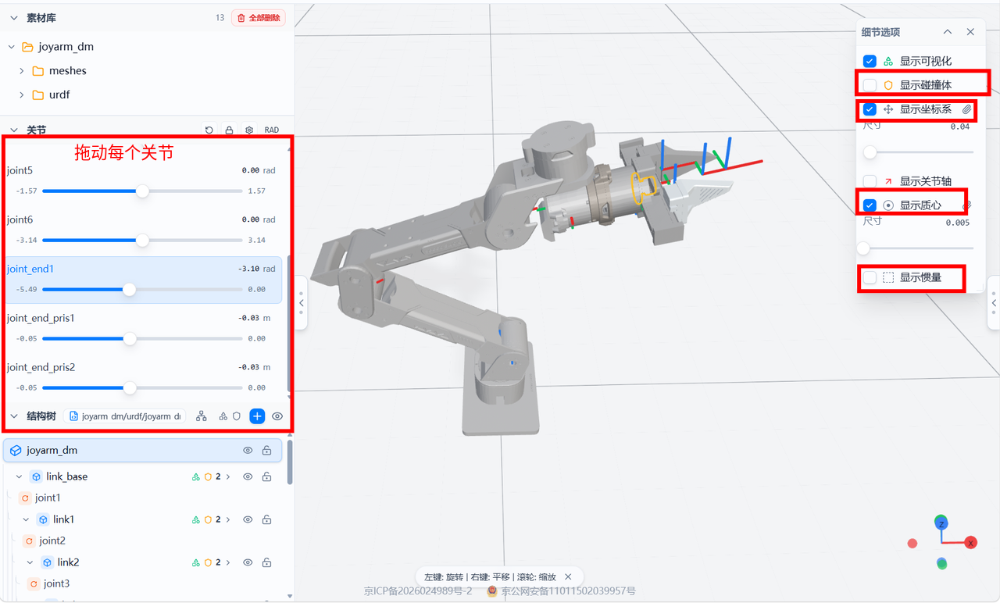

- **外观与零位**：零件完整，连杆、夹爪及工具参考系的位置与 CAD 一致。
- **关节运动**：在限位内逐个改变关节，确认运动轴与方向正确，上游连杆不动，下游连杆随动。
- **夹爪开合**：确认两侧手指按 `mimic` 关系对称运动，行程正确；工具参考系随夹爪本体运动，不随手指开合移动。
- **正运动学**：统一基座与末端参考系、关节顺序及零位，用相同关节角对照[第二章](chapt2_fkine.md)的计算结果。

发现异常时，返回检查零件分组、父子关系、坐标系、轴向及参数设置；若查看器不执行 `mimic`，应换用支持该关系的工具。检查完成后，保存 CAD、导出配置、URDF 与网格，供后续章节使用。
