# 第七章 构型结构设计与 URDF 导出

<!-- 原文备份：原概述
&gt; 📌 **概述**：本章完成从"使用现成机械臂"到"理解并设计机械臂"的跨越：介绍机械臂的构型设计、结构设计、关节电机选型，以及轴系标定和 URDF 导出的完整流程，并在 JoyArm 上实践由 CAD 模型导出 URDF。
-->

> 📌 **概述**：本章以 JoyArm 为例，串起机械臂从方案到软件模型的设计过程：第 1 节根据工作范围和姿态要求确定串联 6R 构型；第 2 节梳理结构设计要解决的问题；第 3 节说明电机参数与负载估算；第 4 节讲清 CAD、MDH 与 URDF 的关系；第 5 节使用 SolidWorks 导出并验收 `JoyArm_dm_v1_1_mdh`。只关心机器人模型导出的读者，可以直接阅读第 4、5 节。

<!-- ✍️ 写作指引（HTML 注释，不会渲染到线上；完稿后可保留或删除）

【本章定位】进阶篇·设计章（从"用"到"设计"），是进阶篇起点；与 [第二章](chapt2_fkine.md) MDH/正运动学互为表里（设计→建模）。
【参考模板】理论部分对齐 chapt2_fkine.md 的推导风格，设计/选型部分以对比表+流程表为主（参考 quickstart.md 的步骤流程表）。
【固定骨架】
  · 第 1 行：H1 章标题（章号用汉字）；第 3 行须是「> 📌 **概述**：……」blockquote 摘要
    （不加标题级别，一句话式概括全章、加粗关键词、点明各节逻辑流、点出末节实践）。
    ⚠️ 当前第 3 行是纯文本，撰写时请改写为该 blockquote 格式。
  · 正文按 ## → ### → #### 展开，每个顶级 ## 之间用 `---` 分隔。
  · 末节固定为「## 5 本章实践：由 JoyArm CAD 模型导出 URDF」，对应脚本 joyarm_code/chapt/chapt7_urdf_demo.py。
【全局写作规范】（详见 AGENTS.md）
  · 简洁、清晰、对新手友好，避免跳跃。
  · 表格一律 `:---:` 居中（每列都写），无需向用户确认。
  · 标题编号：H2 阿拉伯数字每章从 1 重新编号；H3 为"父H2.序号"；章号用汉字。
  · 数学/参数：选型计算用公式（力矩、惯量）；URDF 的 MDH/惯性参数未知时用 *待补充*。
  · 代码：优先用"脚本引用句式"——「对应脚本位于 `joyarm_code/chapt/chapt7_urdf_demo.py`，使用说明见脚本头部注释。」
    URDF 片段可用 ```xml``` 围栏展示。
  · 可复用核心库 joyarm_code/joyarm/：fkine（用导出的 URDF 校验正运动学）。
  · 图示：配图放 docs/images/chapt7_urdf/（构型/结构/装配示意），未就绪时先写好英文文件名和完整图片路径。
  · callout：> 💡 直觉/口诀  ｜  > 📌 重要说明/跨章引用  ｜  > ⚠️ 警告/注意。
  · 跨章引用用相对链接（如 [第二章](chapt2_fkine.md) MDH、[第八章](chapt8_dyn.md) 动力学惯量）。
  · 不写"本章小结"——第 3 行概述已替代它。
【本章可引用的脚本/库】chapt7_urdf_demo.py、robotics/fkine.py。
-->

<!-- 原文备份：第 1 节原文
## 1 构型设计

第一章已经回答“机械臂有哪些构型”，本节进一步回答“**面对一个任务，应该怎样选构型**”。设计从任务出发：先把自然语言需求转化为工程指标，再确定关节类型、运动链和轴线布局，最后用 JoyArm 检查方案是否满足任务。

### 1.1 从任务需求确定设计指标

设计机械臂的第一步不是画连杆、选电机，而是回答一个更直接的问题：**末端到底需要怎样运动？**

以“从桌面抓起杯子并放到置物架”为例，设计者至少要继续追问：杯子分布在哪里？置物架有多高？夹爪从哪个方向接近？杯子有多重？一个动作要在多长时间内完成？允许多大的位置误差？这些问题分别对应不同的设计指标。

| 任务问题 | 设计指标 | 后续影响 |
|:&#45;&#45;&#45;:|:&#45;&#45;&#45;:|:&#45;&#45;&#45;:|
| 末端需要怎样运动？ | 自由度、位置与姿态要求 | 构型与轴线布局 |
| 需要覆盖哪些区域？ | 工作空间、工作半径 | 轴线布局与连杆尺寸 |
| 需要搬运多重物体？ | 额定负载、峰值负载 | 结构强度与关节转矩 |
| 一个动作需要多长时间？ | 速度、加速度、工作节拍 | 电机转速、功率与减速比 |
| 多次运行能否回到同一点？ | 重复定位精度 | 传动间隙、结构刚度与控制 |
| 能否准确到达指令位置？ | 绝对定位精度 | 加工装配误差与轴系标定 |

本小节先确定这些指标“要达到什么水平”，后续再分别解决“怎样做到”：自由度和工作空间落实到构型，负载与精度约束结构设计，速度和加速度进入电机选型，几何误差则通过轴系标定修正。//这里也是同理，能一句话说完就不不要列这么多点，他们只是港入门，对这些每个点没有太多的概念，你在这列这么多也没有用

其中，**自由度首先决定机械臂能不能完成任务**。如果夹爪只需到达空间中的目标点，就要控制 $x$、$y$、$z$ 三个位置变量；如果夹爪还必须从指定方向接近杯子，则要继续控制姿态。任务要求控制的独立变量越多，所需自由度通常也越多。

| 典型任务 | 独立控制的末端变量 | 通常所需自由度 |
|:&#45;&#45;&#45;:|:&#45;&#45;&#45;:|:&#45;&#45;&#45;:|
| 沿固定方向升降 | 1 个位置变量 | 1 |
| 在平面内移动并调整朝向 | 2 个位置变量 + 1 个姿态变量 | 3 |
| 空间中到达目标点并保持工具轴方向 | 3 个位置变量 + 2 个姿态变量 | 5 |
| 任意控制空间位置与姿态 | 3 个位置变量 + 3 个姿态变量 | 6 |

若任务要求独立控制的末端变量数为 $m$，机械臂自由度为 $n$，通常至少需要满足：

$$
n \geq m
$$

以完整的空间位姿控制为例，[第二章](chapt2_fkine.md)已经说明，一个位姿包含三个位置变量和三个姿态变量，因此通常需要 6 个自由度。

如果 $n&gt;m$，机械臂便具有**冗余自由度**。这就像人端稳水杯时，手的位置和姿态不变，肘部仍能上下移动。额外的自由度可用于绕开障碍物、远离关节限位或改善受力，但也会增加重量、成本和控制难度。

不过，**关节数量够，不等于运动能力一定够**。如果多个关节产生的运动方向重复，机械臂仍可能无法完成某些动作。例如，三根始终平行的转轴虽然提供 3 个关节变量，却不能让末端获得任意的空间姿态。因此，数完自由度之后，还必须设计关节类型和轴线布局。


### 1.2 确定机械臂构型

自由度回答“需要几个独立运动”，构型则回答“**这些运动由哪些关节、按照什么顺序实现**”。旋转关节记作 R，移动关节记作 P，一台机械臂可以先用运动链快速表示，例如笛卡尔机械臂为 P&#45;P&#45;P，六轴关节机械臂为 R&#45;R&#45;R&#45;R&#45;R&#45;R（简称 6R）。

**第一步：选择拓扑结构。** 串联、并联和混联决定了关节与连杆之间最基本的连接关系。第一章已经介绍过三者的结构特点，这里只比较它们对设计决策的影响。

| 拓扑 | 代表构型 | 优先考虑的任务 | 主要取舍 |
|:&#45;&#45;&#45;:|:&#45;&#45;&#45;:|:&#45;&#45;&#45;:|:&#45;&#45;&#45;:|
| 串联 | 6R、SCARA | 大工作空间、灵活抓取、多姿态作业 | 累积误差明显，末端刚度相对较低 |
| 并联 | Delta、Stewart | 高速拾放、高刚度或高承载 | 工作空间较小，机构和控制约束较多 |
| 混联 | 并联定位机构 + 串联手腕 | 同时追求刚度、工作空间和姿态能力 | 结构与运动学更复杂 |

JoyArm 需要覆盖较大的桌面工作空间，并灵活改变夹爪的位置和姿态，因此选择串联拓扑。确定拓扑后，再继续选择定位运动链和手腕形式。

**第二步：选择定位运动链。** 不同运动链都能把末端送到空间中的目标点，但工作空间和工程特性明显不同。

| 典型构型 | 主要运动链 | 工作空间特点 | 适合优先考虑的任务 |
|:&#45;&#45;&#45;:|:&#45;&#45;&#45;:|:&#45;&#45;&#45;:|:&#45;&#45;&#45;:|
| 笛卡尔型 | P&#45;P&#45;P | 规则、近似长方体 | 直线搬运、龙门作业、高刚度定位 |
| 圆柱坐标型 | R&#45;P&#45;P | 近似圆柱体 | 围绕基座的搬运与上下料 |
| 球坐标型 | R&#45;R&#45;P | 近似球壳 | 先确定方向、再沿该方向伸缩 |
| SCARA | R&#45;R&#45;P&#45;R | 以水平平面为主 | 高速装配、插装和平面搬运 |
| 关节型 | R&#45;R&#45;R + 手腕 | 不规则球状区域 | 通用抓取、绕障和多姿态作业 |

如果任务要求工作空间规则、运动方向固定，移动关节往往更直接；如果任务区域分散、需要改变接近方向或绕开障碍物，串联旋转关节通常更灵活。JoyArm 面向通用桌面操作，因此继续选择关节型方案。

**第三步：配置末端手腕。** 对常见 6R 机械臂，可以先按功能理解为：

$$
\underbrace{J_1,J_2,J_3}_{\text{主要确定位置}}
+
\underbrace{J_4,J_5,J_6}_{\text{主要调整姿态}}
$$

这种划分便于理解，但不一定在数学上完全解耦。真正决定解耦程度的是后三根关节轴的几何关系。

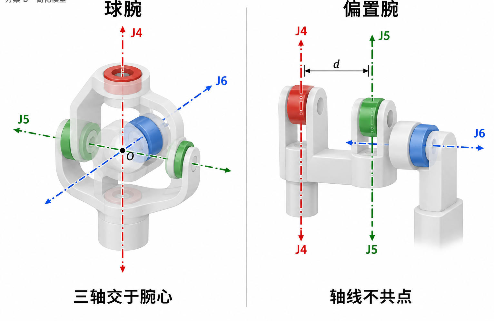

| 手腕方案 | 轴线关系 | 运动学影响 | 设计取舍 |
|:&#45;&#45;&#45;:|:&#45;&#45;&#45;:|:&#45;&#45;&#45;:|:&#45;&#45;&#45;:|
| 正交球腕 | 三轴交于一点，相邻轴通常正交 | 腕心位置与末端姿态容易分开求解 | 解析清晰，但传动布置和内部空间紧张 |
| 偏置腕 | 三轴不完全交于一点 | 转腕会同时改变腕部位置，位置与姿态耦合更强 | 便于直接布置独立关节，结构实现更灵活 |

球腕并不意味着没有奇异性。当中间腕关节使首尾两根腕轴共线时，两个转动方向会退化为同一个方向，形成腕部奇异。偏置腕也会出现奇异，只是位置和判断方式取决于具体几何参数。奇异性的统一判定将在[第四章](chapt4_jacobian.md)中通过雅可比矩阵展开。

**第四步：判断是否需要冗余。** 完整控制空间位姿通常需要 6 个自由度；若增加第七个关节，末端仍然只有六维位姿，但机械臂可以在完成任务的同时调整肘部。这对狭窄空间避障很有价值，也意味着逆运动学必须从多组可行姿态中继续选择。

**第五步：形成候选整机方案。** 对通用串联机械臂，与其罗列大量名称，不如比较三种典型设计路线：//这里不一定需要

| 六轴方案 | 关键几何关系 | 主要优势 | 主要代价 |
|:&#45;&#45;&#45;:|:&#45;&#45;&#45;:|:&#45;&#45;&#45;:|:&#45;&#45;&#45;:|
| PUMA 球腕型 | 肩肘形成定位链，腕部三轴理想共点 | 位置与姿态易解耦，便于推导解析逆解 | 球腕内部传动和装配较复杂 |
| 偏置腕型 | 腕部三轴不完全共点 | 关节布置灵活，容易形成紧凑外形 | 运动学耦合更强 |
| 模块化拟人式 6R | 腰部回转、肩肘伸展、腕部定向 | 关节复用率高，适合快速开发 | 轴线偏置受模组尺寸约束 |

这三种说法不是互斥标签：一台模块化机械臂也可以采用偏置腕。构型设计的重点不是给机械臂贴上名称，而是把**运动链、轴线关系和连杆尺寸**明确下来。中空走线、远置驱动和关节模组等实现细节，留到第 2、3 节讨论。

&gt; 📌 **构型是运动学的源头**：关节轴线与连杆尺寸一旦确定，[第二章](chapt2_fkine.md)中的 MDH 参数、正运动学方程和工作空间也随之确定。

### 1.3 JoyArm 构型设计分析

现在把前面的选择过程应用到 JoyArm。本节以桌面抓取、物体搬运和遥操作作为验证场景：机械臂既要覆盖基座周围的一片三维区域，又要改变夹爪的接近方向，因此只控制位置的三轴机构并不够。JoyArm 采用 **6R 串联构型**：六个旋转关节共同控制末端的三维位置与三维姿态。

[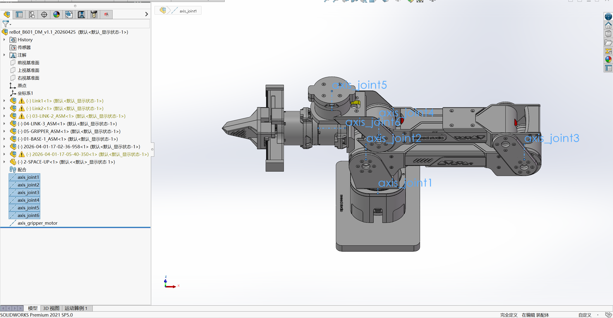]()

从代码库当前使用的URDF 可以读出以下轴线特征：

[占位：等待结构出来后进行分析]()


构型是否合理，不能只看关节数量和外形，还要回到 1.1 的任务指标进行验证：

| 检查项 | 验证问题 | 建议方法 |
|:&#45;&#45;&#45;:|:&#45;&#45;&#45;:|:&#45;&#45;&#45;:|
| 可达工作空间 | 抓取点和放置点是否都“够得到”？ | 在软限位内采样关节角，通过正运动学生成末端点云 |
| 任务姿态覆盖 | 到达目标点时，夹爪能否保持所需方向？ | 对每个目标位置检查一组任务所需姿态，而非只看位置点云 |
| 关节余量 | 完成任务时是否频繁贴近限位？ | 记录各关节到软限位的最小距离 |
| 奇异风险 | 常用路径是否经过运动能力退化区域？ | 在第四章中用雅可比条件数进一步检查 |
| 自碰撞风险 | 肘部、腕部或夹爪是否可能碰到自身？ | 结合碰撞模型检查典型动作和边界位形 |

[第二章](chapt2_fkine.md)已经用蒙特卡洛采样绘制了 JoyArm 的**可达工作空间**，它回答“至少以一种姿态能否到达”。构型设计还应多问一步：在杯子、置物架等目标位置，夹爪能否以任务要求的姿态到达？严格的灵巧工作空间要求末端在某点实现任意姿态，计算成本较高；工程上可以先选取“竖直向下、水平侧向”等几组典型任务姿态逐一检查。

经过上述检查，如果目标点不可达，应优先调整基座位置、轴线布局或连杆长度；如果位置可达但姿态不足，则应重点检查腕部构型和关节限位；如果路径频繁靠近奇异位形，则需要修改构型、调整任务布置，或在规划时主动回避。这样，工作空间分析就不再只是画出一团点云，而是成为判断构型是否满足任务的设计工具。

&gt; 💡 **从设计到实现**：构型确定了机械臂“怎样动”，接下来还要让它“承得住、变形小、装得下”。这正是第 2 节结构设计要解决的问题。

&#45;&#45;&#45;
-->

## 1 从任务确定 JoyArm 构型

第一章已经介绍常见机械臂构型，本节只做一件事：从桌面操作任务出发，说明 JoyArm 为什么采用串联 6R 结构。

### 1.1 把任务要求变成设计指标

设计前先明确机械臂要够到哪里、怎样接近物体、搬运多重、动作多快以及允许多大误差。这些要求会分别影响自由度、连杆尺寸、结构强度和电机选型。

| 任务要求 | 需要确定的指标 | 影响的设计内容 |
|:---:|:---:|:---:|
| 覆盖桌面和置物架 | 工作空间、臂展 | 构型与连杆长度 |
| 从不同方向抓取 | 位置和姿态自由度 | 关节数量与轴线布局 |
| 搬运目标物体 | 负载与力臂 | 结构强度与关节转矩 |
| 在规定时间内完成动作 | 速度和加速度 | 电机转速与功率 |
| 重复到达目标位置 | 定位精度 | 刚度、间隙与标定 |

完整控制空间位置和姿态通常需要 6 个自由度。若任务只要求部分位置或姿态，自由度可以减少；增加到 7 个及以上则可利用冗余关节绕障或远离限位，但会增加结构和控制复杂度。

### 1.2 为什么选择串联 6R

JoyArm 需要覆盖较大的桌面三维区域，并在到达目标后调整夹爪姿态。串联机械臂的各关节依次扩大末端活动范围，旋转关节又便于构成紧凑的拟人式结构，因此选择六个旋转关节组成的串联运动链：

$$
\underbrace{J_1,J_2,J_3}_{\text{主要改变末端位置}}
+
\underbrace{J_4,J_5,J_6}_{\text{主要调整末端姿态}}
$$

这种功能划分便于理解，但不表示位置与姿态完全解耦；实际耦合关系仍由六根轴线和连杆尺寸决定。

| 任务要求 | 设计选择 | 主要理由 |
|:---:|:---:|:---:|
| 较大的三维工作范围 | 串联结构 | 各级连杆的运动范围可以逐级叠加 |
| 任意调整夹爪位置和姿态 | 6 个自由度 | 对应三维位置和三维姿态 |
| 结构紧凑、便于教学 | 6R 运动链 | 六个关节均为旋转关节，建模和装配关系清楚 |
| 控制复杂度与成本受限 | 暂不增加冗余轴 | 6R 已满足本教程的基本任务需求 |

> 📌 **选择结果**：本教程不再比较全部机械臂类型，后续统一以 JoyArm 的串联 6R 本体为对象。

### 1.3 JoyArm 的轴线与连杆布局

JoyArm 的运动链由 `joint1`～`joint6` 串联组成，`joint1` 带动其后的全部连杆，`joint6` 只改变末端工具的朝向。前三轴形成主要定位链，后三轴构成腕部定向链。


最新教学模型中的主要几何关系如下。这里的长度来自 `JoyArm_dm_v1_1_mdh.urdf`，角度和坐标系定义将在第 4 节展开。

| 关系 | 几何特征 | 对运动的作用 |
|:---:|:---:|:---:|
| 基座到 joint1 | 沿基座 Z 方向 140.2 mm | 抬高整条运动链 |
| joint1 到 joint2 | 公共法线长度 20 mm，相邻轴正交 | 从基座回转过渡到肩部俯仰 |
| joint2 到 joint3 | 公共法线长度 264 mm，轴线平行 | 形成主要上臂长度 |
| joint3 到 joint4 | 公共法线长度 248.54 mm，轴线平行 | 形成主要前臂长度 |
| joint4 到 joint5 | 公共法线长度 78.308 mm，并有 2.5 mm 轴向偏置 | 从定位链过渡到腕部 |
| joint5 到 joint6 | 两轴相交且正交 | 调整末端姿态 |

构型验收时至少检查目标是否可达、目标姿态是否能实现、常用动作是否靠近关节限位，以及连杆之间是否会发生自碰撞。[第二章](chapt2_fkine.md)的正运动学和工作空间用于检查可达性，[第四章](chapt4_jacobian.md)的雅可比矩阵用于分析奇异风险。

> 💡 **从构型到结构**：构型确定机械臂“怎样动”，下一步要让它承得住、变形小并且能够装配。

---

## 2 结构设计

<!-- ✍️ 本节写作要点：
  · 本节回答“已经确定的构型怎样变成可承载、可加工、可装配的机械结构”。
  · 逻辑：载荷路径与结构要求 → 关节和连杆方案 → 装配、走线与工程检查。
  · 电机转矩和减速比留到第 3 节，本节只讨论它们在关节中的布置和承载关系。
-->

### 2.1 从载荷与性能指标确定结构要求

<!-- 写作框架：
  · 从 1.1 得到的负载、臂展、速度和精度指标出发，说明结构设计需要同时满足强度、刚度和轻量化要求。
  · 沿“末端—连杆—关节—基座”分析负载、自重和惯性力的传递，指出靠近基座的关节通常承受更大的载荷。
  · 区分强度不足与刚度不足：前者可能损坏，后者虽未损坏，却会因变形降低定位精度。
  · 用简单悬臂梁说明连杆长度、截面和材料对变形的影响，为后续结构方案提供依据。
-->

### 2.2 关节与连杆结构设计

<!-- 写作框架：
  · 关节部分：介绍电机、减速器、输出轴和轴承的功能分工，说明关节不仅要输出转矩，还要承受径向力、轴向力和倾覆力矩。
  · 比较关节附近直接驱动与远置驱动的结构差异：前者模块化程度高，后者可降低运动部件质量，但传动路径更复杂。
  · 连杆部分：围绕材料、截面形状、壁厚和连接方式，解释刚度、质量与转动惯量之间的权衡。
  · 用一张结构方案表比较常见做法，不展开电机参数计算，把选型计算留到第 3 节。
  · 配关节剖面和连杆截面示意图，帮助读者看懂载荷如何从连杆传递到轴承和壳体。
-->

### 2.3 装配、走线与工程检查

<!-- 写作框架：
  · 检查零件能否加工和装配，电机、减速器、轴承及线缆能否维护和更换。
  · 比较外部走线与中空走线，说明线缆和气管需要预留弯曲半径与运动余量，避免被拉紧、夹伤或持续扭转。
  · 说明关节“无限旋转”还需要滑环、中空通道或其他过线方案配合，不能只由关节角范围决定。
  · 加入机械限位、防松、防碰撞、散热和防护等容易在概念设计中遗漏的问题。
  · 最后以 JoyArm 为例做一次结构检查，形成可进入电机选型与 CAD 细化的方案。
-->

---

<!-- 原文备份：第 3 节原文
## 3 关节电机选型

阅读电机参数表时，最需要弄清楚两个问题：**每个参数表示什么，以及这些参数意味着机械臂能带动多重的负载**。本节先介绍常见参数，再从力矩平衡出发计算负载能力，最后通过算例说明如何估算可承载的工件质量。

### 3.1 认识电机与关节模组的主要参数

机械臂关节通常由电机、减速器、编码器和驱动器组成，也可以使用将这些部件集成在一起的关节模组。查看参数前，先确认数据对应的是**电机轴端**还是**减速器输出端**，后者才是直接驱动连杆的轴端。

以达妙 **DM&#45;J4340&#45;2EC V1.1** 电机为例，下面结合其参数表进行说明。我们先看转矩、转速和减速比，再理解电流、编码器等参数与机械臂使用的关系。

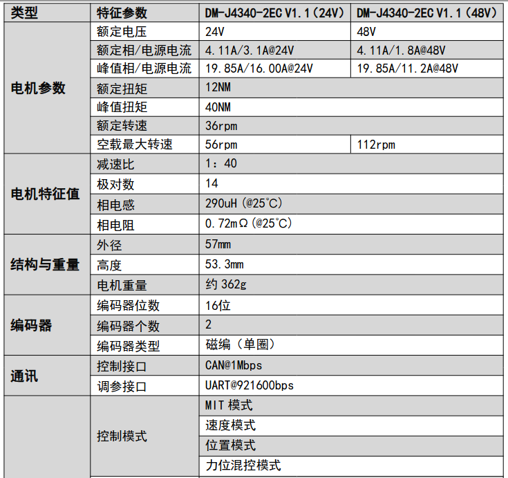

#### 3.1.1 转矩、转速与功率

| 参数 | 常见单位 | 含义 | 对机械臂的影响 |
|:&#45;&#45;&#45;:|:&#45;&#45;&#45;:|:&#45;&#45;&#45;:|:&#45;&#45;&#45;:|
| 额定转矩 | N·m | 在厂家规定的额定工况下可持续输出的转矩 | 用于评估持续搬运和保持负载的能力，实际能力还受转速与散热影响 |
| 峰值转矩 | N·m | 在规定条件和短时间内允许输出的较大转矩 | 用于启动、加速等短时工况，不能作为长期承载依据 |
| 额定转速 | r/min 或 rpm | 额定工作点对应的转速 | 表示额定条件下的运行速度，通常不等于最高转速 |
| 最高转速 | r/min 或 rad/s | 规定条件下允许达到的转速上限 | 限制关节运动速度，但不表示此时仍能输出峰值转矩 |
| 额定功率 | W | 额定工作点的机械输出功率 | 反映持续做功能力，需要与转矩、转速一起看 |

图中的额定转矩为 **12 N·m**，峰值转矩为 **40 N·m**。前者用于理解额定条件下的持续输出能力，后者只能用于规定的短时工况。24 V 和 48 V 两栏的额定转速均为 **36 rpm**，空载最大转速分别为 **56 rpm、112 rpm**；空载速度不能当作带额定负载时的速度。

转矩描述绕轴转动的驱动能力。在距离转轴 $0.1\ \mathrm{m}$ 处沿垂直于力臂的方向施加 $10\ \mathrm{N}$ 的力，产生的力矩就是 $1\ \mathrm{N\cdot m}$。因此，同一个电机能带动多重的物体，还取决于物体距离关节轴有多远。

转速与角速度的换算，以及机械输出功率的关系为：

$$
\omega=\frac{2\pi n}{60},\qquad P=\tau\omega
$$

其中，$n$ 的单位为 r/min，$\omega$ 为 rad/s，$\tau$ 为 N·m，$P$ 为 W。例如，$60\ \mathrm{r/min}$ 对应 $2\pi\ \mathrm{rad/s}$。

**转矩和转速必须一起检查。** 参数表中的最大转矩与最高转速通常不能同时达到，应查看转矩—转速曲线。悬停时转速为零、机械输出功率为零，但电机仍需通电提供转矩并产生热量，因此不能仅用额定功率判断承载能力。

#### 3.1.2 减速比与输出能力

减速器通过降低转速来增大输出转矩。设减速比为 $i$，传动效率为 $\eta$，在电机驱动负载的运动工况下，忽略传动部件自身的加速转矩，可近似写为：

$$
i=\frac{\omega_m}{\omega_j},\qquad
\omega_j=\frac{\omega_m}{i},\qquad
\tau_j\approx\eta i\tau_m
$$

下标 $m$ 表示电机轴端，$j$ 表示关节输出端。图中减速比写作 1∶40，表示电机轴转 40 圈、输出轴转 1 圈；按本文输入转速除以输出转速的定义，$i=40$。为了理解换算关系，另举一个简单例子：电机轴端转矩为 $0.5\ \mathrm{N\cdot m}$、转速为 $300\ \mathrm{r/min}$，减速比为 10、效率为 0.8，则关节输出转矩约为 $4\ \mathrm{N\cdot m}$，转速为 $30\ \mathrm{r/min}$。

该换算用于初步估算；静止保持时应查阅厂家给出的保持或连续输出能力，不能直接用运动效率判断。最终输出还受减速器允许转矩和驱动器电流限制。**若模组参数已给出输出端转矩，不要再乘一次减速比。**

#### 3.1.3 其他需要读懂的参数

| 参数 | 常见单位或形式 | 含义与用途 |
|:&#45;&#45;&#45;:|:&#45;&#45;&#45;:|:&#45;&#45;&#45;:|
| 额定电压／工作电压范围 | V | 决定供电要求；电源与驱动器需满足厂家规定范围 |
| 额定电流／峰值电流 | A | 分别对应规定条件下的持续与短时电流能力；区分相电流和电源输入电流 |
| 转矩常数 $K_t$ | N·m/A | 描述电机转矩与产生转矩的电流之间的比例；使用时须匹配厂家定义的电流口径 |
| 编码器分辨率 | bit、计数/转 | 表示位置反馈的细分程度；分辨率高不等于整机定位精度高 |
| 回差 | °、角分 | 传动换向时的空程，会影响换向定位表现 |
| 扭转刚度 | N·m/rad 等 | 表示抵抗扭转变形的能力；相同转矩下，刚度越大，变形越小 |
| 质量与尺寸 | kg、mm | 影响安装空间及上游关节负载，腕部电机的质量也要由肩、肘关节承担 |
| 输出轴允许载荷 | N、N·m | 轴承或结构允许承受的径向力、轴向力及倾覆力矩，与驱动转矩不是同一个参数 |
| 通信接口与控制模式 | CAN 等；位置、速度、转矩模式 | 决定如何连接控制器，以及能够接收何种控制指令 |

结合图中参数，还需注意：

&#45; **电流**：额定／峰值相电流为 4.11／19.85 A；24 V、48 V 下额定电源电流分别为 3.1、1.8 A。相电流与电源电流不能混用。
&#45; **编码器**：16 位对应单圈 65536 个位置，细分约为 $0.0055^\circ$，但不等于实际定位精度；两个编码器也不等于 32 位。
&#45; **尺寸与质量**：外径 57 mm、高度 53.3 mm、质量约 362 g，下游电机质量也要计入上游关节负载。
&#45; **特征与接口**：极对数 14，相电感 290 μH（25 °C）；支持 CAN 控制、UART 调参，以及 MIT、速度、位置和力位混控模式。

相电阻单位和过流保护的电流口径需核对后再用于计算。用 $\tau_m\approx K_tI$ 估算转矩时，应采用厂家定义的电流，不能将电源电流或协议转矩上限直接当作持续输出能力。

### 3.2 从关节转矩计算负载能力

#### 3.2.1 先理解力臂与重力矩

先考虑最容易理解的情况：关节轴水平，连杆在竖直平面内运动，工件通过重力对关节产生力矩。质量为 $m$ 的工件所产生的重力矩大小为：

$$
\tau_{\mathrm{load}}=mgd
$$

其中，$g\approx9.81\ \mathrm{m/s^2}$，$d$ 为关节轴到工件重力作用线的垂直距离，称为**重力力臂**。水平伸展时，力臂等于关节轴到工件质心的水平距离；抬起后，力臂会变化，不能始终使用连杆长度。

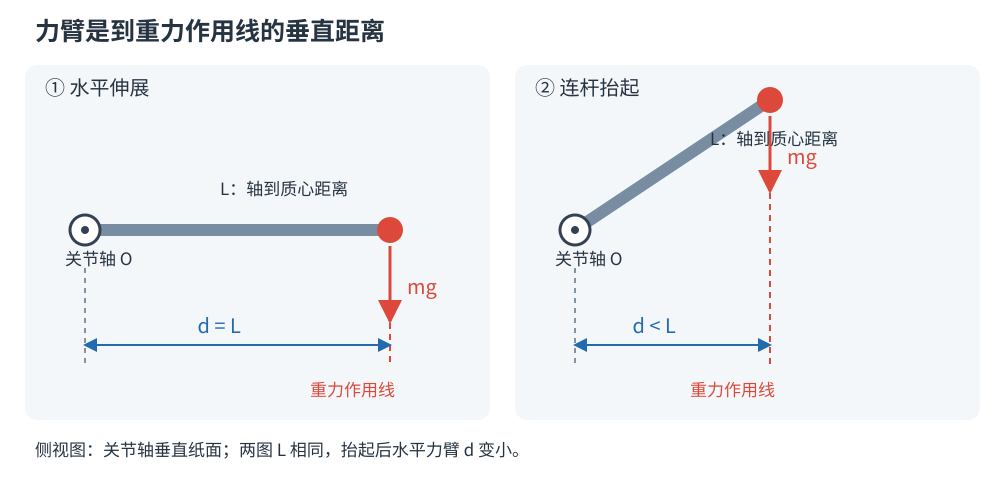

图中 $L$ 为关节轴到工件质心的距离，$d$ 为其水平投影。两种姿态的 $L$ 相同，但抬起后 $d$ 变小；计算重力矩时应使用 $d$。

例如，$1\ \mathrm{kg}$ 的工件在 $0.2\ \mathrm{m}$ 力臂处产生约 $1.96\ \mathrm{N\cdot m}$ 的重力矩，移到 $0.4\ \mathrm{m}$ 处则变为约 $3.92\ \mathrm{N\cdot m}$。**同样的关节转矩，伸得越远，可承载的质量越小。**

#### 3.2.2 扣除机械臂自身消耗的转矩

电机不仅要支撑工件，还要支撑下游连杆、关节模组、夹爪和转接件。在各部分重力矩方向相同的静态工况下：

$$
\tau_{\mathrm{req}}=\tau_{\mathrm{self}}+mgd,\qquad
\tau_{\mathrm{self}}=\sum_k m_k g d_k
$$

$\tau_{\mathrm{self}}$ 表示不含工件的下游部件总重力矩。夹爪与转接件在这里计入自重，$m$ 仅表示工件质量，避免重复计算。

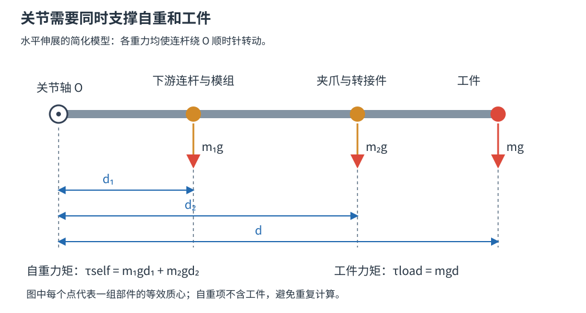

图中将不含工件的下游部件简化为两组，分别用质量 $m_1$、$m_2$ 和力臂 $d_1$、$d_2$ 表示。因此，关节需要提供的转矩为 $m_1gd_1+m_2gd_2+mgd$；其中前两项是自重，最后一项才是工件。

设关节输出端在当前保持或运行条件下的可用连续转矩为 $\tau_{\mathrm{avail}}$，选取转矩裕量系数 $K&gt;1$，要求：

$$
K(\tau_{\mathrm{self}}+mgd)\leq\tau_{\mathrm{avail}}
$$

当 $d&gt;0$ 且剩余转矩为正时，得到该姿态下、由此关节决定的**静态工件质量上限估算值**：

$$
\boxed{m_{\max}=\frac{\tau_{\mathrm{avail}}/K&#45;\tau_{\mathrm{self}}}{gd}}
$$

这里用连续能力评估持续承载，不使用峰值转矩。$K$ 应结合参数误差、工况和设计要求确定。如果分子为负，说明该关节在所取裕量下连自身重量都无法满足；如果 $d=0$，该公式不能用于求质量上限，仍需检查其他关节、结构承载和运动需求。

上述公式适用于同向重力矩的简化工况。一般空间姿态应把各重力产生的力矩投影到关节轴，再按方向求和，不能不加区分地累加大小。

#### 3.2.3 运动时还需要多少转矩

静止时能够托住的负载，未必能按要求快速抬起。对于其余关节固定的单轴运动，可初步估算：

$$
\tau_j\approx\tau_g+J_{\mathrm{eq}}\alpha+\tau_f
$$

其中，$J_{\mathrm{eq}}$ 是绕该轴的等效惯量，$\alpha$ 是角加速度，$\tau_f$ 是补偿摩擦等阻力所需的转矩，各项按统一方向代数相加。工件变重或离转轴更远，通常也会增加等效惯量，因此动态负载计算中不能只增加重力项。

计算运动负载时，需要检查：

&#45; 加速、制动阶段的转矩及其持续时间是否在允许峰值范围内。
&#45; 所需转速下能否输出相应转矩。
&#45; 完整工作周期是否满足连续运行和散热要求，停留时的保持转矩也要计入。

周期负载可用电机侧均方根转矩辅助热校核。多轴同时运动还存在动力学耦合，完整计算见[第八章](chapt8_dyn.md)。本节的静态公式主要用于理解承载能力和进行初步估算。

### 3.3 负载能力计算示例


假设机械臂水平伸展，工件质心距离肩部关节轴 **0.40 m**。我们想知道：这个关节除了托住机械臂自身，还能托住多重的工件？

本例采用图中达妙4340电机的额定转矩 **12 N·m**，假设它是当前工况下可持续使用的关节输出转矩。下面的部件质量、力臂和裕量系数均为教学假设。

**第一步：留出转矩裕量。**

取裕量系数 $K=1.5$，即让计算得到的总需求不超过 $12/1.5=8\ \mathrm{N\cdot m}$。接下来，就在这 **8 N·m** 中分配支撑自重和工件所需的转矩。

**第二步：扣除托住机械臂自身所需的转矩。**

按上一节的 $mgd$，分别计算下游部件的重力矩。这里将它们简化为两组，均不包含工件：

| 下游部件 | 质量（kg） | 重力力臂（m） | 重力矩（N·m） |
|:&#45;&#45;&#45;:|:&#45;&#45;&#45;:|:&#45;&#45;&#45;:|:&#45;&#45;&#45;:|
| 连杆及关节模组 | 1.20 | 0.20 | 约 2.354 |
| 夹爪与转接件 | 0.30 | 0.35 | 约 1.030 |
| 合计 | — | — | 约 3.384 |

因此，8 N·m 中约有 3.384 N·m 用于托住机械臂自身，留给工件的转矩为 **8 − 3.384 = 4.616 N·m**。

**第三步：把剩余转矩换算成工件质量。**

工件的力臂为 0.40 m。由 $\tau=mgd$，用剩余转矩除以 $gd$，得到：

$$
m_{\max}\approx\frac{4.616}{9.81\times0.40}\approx1.18\ \mathrm{kg}
$$

也就是说，在本例的姿态和假设条件下，**这个肩部关节可静态支撑的工件质量约为 1.18 kg**。这个数值只反映该关节的转矩约束，不是 JoyArm 的额定负载。

接下来，还要用同样的方法检查其他关节和任务中的不同姿态。每个关节都必须满足要求，整机才能承载该工件；六个关节的转矩不能直接相加。

| 关节位置 | 负载计算重点 |
|:&#45;&#45;&#45;:|:&#45;&#45;&#45;:|
| 基座回转关节 | 竖直轴的重力驱动转矩可以为零，但仍需检查启动、制动惯量及轴承载荷 |
| 肩、肘俯仰关节 | 下游全部部件与工件的重力矩，以及抬升加速所需转矩 |
| 腕部关节 | 工具与工件的质心偏置、姿态变化及输出轴允许载荷 |

对于实际 JoyArm，需要补齐各关节的**输出端连续与峰值转矩、允许转速，以及下游部件的质量、质心和惯量**，再按上述方法计算。第 5 节记录的角度限位用于确定可达姿态，不能直接换算为负载能力。整机最终可用负载还需结合动态需求、结构强度和实际运行验证确定。

&gt; 💡 **负载计算的关键**：先确认关节输出端的可用转矩，再扣除自重并留出裕量，最后根据工件力臂换算质量；末端负载必须同时满足各关节和结构的约束。

&#45;&#45;&#45;
-->

## 3 为关节选择电机

电机选型要回答两个问题：关节需要多大转矩，以及在该转矩下能否达到所需速度。本节保留入门计算，完整动力学计算见[第八章](chapt8_dyn.md)。

### 3.1 先看转矩、速度和减速比

机械臂关节通常由电机、减速器、编码器和驱动器组成，也可以使用一体化关节模组。阅读参数表时，先确认数据对应电机轴端还是减速器输出端；直接驱动连杆的是输出端。


| 参数 | 用途 | 选型时注意 |
|:---:|:---:|:---:|
| 额定转矩 | 判断能否持续搬运或保持负载 | 不能用峰值转矩代替 |
| 峰值转矩 | 检查启动、加速和制动等短时工况 | 不能长期输出 |
| 额定/最高转速 | 判断关节能否达到任务速度 | 最高转速通常是空载数据 |
| 减速比 | 在转矩和速度之间进行转换 | 模组若已给输出端转矩，不再重复乘减速比 |
| 回差与刚度 | 评估换向误差和受力变形 | 会影响末端定位表现 |
| 质量与尺寸 | 检查安装空间和上游负载 | 腕部电机质量也由肩、肘承担 |

以图中的 DM-J4340-2EC V1.1 为例，额定转矩为 12 N·m，峰值转矩为 40 N·m；峰值只用于规定的短时工况。转矩与速度必须结合转矩—转速曲线检查。

设减速比为 $i$、传动效率为 $\eta$，电机轴端转矩和转速分别为 $\tau_m$、$\omega_m$，可用下面的关系做初步估算：

$$
\omega_j=\frac{\omega_m}{i},\qquad
\tau_j\approx\eta i\tau_m
$$

除上述参数外，还应检查工作电压、电流、编码器、输出轴允许载荷、散热条件和通信接口。它们决定关节能否安全接入系统，但本节不逐项展开。

### 3.2 用关节转矩估算负载

当关节轴水平时，质量为 $m$ 的工件在重力力臂 $d$ 处产生的力矩为：

$$
\tau_{\mathrm{load}}=mgd
$$


电机还要支撑下游连杆、关节模组和夹爪。将这些部件的重力矩记为 $\tau_{\mathrm{self}}$，可用连续转矩 $\tau_{\mathrm{avail}}$ 和裕量系数 $K>1$ 估算该姿态下的工件质量上限：

$$
K(\tau_{\mathrm{self}}+mgd)\leq\tau_{\mathrm{avail}}
$$

$$
\boxed{m_{\max}=\frac{\tau_{\mathrm{avail}}/K-\tau_{\mathrm{self}}}{gd}}
$$


该式只用于静态初估。运动时还要考虑等效惯量、角加速度、摩擦、转矩—转速关系和散热；一般空间姿态还要把重力矩投影到对应关节轴。

### 3.3 JoyArm 负载估算示例

假设某肩部关节的可用连续输出转矩为 12 N·m，裕量系数取 $K=1.5$。下游部件不含工件，其简化参数为：

| 下游部件 | 质量（kg） | 重力力臂（m） | 重力矩（N·m） |
|:---:|:---:|:---:|:---:|
| 连杆及关节模组 | 1.20 | 0.20 | 约 2.354 |
| 夹爪与转接件 | 0.30 | 0.35 | 约 1.030 |
| 合计 | — | — | 约 3.384 |

考虑裕量后，可用于自重和工件的总转矩为 $12/1.5=8$ N·m，因此留给工件的转矩约为 $8-3.384=4.616$ N·m。若工件重力力臂为 0.40 m，则：

$$
m_{\max}\approx\frac{4.616}{9.81\times0.40}\approx1.18\ \mathrm{kg}
$$

该结果只是教学假设下、由一个关节决定的静态上限，不是 JoyArm 的额定负载。实际选型还需补齐各关节的连续/峰值转矩、速度，以及下游部件的质量、质心和惯量，并检查全部关节与结构。

---

<!-- 原文备份：第 4 节原文
## 4 轴系标定和URDF导出

CAD 模型能展示机械臂的外形，但控制程序还需要知道：**每个关节绕哪里转、朝哪个方向转，以及转动后末端会到哪里**。轴系标定就是把这些几何关系和实机读数对应起来；URDF 则把结果写成软件能够读取的机器人模型。

本节先讲清“为什么这样建系、导出的数字是什么意思”，第 5 节再按 SolidWorks 的界面一步步操作。下面的数值取自实际导出的 `JoyArm_dm_v1_1_mdh.urdf`，用于解释文件结构；其中尚待核对的项目会单独指出。//这里强调了第一句话“CAD 模型能展示机械臂的外形”这个表述不当，因为模型他并不是只用于展示，他最重要的是整个实物结构就是根据这个加工出来的，这才是他的重点，我们用他导出urdf只是顺便，方便了我们不用自己去写这个urdf，要解释以下urdf每个字母的意思，urdf的作用是什么，我们什么时候会用到urdf，和urdf同类的有啥比如说mujoco里面的一个MJCF，等等，最后说因为urdf使用最广泛，所以我们要导出urdf

### 4.1 先让实机、CAD 和程序认同同一个零位

可以把每个连杆坐标系想成贴在零件上的一把三维尺子：原点告诉我们“从哪里量”，三根轴告诉我们“往哪个方向量”。尺子位置或朝向不同，同一个点的坐标也会不同。

**首先统一零位。** 机械臂摆成约定姿态时，CAD 中的装配姿态、程序中的关节角和实机编码器读数需要建立明确对应。编码器读数为 0，并不自动意味着机械臂已经处于教程约定的零位。


例如，某关节摆到约定零位时编码器显示 0.12 rad，应记录这个零位读数；如果编码器增加时的转向与模型正方向相反，还要记录方向关系。后续程序依据这些记录换算关节角，而不是通过随意旋转网格让画面“看着一致”。

| 步骤 | 做什么 | 记录什么 |
|:&#45;&#45;&#45;:|:&#45;&#45;&#45;:|:&#45;&#45;&#45;:|
| 1. 固定参考 | 确定基座安装面、基座原点和朝向 | 后续测量共同使用的基准 |
| 2. 确定零位 | 按装配基准或定位工装摆好六个关节 | 零位照片、CAD 姿态和编码器读数 |
| 3. 确认轴线 | 在 CAD 中选择输出轴、圆柱面或同轴孔；实机检查实际转轴 | 六根关节轴的位置与方向 |
| 4. 检查正方向 | 在有运动余量的姿态下，单独让一个关节小幅运动 | 编码器增加方向与模型正方向是否一致 |
| 5. 核对几何 | 测量轴间距离、轴线夹角及工具偏移 | 与设计尺寸的差异及测量基准 |

这里要区分**建系**与**实机标定**：在 CAD 中创建参考轴、点和坐标系，是确定模型的几何描述；用实机测量修正零位和几何误差，才是在校准模型。完成 CAD 导出，并不代表实际机械臂已经标定完成。

### 4.2 把关节轴变成 MDH 坐标系

#### 4.2.1 先找转轴，再找原点和方向

沿用[第二章](chapt2_fkine.md)的 MDH 约定：`link1`～`link6` 的 Z 轴分别沿对应关节轴，X 轴由当前轴与下一轴的几何关系确定，Y 轴按右手系补齐。

可以用两支铅笔代表相邻转轴：两支铅笔相交时，交点可以定位原点；错开时，需要找到同时垂直于两根轴的连线，也就是公共法线。它连接的是轴线，不一定沿着连杆外壳的边缘。


| 相邻轴关系 | 原点如何定位 | X 轴如何确定 |图片示例|
|:&#45;&#45;&#45;:|:&#45;&#45;&#45;:|:&#45;&#45;&#45;:|:&#45;&#45;&#45;:|
| 相交 | 取两轴交点 | 取两轴所在平面的法向，并统一正方向 | 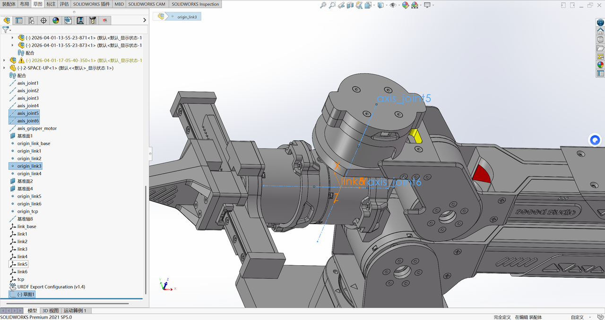|
| 平行且不重合 | 选定一条公共法线，取它与当前轴的交点 | 沿公共法线指向下一轴；选取位置需与第二章一致 |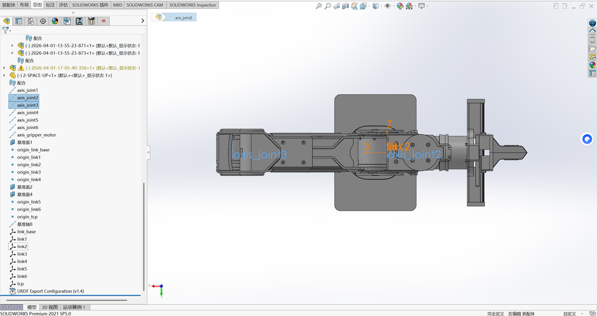 |
| 异面 | 取唯一公共法线与当前轴的交点 | 沿公共法线指向下一轴 |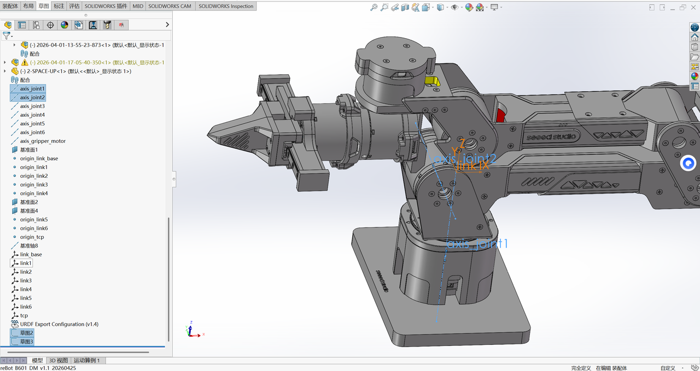 |

若两轴重合，公共法线方向不能唯一确定，需要另选装配基准来固定 X 轴。末连杆没有下一根运动轴，其原点和 X 轴按末端结构统一约定；`tcp` 则放在工具实际作用的位置，例如夹爪夹持中心。

第 5 节中的操作正好对应这三件事：**创建基准轴 → 用基准面或交点定位原点 → 建立坐标系**。基准面只是帮助定位的辅助几何，不是多增加了一个关节。

#### 4.2.2 看懂“轴相同”和“正方向相同”的区别

一根轴线可以指向两个方向。右手拇指指向正轴，四指弯曲方向才是关节角增加的方向。因此，坐标系 Z 轴和实体转轴重合后，还要检查正负方向。

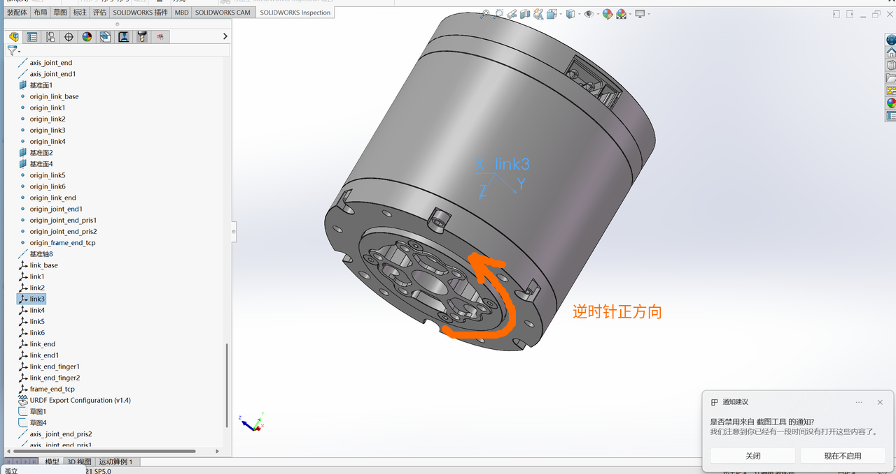

本体关节的 Z 轴正方向已与实际关节正转方向统一，导出时 `joint1`～`joint6` 均使用 `axis="0 0 1"`。

**MDH 与 URDF 是同一机构的两种描述方式。** MDH 用四个参数表达相邻坐标系关系，URDF 用关节的固定安装变换和运动轴表达。比较两者时，要统一基座、工具系、零位和关节方向，再比较相同关节角下的位姿；URDF 的 `rpy` 不是可以直接抄入 MDH 表的三个参数。

### 4.3 读懂导出的 URDF

#### 4.3.1 `link` 是部件，`joint` 是连接规则

将机械臂想成一串由铰链连接的刚性部件：`link` 描述每个部件，`joint` 描述相邻部件怎样连接和运动。同一部件上的壳体、螺钉等零件只要始终相对固定，就可以归为一个 `link`。

实际文件包含 `link_base`、`link1`～`link6` 和 `tcp`，由六个旋转关节及一个固定关节连接。以中间的一段为例：

```text
link2 ── joint3（旋转）── link3
```

一个 `link` 中还可以保存三类信息：

| 标签 | 回答的问题 | 在实际导出文件中的表现 |
|:&#45;&#45;&#45;:|:&#45;&#45;&#45;:|:&#45;&#45;&#45;:|
| `visual` | 看起来是什么样？ | 引用 `meshes/link2.STL` 等网格 |
| `collision` | 用什么形状检查碰撞？ | 当前文件与外观引用相同 STL，后续可按需要简化 |
| `inertial` | 有多重、质心在哪、转起来有多难？ | 保存质量、质心及惯性张量 |


例如，实际文件的 `link2` 质量为 **0.71188 kg**，质心位置为 `0.13252 0.0030488 0.00074044` m，均来自此次 CAD 导出。这些值仍取决于材料和零件分组是否正确，不能自动视为实测质量。`inertial/origin` 定位质心参考系，`visual/origin` 定位网格，二者都相对于所属 link 坐标系；它们不负责连接两个连杆。相关定义见 [ROS 的碰撞与惯性属性教程](https://docs.ros.org/en/humble/Tutorials/URDF/Adding&#45;Physical&#45;and&#45;Collision&#45;Properties&#45;to&#45;a&#45;URDF&#45;Model.html)。

#### 4.3.2 用一个真实关节读懂 `origin` 和 `axis`//leader觉得这个标题说的东西有一些细，但是看了这里面的内容又觉得也是要有的东西

下面摘取实际文件中的 `joint3`，只调整排版，保留导出数值：

```xml
&lt;joint name="joint3" type="revolute"&gt;
  &lt;origin xyz="0.264 0 0" rpy="0 0 2.9226" /&gt;
  &lt;parent link="link2" /&gt;
  &lt;child link="link3" /&gt;
  &lt;axis xyz="0 0 &#45;1" /&gt;
  &lt;limit lower="0" upper="3.14" effort="0" velocity="0" /&gt;
&lt;/joint&gt;
```

按“先找到铰链，再让它转动”的顺序读：

1. **连接谁？** `parent` 是 `link2`，`child` 是 `link3`；`revolute` 表示有角度限位的旋转关节。
2. **铰链装在哪里？** `xyz="0.264 0 0"` 表示关节原点在父坐标系 X 方向偏移 **264 mm**，不是相对世界原点的位置。
3. **零位时朝哪里？** `rpy="0 0 2.9226"` 描述零关节角下的固定朝向，表示这里的 yaw 约为 167.45°；它不是运行中的关节角。
4. **绕哪根轴转？** `axis="0 0 &#45;1"` 表示绕关节坐标系的负 Z 轴转动。先考虑 `origin` 带来的朝向，再理解这根本地轴指向哪里。
5. **允许转多少？** `lower`、`upper` 给出 0～3.14 rad 的范围。这里的 `effort`、`velocity` 都是 0，是当前文件需要补齐的项目，不能理解成“不限力矩、不限速度”。

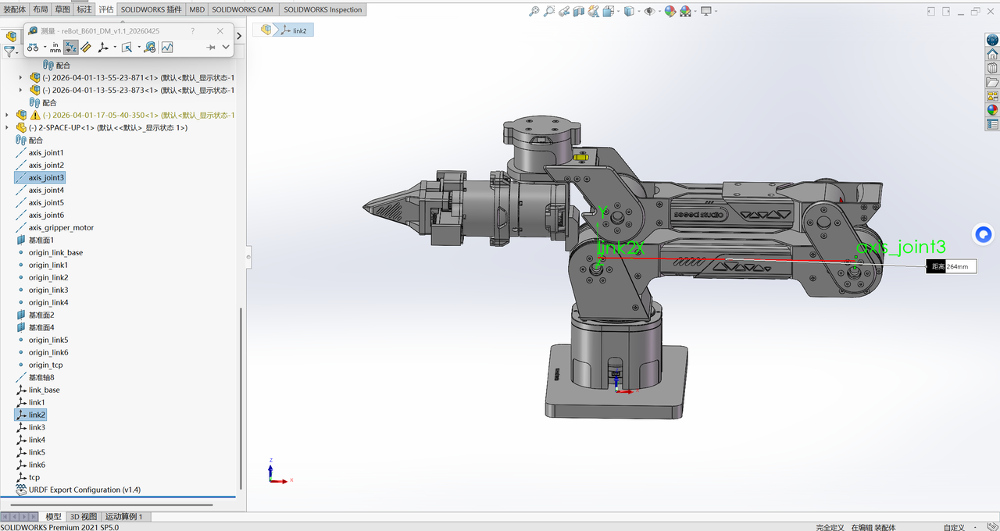

`joint/origin` 描述父 link 到关节坐标系的固定变换，`axis` 在关节坐标系中表达；关节角为 0 时，子 link 坐标系与关节坐标系重合。定义可对照 [URDF 关节说明](https://docs.ros.org/kinetic/api/urdf/html/index.html)。**所有关节角为 0，不等于所有 `origin rpy` 都为 0**，就像铰链还没转动，安装它的两个零件也可以已经存在夹角。

#### 4.3.3 `tcp` 是工具工作点

关节链走到 `link6`，还不一定走到了夹持中心。实际文件的 `joint_tcp` 给出了最后一段固定偏移：

```xml
&lt;!&#45;&#45; 教学版写法：tcp 只表示参考系，不分配实体零件 &#45;&#45;&gt;
&lt;link name="tcp" /&gt;
&lt;joint name="joint_tcp" type="fixed"&gt;
  &lt;origin xyz="0 0 0.15348" rpy="0 0 0" /&gt;
  &lt;parent link="link6" /&gt;
  &lt;child link="tcp" /&gt;
&lt;/joint&gt;
```

这里的变换数值取自实际文件：从 `link6` 沿自身 Z 方向走 **153.48 mm**，朝向不变，就到达 `tcp`。`fixed` 表示这段关系不随独立关节变量变化；转动 `joint6` 时，工具点仍会跟随 `link6` 一起运动。


### 4.4 从“导出来了”到“模型对应正确”

第 5 节完成按钮操作后，可以沿下面的顺序验收。每次只动一个关节，通常比一次拖动六个滑块更容易定位问题。

| 检查顺序 | 看什么 | 对本次实际导出的检查线索 |
|:&#45;&#45;&#45;:|:&#45;&#45;&#45;:|:&#45;&#45;&#45;:|
| 1. 运动树与资源 | 部件连接完整、网格能加载 | `package://joyarm_dm_v1_1_mdh/meshes/…` 需要查看器能找到对应包目录 |
| 2. 零位 | 同一观察方向下，CAD、模型和实机姿态是否对应 | 先统一零位与基座，不靠改外观偏移掩盖运动学差异 |
| 3. 单轴运动 | 转轴位置、方向和带动的部件是否正确 | `joint1` 的轴为 `0.022068 &#45;0.015667 0.99963`，并非严格的本地 Z；应检查参考轴与坐标系选择 |
| 4. 限位与工具 | 角度范围、速度和转矩限制、TCP 位置是否正确 | 六轴 `effort`、`velocity` 均为 0；`tcp` 的实体分组需按教学版目标核对 |
| 5. 多姿态对照 | 多组关节角下，各连杆及末端位姿是否一致 | 第二章 MDH 数值表尚待补齐，当前不能宣称已通过 MDH 一致性校验 |

上表指出的是待核对项，不代表已经确定了每项偏差的来源。例如，非 `0 0 1` 的轴向在 URDF 中可以合法存在，但如果目标是第 5 节约定的正 Z 建系，就需要回到 CAD 检查，而不是仅凭文件名带有 `mdh` 就认为已经一致。

完成零位检查后，再选几组非零关节角对照。零位外观相同的两个模型，也可能因轴向或转角符号不同，在转动后逐渐分离。这个过程就像沿着机械臂从基座逐节检查接头：找到最先出现差异的连杆，才容易判断问题来自哪一个关节。

&gt; 📌 **模型连接了前后两部分知识**：关节轴、零位和安装变换为[第二章](chapt2_fkine.md)的正运动学提供几何依据；经核对的质量、质心和惯量则为[第八章](chapt8_dyn.md)的动力学提供输入。下一节把这些关系落实到 SolidWorks 的具体操作中。

&#45;&#45;&#45;
-->

## 4 从 CAD 模型到机器人描述文件

CAD 模型是机械设计与制造的依据：它定义零件尺寸、装配关系和关节轴线，实际零件也据此加工。机器人软件并不直接使用完整 CAD 装配体，而需要一份结构清楚、便于计算的机器人描述文件，把连杆、关节、网格、碰撞和惯性等信息交给可视化、运动学、规划与仿真程序。

### 4.1 为什么本教程选择 URDF

URDF 的全称是 **Unified Robot Description Format（统一机器人描述格式）**。它使用 XML 描述机器人的几何结构和组织关系，在 ROS 中常用于 `robot_state_publisher`、RViz、MoveIt 等工具之间共享同一套机器人模型。

机器人描述格式并不只有 URDF：

| 格式 | 主要生态 | 适合描述的内容 |
|:---:|:---:|:---:|
| [URDF](https://docs.ros.org/en/rolling/Tutorials/Intermediate/URDF/URDF-Main.html) | ROS | 单个机器人的运动树、几何、碰撞和惯性 |
| [SDFormat（SDF）](https://sdformat.org/) | Gazebo | 机器人、传感器、物理参数及完整仿真世界 |
| [MJCF](https://mujoco.readthedocs.io/en/stable/XMLreference.html) | MuJoCo | MuJoCo 模型、执行器、接触和约束 |
| [USD / USD Physics](https://openusd.org/release/api/usd_physics_page_front.html) | Isaac Sim 等 | 大型场景、资产组织和物理属性 |

本教程后续使用 ROS 的可视化、坐标变换和运动规划工具，因此选用 URDF 作为 JoyArm 的主描述格式。SolidWorks 和 SW2URDF 帮助我们从 CAD 中提取已有信息，减少手工填写，但导出后仍需逐项验收。

### 4.2 为什么实机、CAD 和程序必须使用同一个零位

可以把每个连杆坐标系想成固定在零件上的三维尺子：原点决定从哪里量，坐标轴决定向哪里量。CAD 装配姿态、URDF 的零关节角和实机编码器读数必须建立明确对应，否则模型零位看似正确，转动后仍会逐渐偏离实机。

[图片待补充：并排展示 JoyArm 实机、SolidWorks 和 URDF 零位]()

| 步骤 | 检查内容 | 需要记录的结果 |
|:---:|:---:|:---:|
| 固定参考 | 基座安装面、原点和朝向 | 所有测量共同使用的基准 |
| 确定零位 | 六个关节的约定姿态 | 零位照片、CAD 姿态和编码器读数 |
| 确认轴线 | 输出轴、圆柱面或同轴孔 | 六根轴线的位置与方向 |
| 检查正方向 | 每次只让一个关节小幅正向运动 | 编码器、CAD 和模型的方向关系 |
| 核对几何 | 轴间距离、夹角和工具偏移 | 设计值与实测值的差异 |

在 CAD 中创建参考轴和坐标系属于**建系**；用实机测量修正零位与几何误差才是**标定**。完成 CAD 导出不等于实机已经完成标定。

### 4.3 怎样从关节轴建立 MDH 坐标系

沿用[第二章](chapt2_fkine.md)的 Craig MDH 约定：`link1`～`link6` 的 Z 轴分别与对应关节轴线重合，X 轴由当前轴和下一轴的几何关系确定，Y 轴按右手系补齐：

$$
\boldsymbol{y}_i=\boldsymbol{z}_i\times\boldsymbol{x}_i
$$

| 相邻轴关系 | 原点如何定位 | X 轴如何确定 | 图片示例 |
|:---:|:---:|:---:|:---:|
| 相交 | 取两轴交点 | 取两轴所在平面的法向，并按既定 $\alpha$ 符号选定正方向 |  |
| 平行且不重合 | 取选定公共法线与当前轴的交点 | 沿公共法线由当前轴指向下一轴 |  |
| 异面 | 取唯一公共法线与当前轴的交点 | 沿公共法线由当前轴指向下一轴 |  |

若两轴重合，X 轴方向不唯一，需要使用装配基准固定方向；末连杆没有下一根运动轴，其 X 轴按末端结构约定；`tcp` 放在工具实际作用位置。

最新 `JoyArm_dm_v1_1_mdh.urdf` 可在数值精度内写成：

| 关节 | $a_{i-1}$（m） | $\alpha_{i-1}$（rad） | $d_i$（m） | $\theta_{i0}$（rad） | $\theta_i$ |
|:---:|:---:|:---:|:---:|:---:|:---:|
| `joint1` | 0 | 0 | 0.1402 | 0 | $-q_1$ |
| `joint2` | 0.020 | $-\pi/2$ | 0 | $\pi$ | $\pi-q_2$ |
| `joint3` | 0.264 | 0 | 0 | 2.922574662 | $2.922574662-q_3$ |
| `joint4` | 0.24854 | 0 | 0 | 0.21902 | $0.21902-q_4$ |
| `joint5` | 0.078308 | $-\pi/2$ | 0.0025 | $\pi/2$ | $\pi/2-q_5$ |
| `joint6` | 0 | $\pi/2$ | 0 | 0 | $-q_6$ |

上表展示负 Z 轴向的换算示例，并非本教程实际导出的正方向约定。若使用 `axis="0 0 -1"`，关节角相对于正 Z 定义的 MDH 角满足：

$$
\theta_i=\theta_{i0}-q_i
$$


本教程已在建系时统一本体关节的正方向，实际配置使用 `axis="0 0 1"`。

### 4.4 `link` 和 `joint` 怎样描述机器人

`link` 表示运动时保持刚性的部件组，`joint` 表示两个 link 怎样连接和运动。实际运动树为：

```text
link_base
└── joint1 → link1
    └── joint2 → link2
        └── joint3 → link3
            └── joint4 → link4
                └── joint5 → link5
                    └── joint6 → link6
                        └── joint_tcp（fixed）→ tcp
```

一个 link 常用三类属性：

| 标签 | 回答的问题 |
|:---:|:---:|
| `visual` | 显示时使用什么外观 |
| `collision` | 碰撞检测使用什么几何 |
| `inertial` | 质量、质心和惯性是多少 |

以 `joint3` 为例：

```xml
<joint name="joint3" type="revolute">
  <origin xyz="0.264 0 0" rpy="0 0 2.92257466236996" />
  <parent link="link2" />
  <child link="link3" />
  <axis xyz="0 0 -1" />
  <limit lower="0" upper="3.14" effort="0" velocity="0" />
</joint>
```

`parent` 和 `child` 决定连接关系；`origin` 是父 link 到关节零位坐标系的固定变换；`axis` 在关节坐标系中表达；`limit` 给出运动范围和能力限制。这里的 `rpy` 是固定安装朝向，不是运行中的关节角。当前 `effort` 和 `velocity` 为 0，是尚待补齐的真实参数，不能理解成无限制。

### 4.5 `tcp` 为什么只作为工具参考系

`tcp`（Tool Center Point）表示工具真正执行任务的位置，例如夹爪夹持中心。教学版中它是无网格、无质量、无惯量的纯参考 link，通过固定关节连接到 `link6`：

```xml
<link name="tcp" />

<joint name="joint_tcp" type="fixed">
  <origin xyz="0 0 0.15348" rpy="0 0 0" />
  <parent link="link6" />
  <child link="tcp" />
</joint>
```

这表示从 `link6` 沿自身 Z 方向移动 153.48 mm 到达 TCP。当前 SW2URDF 导出文件仍给 `tcp` 写入了实体网格和惯性；最终教学版应将实体工具归入 `link6`，并把 `tcp` 整理为上述纯参考系。本章只说明验收目标，不直接修改 URDF。

### 4.6 模型能打开为什么还不代表模型正确

验收应从基座向末端逐级进行，每次只改变一个关节：

| 顺序 | 检查内容 | 通过标准 |
|:---:|:---:|:---:|
| 1 | 运动树与资源 | link、joint 和网格齐全，父子关系正确 |
| 2 | 零位 | CAD、URDF 和实机的约定姿态一致 |
| 3 | 单轴运动 | 每个关节绕正确轴线、沿约定方向转动 |
| 4 | 限位与 TCP | 可动范围正确，TCP 位于工具作用点 |
| 5 | 多姿态对照 | 多组关节角下，URDF 与 MDH 末端位姿一致 |

零位相同的两个模型也可能在转动后分离。找到最先出现差异的 link，才能判断问题来自哪个关节。关节几何为[第二章](chapt2_fkine.md)的运动学提供依据，核对后的质量、质心和惯量为[第八章](chapt8_dyn.md)的动力学提供输入。

---

## 5 本章实践：使用 SolidWorks 导出并验收 JoyArm URDF

本节使用 SolidWorks 和 SW2URDF 插件，将 JoyArm 装配体导出为 `JoyArm_dm_v1_1_mdh.urdf`。该文件服务于 MDH 建模、正运动学和课堂演示，只保留六轴机械臂本体与固定工具中心点，不模拟夹爪开合。

本次导出的运动树固定为：

```text
link_base
└── joint1 → link1
    └── joint2 → link2
        └── joint3 → link3
            └── joint4 → link4
                └── joint5 → link5
                    └── joint6 → link6
                        └── joint_tcp（fixed）→ tcp
```

`joint1`～`joint6` 是六个可运动的旋转关节；`joint_tcp` 只是 URDF 为连接 `link6` 和 `tcp` 所需的固定关节，不属于运动轴。

> 📌 **教学版边界**：`JoyArm_dm_v1_1_mdh` 表示“六轴本体 + 固定末端 + `tcp`”。带可动夹爪和 `<mimic>` 传动的 `joyarm_<型号>` 标准版留待后续单独导出，不能在本次配置中混入。

完成实践后，应得到 URDF 文件及其引用的网格文件，并确认名称、运动树、零位、六根关节轴、旋转正方向和 `tcp` 位姿均与 MDH 模型一致。

### 5.1 模型命名与零位设置

为便于后续配置和检查，导出时按下表命名各连杆与关节。编号从基座向末端依次排列。

| 项目 | 名称 | 说明 |
|:---:|:---:|:---:|
| URDF 文件 | `JoyArm_dm_v1_1_mdh.urdf` | 将 `<型号>` 替换为实际型号，如 `JoyArm_dm_v1_1_mdh.urdf` |
| 基座 | `link_base` | 运动树的根连杆 |
| 六轴连杆 | `link1`～`link6` | 从基座向末端依次编号 |
| 六轴旋转关节 | `joint1`～`joint6` | `joint1` 连接基座与 `link1`，其余依次连接相邻连杆 |
| 工具中心点 | `tcp` | 用于描述末端工具的位置与姿态 |
| 末端固定关节 | `joint_tcp` | 将 `tcp` 固定连接到 `link6` |

URDF 中长度使用米（m），角度使用弧度（rad），关节旋转正方向按右手定则确定。

导出前，将 CAD 装配体调整到六个关节角均为 0 的姿态。零位应根据装配基准或控制器的零位说明确定；若电机零位与 MDH 模型的零位不同，需记录对应的角度偏置。

建立坐标系时，对照[第二章](chapt2_fkine.md)的 MDH 参数表，确认 CAD 中的关节轴位置、轴间距离和夹角与参数表一致，再进行后续设置。

### 5.2 前期准备

#### 5.2.1 安装和配置 SW2URDF 插件

SW2URDF 用于将 SolidWorks 装配体转换为 URDF 模型。安装前，先打开[插件发布页面](https://wiki.ros.org/sw_urdf_exporter)获取插件。

| 步骤 | 说明 | 操作图片 |
|:---:|:---:|:---:|
| 1. 获取插件 | 在插件发布页面中找到下载入口，下载 `SW2URDFSetup.exe`。下载前应确认插件版本与所用 SolidWorks 版本兼容。 | 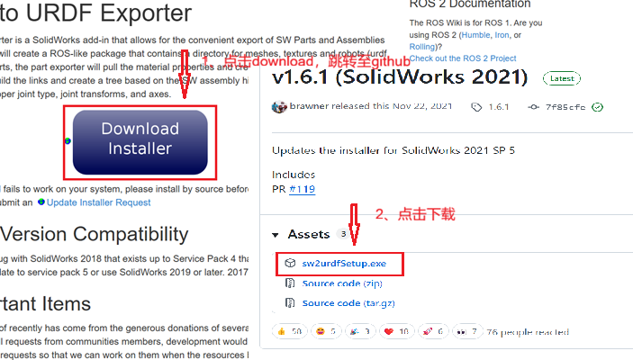 |
| 2. 本地安装 | 关闭 SolidWorks，运行下载的安装程序，按照安装向导完成安装。 | 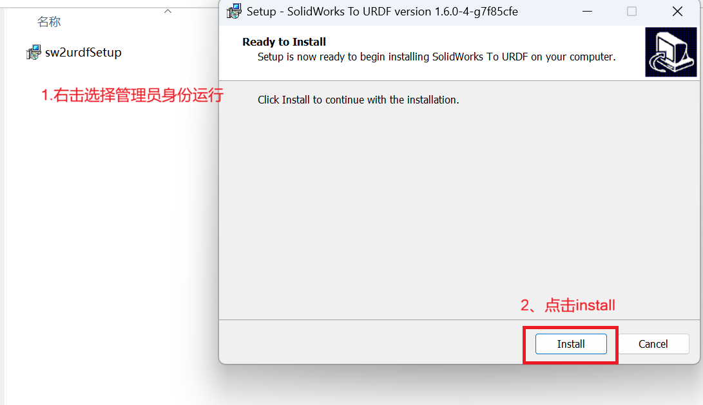 |
| 3. 在 SolidWorks 中激活 | 重新打开 SolidWorks，依次进入“工具 → 插件（Add-Ins）”，找到 SolidWorks to URDF Exporter，并勾选“活动插件”。如需启动时自动加载，可同时勾选“启动”。 | 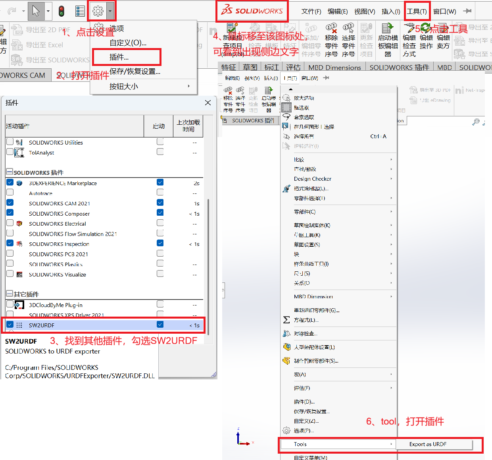 |

激活后打开一个装配体，确认“工具”菜单中出现 `Export as URDF` 命令。如果没有出现，应重新检查插件是否安装成功并已启用。

#### 5.2.2 下载并整理模型

JoyArm CAD 模型下载地址：*待补充 GitHub 仓库链接*。

1. 下载并解压完整模型，保留总装、子装配体和零件之间的目录关系。
2. 在 SolidWorks 中打开 JoyArm 总装文件（文件名*待补充*）。
3. 检查是否存在丢失引用、压缩零件或错误配合，然后重建装配体。
4. 另存一份专用于导出的配置或装配体，例如 `JoyArm_dm_v1_1_mdh_export`，避免修改生产装配体。
5. 将机械臂调整到约定的六轴机械零位并保存。后续坐标系设置和导出均以该姿态为基准。
6. 将夹爪开合机构固定或排除出导出分组；夹爪外壳若需要显示，可作为固定几何并入 `link6`。


导出前，还要按运动关系划分连杆：运动时始终保持相对静止的零件属于同一个 `link`，能够发生相对运动的两组零件通过 `joint` 连接。例如，同一连杆上的壳体和紧固件通常归为一组，关节两侧发生相对转动的零件应划入不同连杆。

> 📌 **统一零位**：CAD 中的导出姿态应对应 URDF 中所有关节角均为 0 的姿态。如果 CAD 零位与控制程序零位不同，必须记录两者之间的角度偏置。

#### 5.2.3 准备可视化工具

导出后需要检查模型外观和关节运动，可选择以下任一种工具：

| 工具 | 使用方式 | 主要用途 | 界面 |
|:---:|:---:|:---:|:---:|
| [URDF Studio](https://urdf.enkeebot.com/) | 在浏览器中打开，并将urdf整个文件夹拖入页面 | 查看 URDF 结构、外观和关节运动 | |
| VS Code URDF 可视化插件 | 在扩展市场搜索 `URDF Visualizer` 并按扩展说明安装 | 修改 URDF 参数时预览模型 |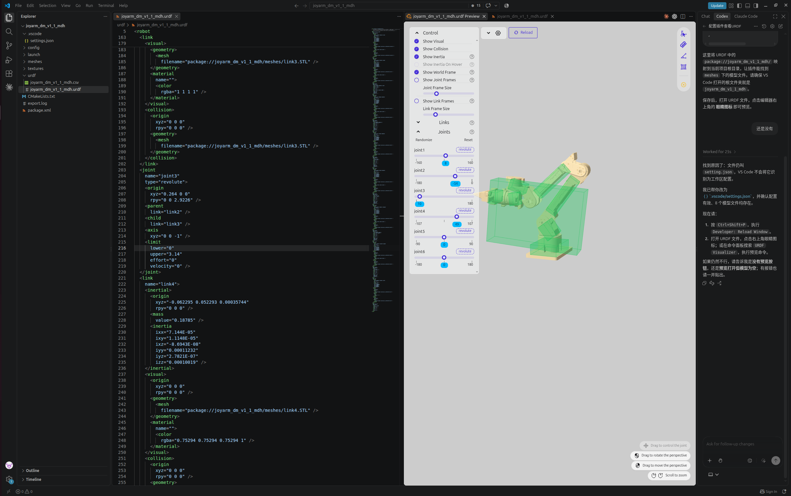 |

使用 VS Code 时，应打开包含 URDF 和网格资源的完整文件夹，再启动预览。不同扩展处理资源路径的方式可能不同，具体操作以所安装扩展的说明为准。

> 📌 **保留完整导出目录**：URDF 通常只保存网格文件的引用路径。缺少 STL 等网格文件时，可能只能看到坐标轴或关节树，无法显示机械臂外观。

### 5.3 建立 MDH 教学坐标系

关节坐标系决定关节位于哪里、绕哪条轴线运动以及哪个方向为正方向。本节在装配体零位下，为基座、六个关节和 `tcp` 建立导出所需的参考几何体。

下面使 `link1`～`link6` 的 Z 轴与对应关节轴线重合，并按第 4 节的 MDH 规则设置 X、Y 轴。本体关节正 Z 与电机反馈角增大时的实际关节转动方向一致，导出后检查 `joint1`～`joint6` 的本地轴为 `0 0 1`；夹爪运动轴按实际驱动与导轨方向单独设置。

#### 5.3.1 创建基准轴

| 步骤 | 说明 | 操作图片 |
|:---:|:---:|:---:|
| 1. 选择转轴几何特征 | 从第一个关节开始，找到与实际转轴同轴的圆柱面、圆孔或装配轴线。 | 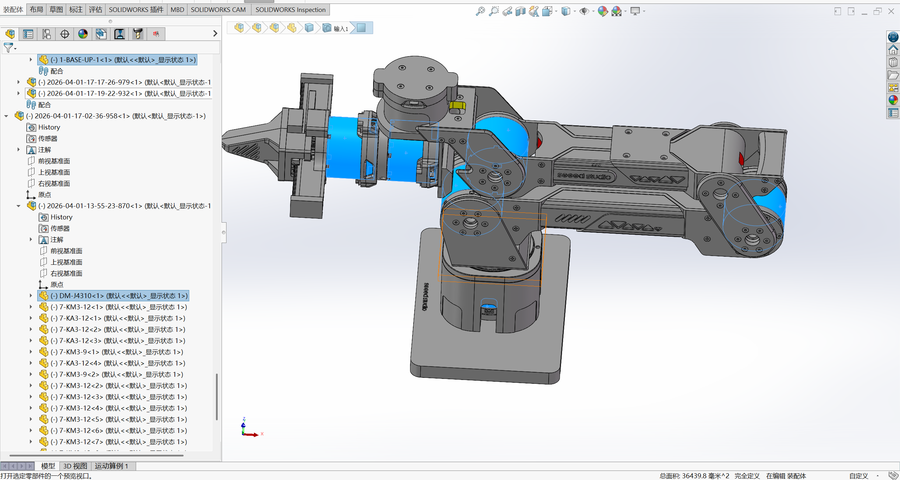 |
| 2. 创建基准轴 | 依次选择“装配体 → 参考几何体 → 基准轴”，根据选中的几何元素创建轴线。（后续的原点坐标系基准面入口都在此处，后面不过多赘述） | 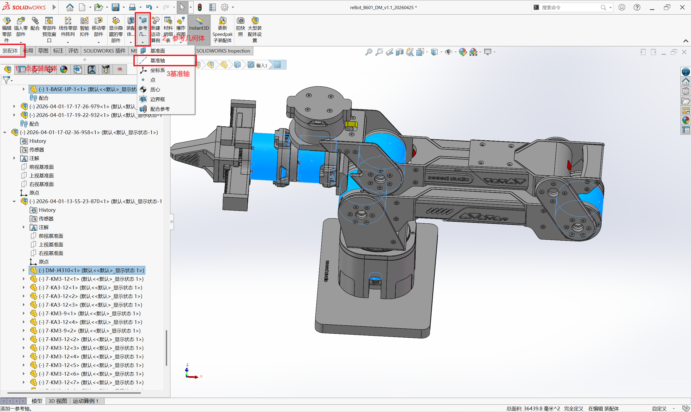 |
| 3. 选择基准轴 | 选择参考面 → 圆柱圆锥面 | 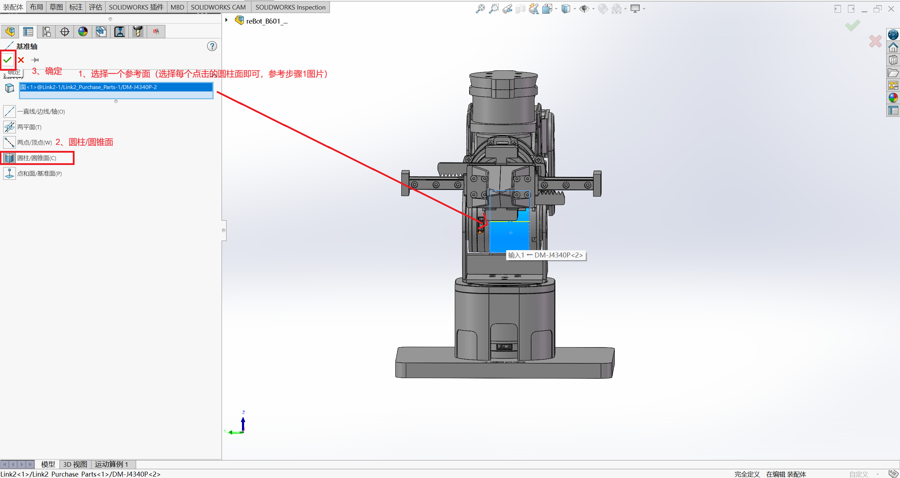 |
| 4. 命名基准轴 | 按照从基座到末端的顺序，将六条基准轴依次命名为 `axis_joint1`～`axis_joint6`。 | 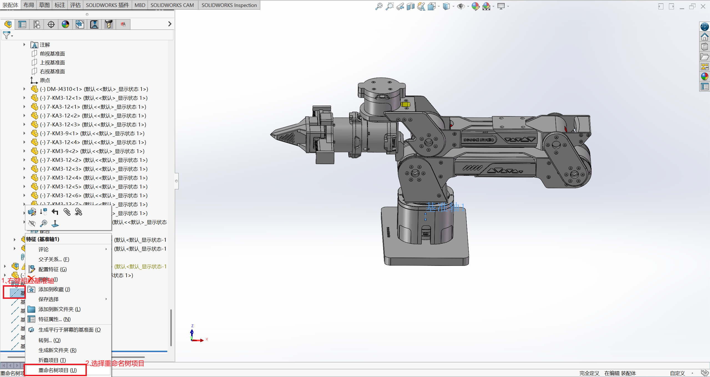 |


> 最终效果


#### 5.3.2 按 MDH 规则确定坐标系原点


如果模型中没有可直接选择的交点，可先创建基准面、草图线或参考点，再用它定位原点。
本次确定坐标系原点需要建立三个基准面，操作如下：

| 步骤 | 说明 | 操作图片 |
|:---:|:---:|:---:|
| 1. 建立`基准面1` | 依次选择“装配体 → 参考几何体 → 基准面”，选择“第一参考”和“第二参考”，确认预览位置正确后创建基准面。 | 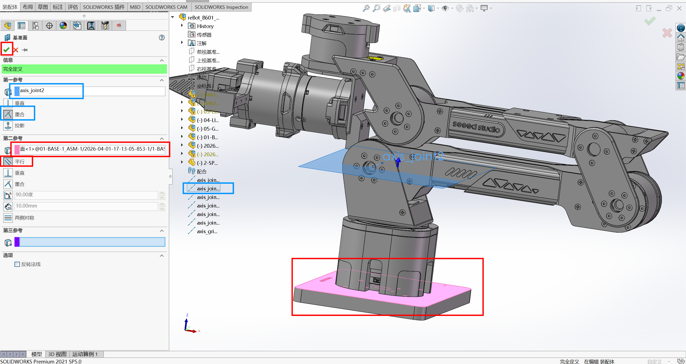 |
| 2. 建立`基准面2` | 再次进入“装配体 → 参考几何体 → 基准面”，选择“第一参考”和“第二参考”，确认方向与位置后创建基准面。 | 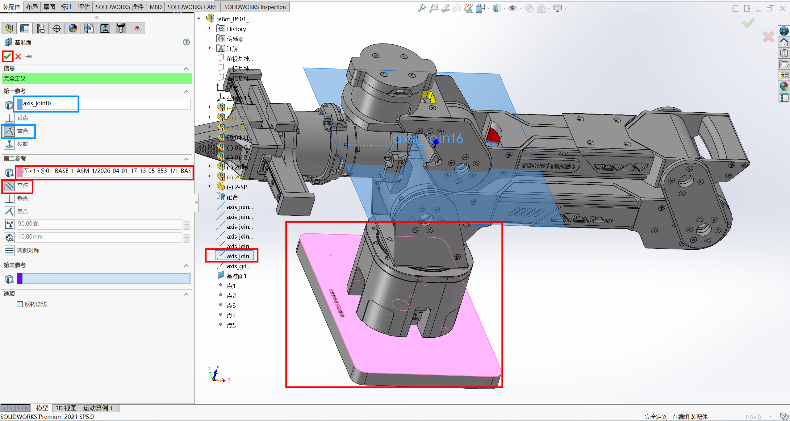 |
| 3. 建立`基准面3` | 再次进入“装配体 → 参考几何体 → 基准面”，选择“第一参考”和“第二参考”，确认方向与位置后创建基准面。 | 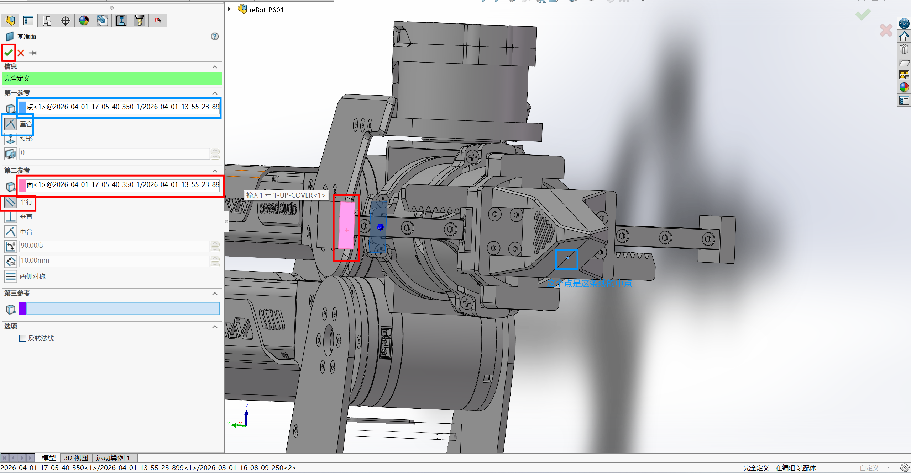 |

三个基准面建立完成后，使用它们的交线或交点继续定位坐标系原点。
本节直接按照第 4 节确定的 MDH 建系规则，在 SolidWorks 中标出各坐标系原点。

| 步骤 | 操作说明 | 操作图片 |
|:---:|:---:|:---:|
| 1. 确定基座原点 | 装配体  → 参考几何体 → 点 → 选取基座底面安装面中心 → 圆弧中心  → 确定 | 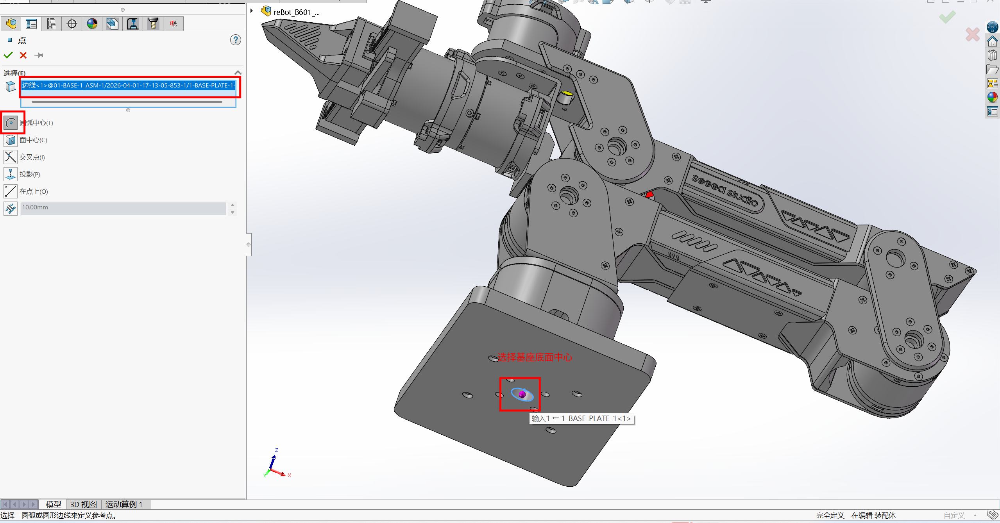 |
| 2. 确定 `origin_link1` 原点 |  选择`axis_joint1`和`基准面1` → 选择`交叉点` → 确定| 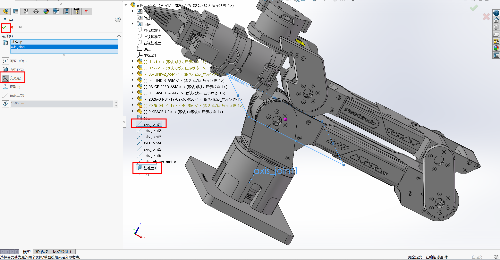 |
| 3. 确定 `origin_link2` 原点 |  选择`axis_joint2`和`上视基准面` → 选择`交叉点` → 确定 | 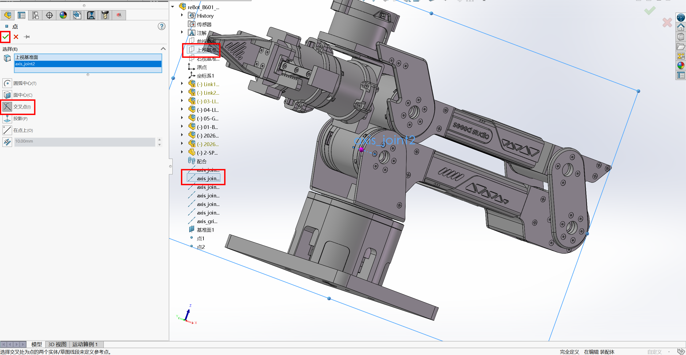 |
| 4. 确定 `origin_link3` 原点 |   选择`axis_joint3`和`上视基准面` → 选择`交叉点` → 确定| 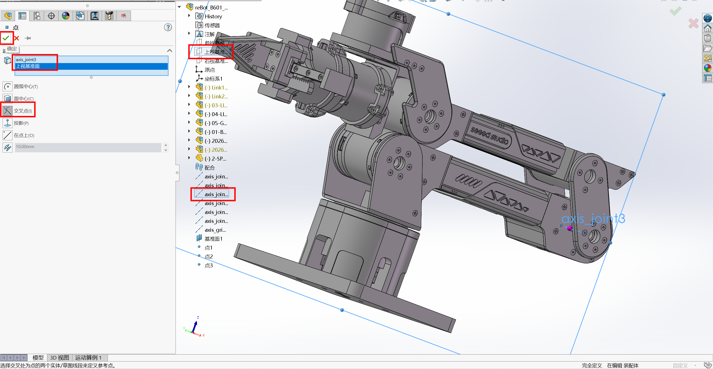 |
| 5. 确定 `origin_link4` 原点 |  选择`axis_joint4`和`上视基准面` → 选择`交叉点` → 确定 | 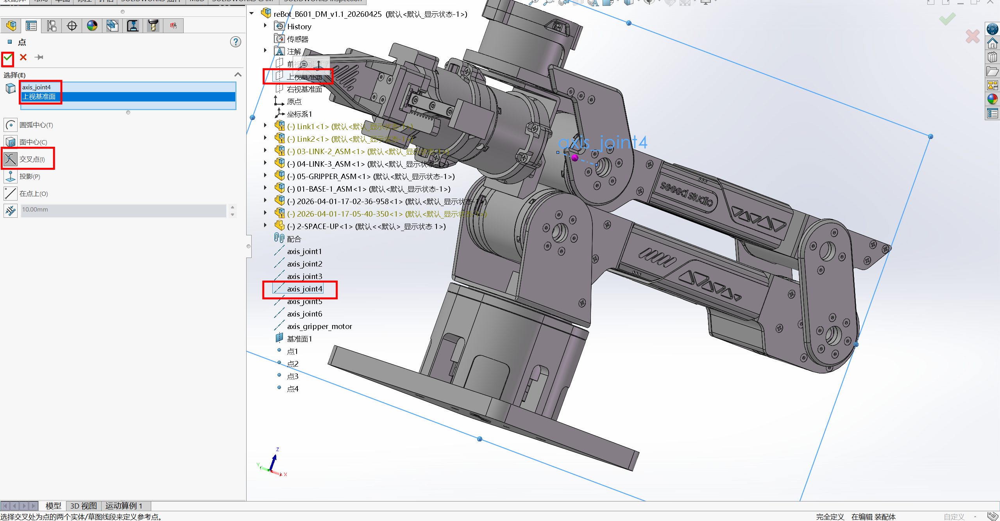 |
| 6. 确定 `origin_link5` 原点 |选择`axis_joint5`和`基准面2` → 选择`交叉点` → 确定| 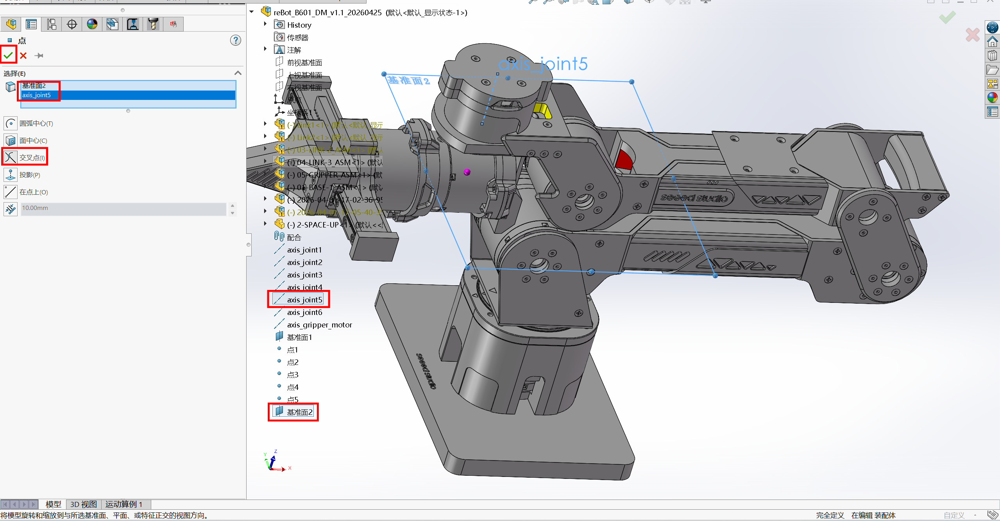 |
| 7. 确定 `origin_link6` 原点 |选择`axis_joint5`和`axis_joint6` → 选择`交叉点` → 确定  | 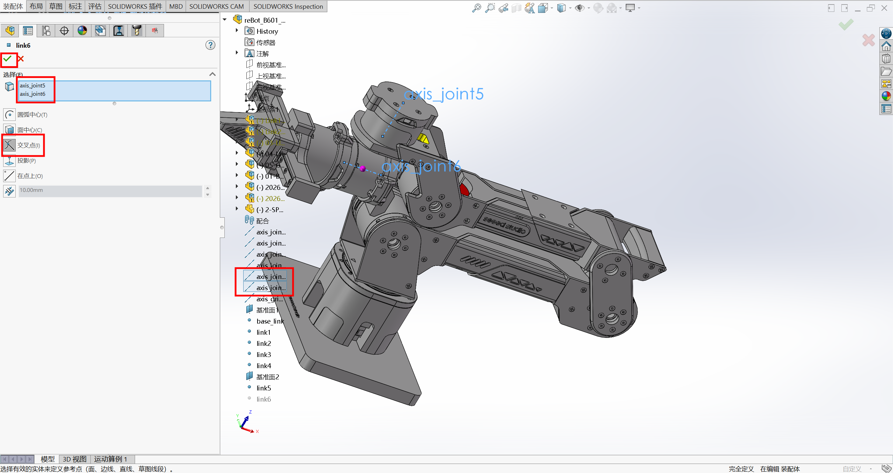 |
| 8. 确定 `origin_tcp` 原点 | 在夹爪的实际夹持中心创建参考点，并确认其与 `link6` 固连。 | 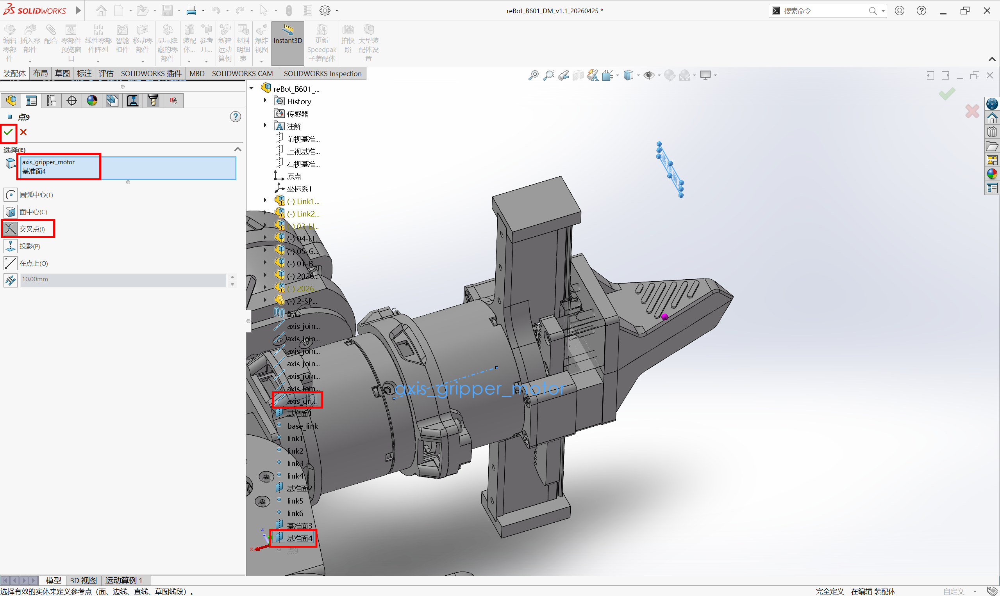 |
| 9. 检查原点  | 显示全部参考点，对照第 4 节的坐标系图和 MDH 参数表逐一检查。 | 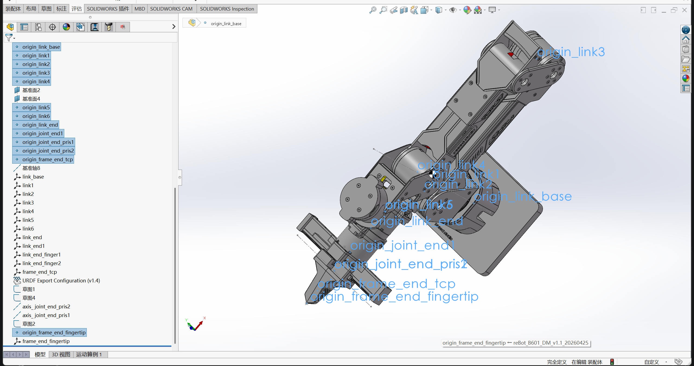 |


#### 5.3.3 设置坐标轴方向

在 SolidWorks 中依次选择“装配体 → 参考几何体 → 坐标系”，使用 5.3.2 创建的参考点作为原点，再根据第 4 节确定的 MDH 方向选择 X 轴和 Z 轴参考。各坐标系的操作如下：
几点原则：

<!-- 原文备份：5.3.3 原坐标轴方向说明
1、Z 轴沿关节转轴：link1～link6 的 Z 轴分别与 axis_joint1～axis_joint6 重合。

2、Z 轴正方向与关节正方向一致：按右手定则检查：右手拇指指向 Z 轴正方向，四指弯曲方向就是关节角正方向。该方向还要与电机控制程序中的正方向一致。

3、X 轴遵循 MDH 建系规则：X 轴沿当前关节轴与下一关节轴之间的公共法线，并由当前关节轴指向下一关节轴。
若两根轴相交，X 轴取两根轴所在平面的法向方向；若两根轴平行，则按第四节已经确定的 MDH 方向设置
-->

1. **Z 轴线重合**：`link1`～`link6` 的 Z 轴线分别与 `axis_joint1`～`axis_joint6` 重合。
2. **设置正方向**：前文已约定本体关节的 Z 轴正方向与实际关节正转方向一致，`joint1`～`joint6` 统一使用 `axis="0 0 1"`。夹爪电机7及两侧手指按各自运动轴配置。
3. **按 MDH 设置 X 轴**：平行或异面轴沿公共法线由当前轴指向下一轴；相交轴按第 4.3 节规定的法向和 $\alpha$ 符号选向。
4. **补齐 Y 轴**：按照 $\boldsymbol{y}_i=\boldsymbol{z}_i\times\boldsymbol{x}_i$ 形成右手坐标系。

| 步骤 | 操作说明 | 操作图片 |
|:---:|:---:|:---:|
| 1. 建立 `link_base` |右手建系，Z轴向上，X轴向前  | 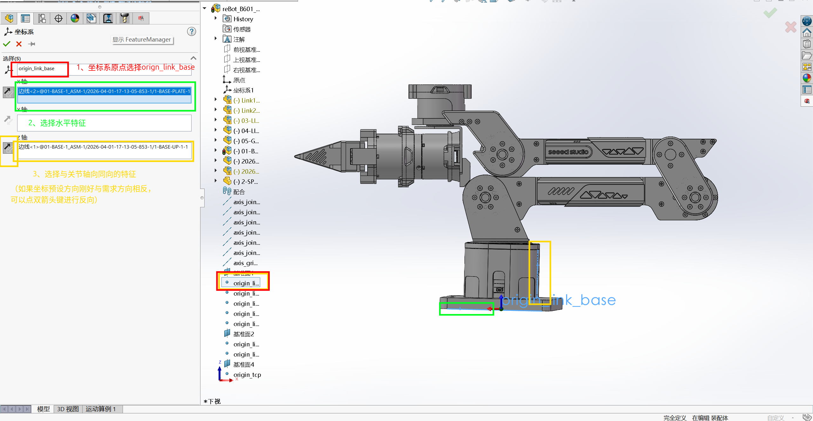 |
| 2. 建立 `link1` | 选择 `origin_link1` 作为原点，选择 `axis_joint1` 作为 Z 轴，再选择对应的 MDH X 轴参考 → 确定 → 命名为 `link1`。 | 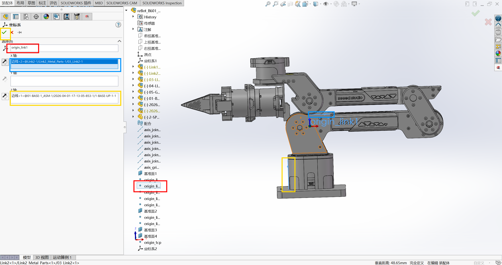 |
| 3. 建立 `link2` | 选择 `origin_link2` 作为原点，选择 `axis_joint2` 作为 Z 轴，再选择对应的 MDH X 轴参考 → 确定 → 命名为 `link2`。 | 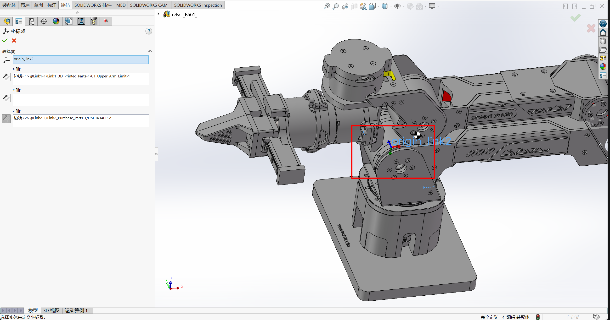 |
| 4. 建立 `link3` | 选择 `origin_link3` 作为原点，选择 `axis_joint3` 作为 Z 轴，再选择对应的 MDH X 轴参考 → 确定 → 命名为 `link3`。 | 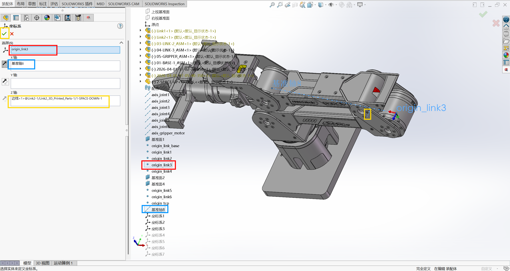 |
| 5. 建立 `link4` | 选择 `origin_link4` 作为原点，选择 `axis_joint4` 作为 Z 轴，再选择对应的 MDH X 轴参考 → 确定 → 命名为 `link4`。 | 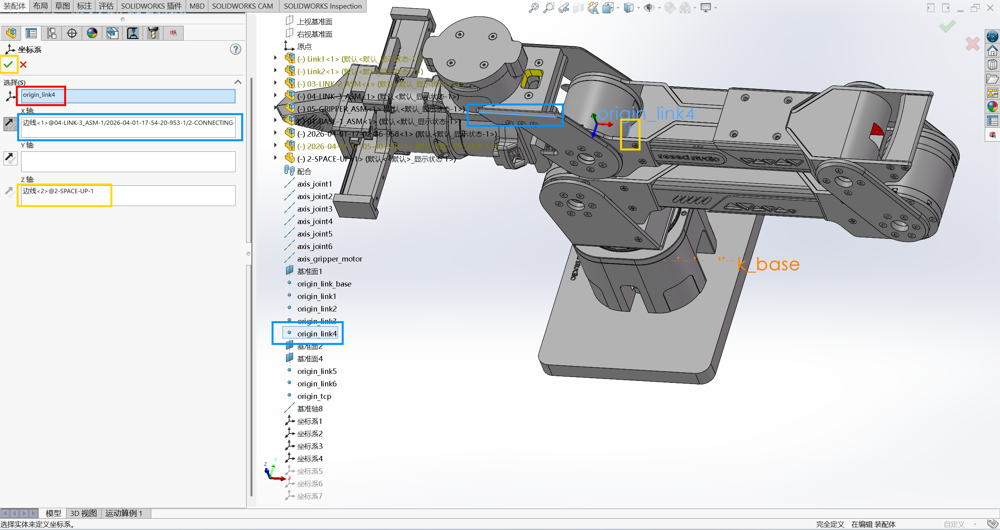 |
| 6. 建立 `link5` | 选择 `origin_link5` 作为原点，选择 `axis_joint5` 作为 Z 轴，再选择对应的 MDH X 轴参考 → 确定 → 命名为 `link5`。 | 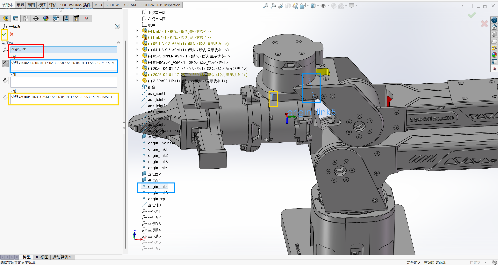 |
| 7. 建立 `link6` | 选择 `origin_link6` 作为原点，选择 `axis_joint6` 作为 Z 轴，再按照第 4 节的末连杆系方向设置 X 轴 → 确定 → 命名为 `link6`。 | 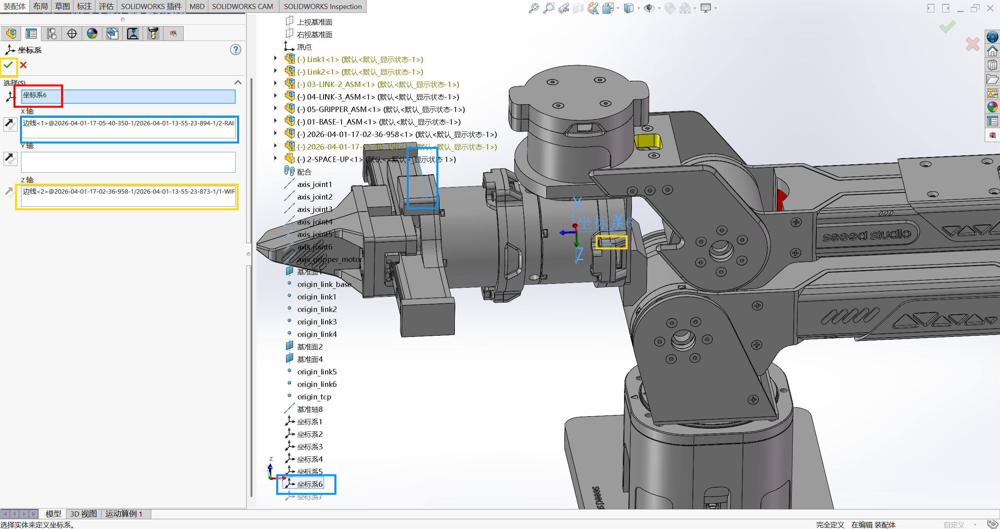 |
| 8. 建立 `tcp` | 选择 `origin_tcp` 作为原点，使 Z 轴沿工具伸出方向、X 轴沿夹爪开合方向 → 确定 → 命名为 `tcp`。 | 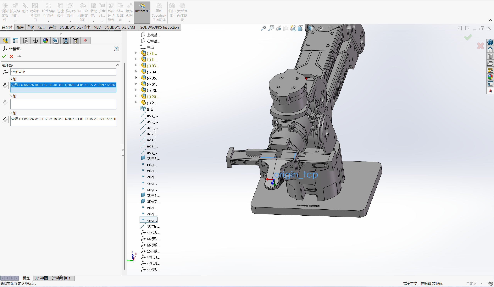 |
| 9. 检查全部坐标系 | 显示 `link_base`、`link1`～`link6` 和 `tcp`，检查原点、轴向及命名是否正确。 | 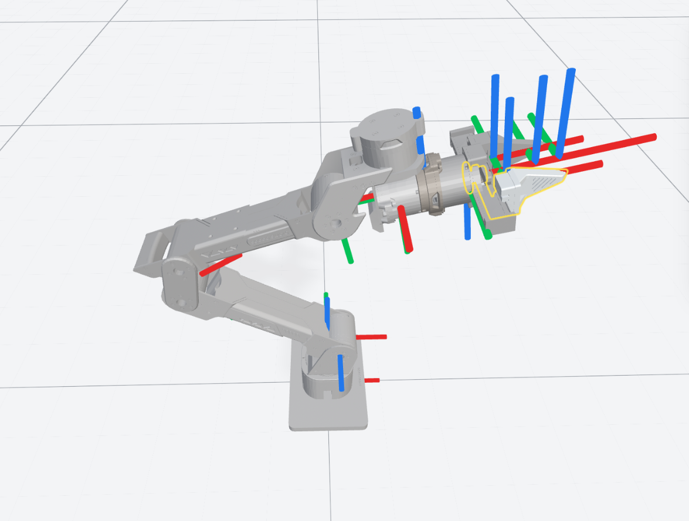 |

如果坐标轴箭头与第 4 节规定的方向相反，在坐标系设置界面中使用“反转方向”进行调整。完成后保存装配体。

> ⚠️ **不要混用坐标系**：可视模型的几何坐标系、质量属性中的质心坐标系和运动学 link 坐标系用途不同。本教程要求运动学的 `link_base`、`link1`～`link6` 与第二章 MDH 建系一致；质心仍应由 SolidWorks 质量属性计算，不能强行放在关节轴上。

### 5.4 在 SW2URDF 中配置运动树

#### 5.4.1 配置六轴本体

打开已经保存的 JoyArm 总装文件，点击 `Export as URDF` 进入配置界面，然后按照从基座到末端的顺序建立运动链。

<!-- 原文备份：5.4.1 原逐节点配置表
| 1. 配置 `link_base` | 将根连杆命名为 `link_base`，选择固定基座的全部零件，并选择参考坐标系 `link_base`。根连杆不填写父关节和关节轴。 | 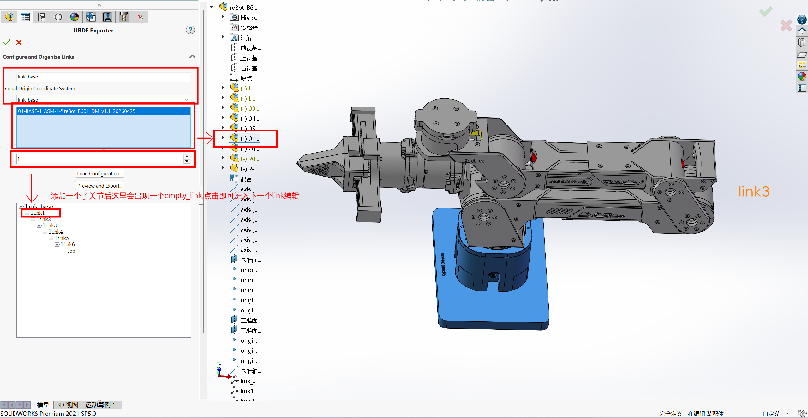 |
| 2. 配置 `link1` | 父连杆选择 `link_base`，Link Name 填写 `link1`，Joint Name 填写 `joint1`，Reference Coordinate System 选择 `link1`，Reference Axis 选择 `axis_joint1`，Joint Type 选择 `revolute`，然后选择属于 `link1` 的零件。 | 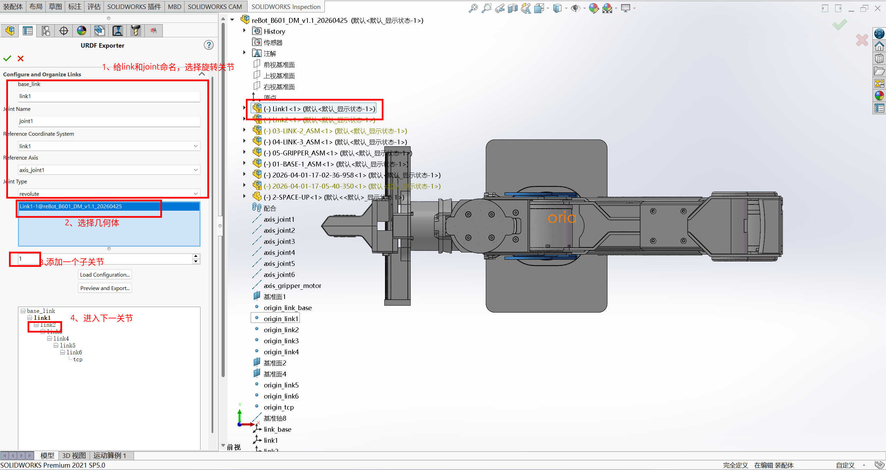 |
| 3. 配置 `link2` | 父连杆选择 `link1`，Link Name 填写 `link2`，Joint Name 填写 `joint2`，Reference Coordinate System 选择 `link2`，Reference Axis 选择 `axis_joint2`，Joint Type 选择 `revolute`，然后选择属于 `link2` 的零件。 | 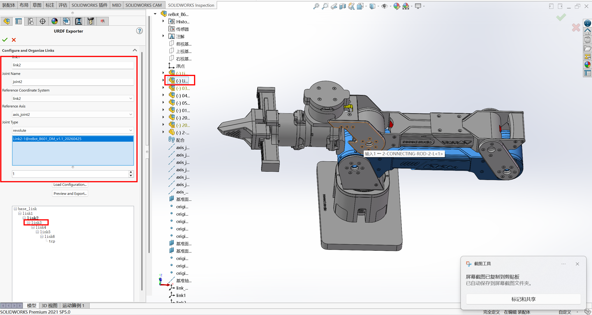 |
| 4. 配置 `link3` | 父连杆选择 `link2`，Link Name 填写 `link3`，Joint Name 填写 `joint3`，Reference Coordinate System 选择 `link3`，Reference Axis 选择 `axis_joint3`，Joint Type 选择 `revolute`，然后选择属于 `link3` 的零件。 | 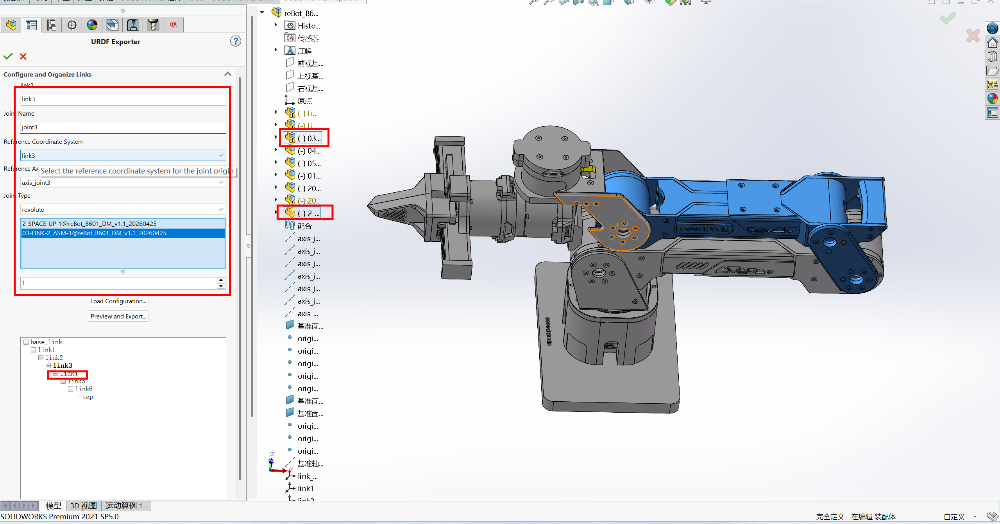 |
| 5. 配置 `link4` | 父连杆选择 `link3`，Link Name 填写 `link4`，Joint Name 填写 `joint4`，Reference Coordinate System 选择 `link4`，Reference Axis 选择 `axis_joint4`，Joint Type 选择 `revolute`，然后选择属于 `link4` 的零件。 | 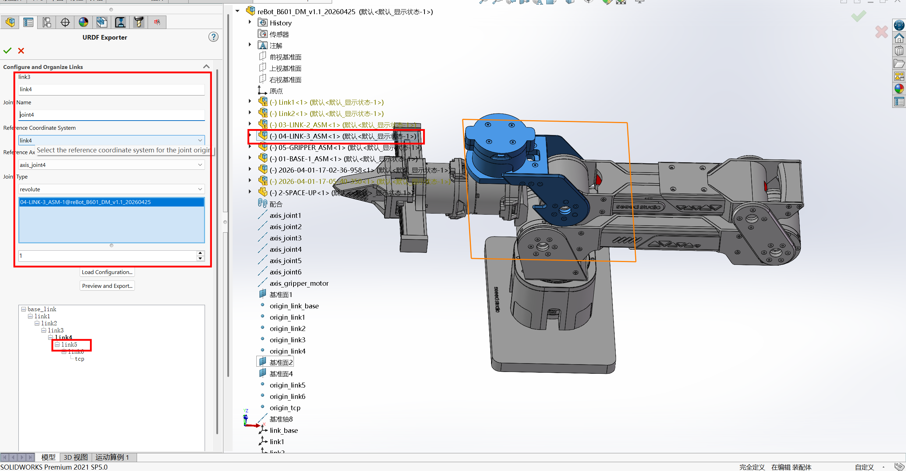 |
| 6. 配置 `link5` | 父连杆选择 `link4`，Link Name 填写 `link5`，Joint Name 填写 `joint5`，Reference Coordinate System 选择 `link5`，Reference Axis 选择 `axis_joint5`，Joint Type 选择 `revolute`，然后选择属于 `link5` 的零件。 | 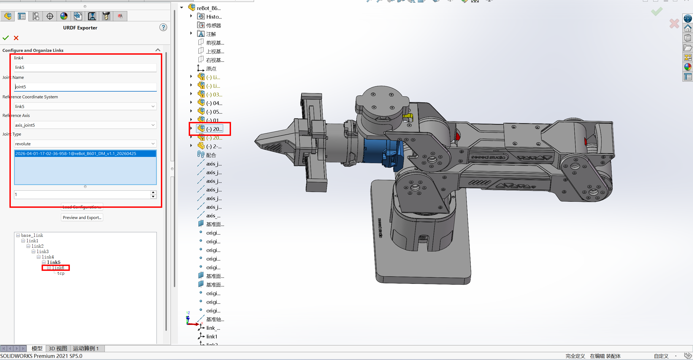 |
| 7. 配置 `link6` | 父连杆选择 `link5`，Link Name 填写 `link6`，Joint Name 填写 `joint6`，Reference Coordinate System 选择 `link6`，Reference Axis 选择 `axis_joint6`，Joint Type 选择 `revolute`。教学版还需将固定状态的夹爪零件一并选入 `link6`。 | 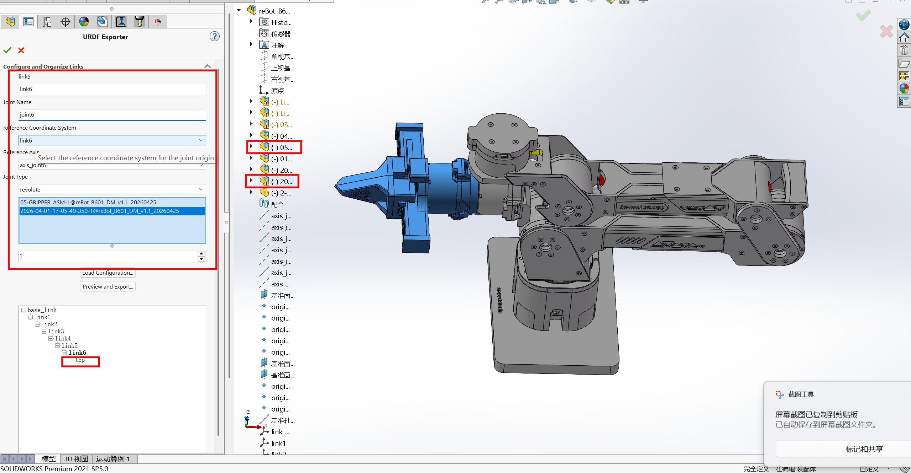 |
-->

配置方法对六个活动关节完全相同：填写当前 link、父 link 和 joint 名称，选择对应的 Reference Coordinate System 与 Reference Axis，再把始终相对固定的实体零件分到该 link。参数对应关系如下：

| Link Name | Parent Link | Joint Name | Reference Coordinate System | Reference Axis |
|:---:|:---:|:---:|:---:|:---:|
| `link_base` | — | — | `link_base` | — |
| `link1` | `link_base` | `joint1` | `link1` | `axis_joint1` |
| `link2` | `link1` | `joint2` | `link2` | `axis_joint2` |
| `link3` | `link2` | `joint3` | `link3` | `axis_joint3` |
| `link4` | `link3` | `joint4` | `link4` | `axis_joint4` |
| `link5` | `link4` | `joint5` | `link5` | `axis_joint5` |
| `link6` | `link5` | `joint6` | `link6` | `axis_joint6` |

`link_base` 选择全部固定基座零件；其余每个实体零件只能归入一个 link。教学版把固定状态的夹爪实体归入 `link6`。以下截图展示各节点在 SW2URDF 中的位置：


六轴机械臂主体的运动链应满足：

```text
link_base
└── joint1 → link1
    └── joint2 → link2
        └── joint3 → link3
            └── joint4 → link4
                └── joint5 → link5
                    └── joint6 → link6
```

> 📌 **名称不要混填**：Joint Name 使用 `joint1`～`joint6`，Reference Axis 才使用 `axis_joint1`～`axis_joint6`。每个实体零件只能归入一个 link。

#### 5.4.2 添加固定 `tcp`

`tcp` 是 SolidWorks 中的工具参考坐标系，在教学版 URDF 中应是无网格、无碰撞体、无质量和惯量的纯参考 link。按照下表将它固定连接到 `link6`：

| 步骤 | 操作说明 | 操作图片 |
|:---:|:---:|:---:|
| 1. 添加 `tcp` 节点 | 在 `link6` 下添加子节点，Link Name 填写 `tcp`，Joint Name 填写 `joint_tcp`，Reference Coordinate System 选择 `tcp`，Joint Type 选择 `fixed`。Reference Axis 使用 `Automatically Generate` 或保持为空，并且不选择任何实体零件。 | 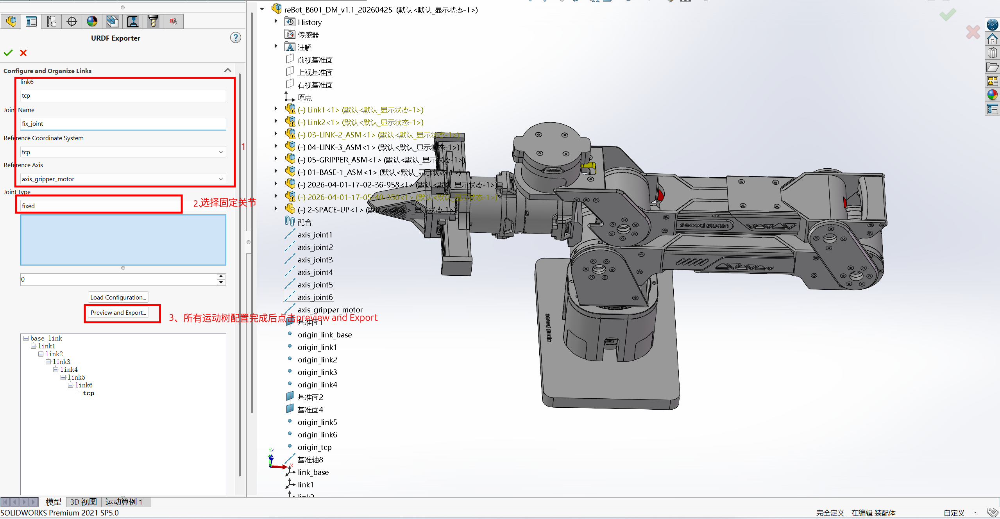 |
| 2. 检查运动树 | 确认末端层级为 `link6 → joint_tcp → tcp`，并确认 `tcp` 下方没有其他夹爪运动节点。 |  |

不同版本的 SW2URDF 界面可能不提供空 link 或 fixed frame。遇到这种情况，先从 SolidWorks 导出到 `link6`，再在生成的 URDF 根元素结束前补入：

```xml
<link name="tcp"/>

<joint name="joint_tcp" type="fixed">
  <parent link="link6"/>
  <child link="tcp"/>
  <origin xyz="x y z" rpy="r p y"/>
</joint>
```

其中 `xyz` 和 `rpy` 必须填写参考坐标系 `tcp` 相对于 `link6` 的实际变换，不能照抄示例字母。即使末端固定，也不能省略 `joint_tcp`：URDF 的两个 link 必须通过 joint 建立父子关系。

#### 5.4.3 检查并导出模型

完成运动树配置后，按照下表检查参数并导出模型。URDF 中长度使用 m，角度使用 rad，角速度使用 rad/s，力矩使用 N·m。角度换算关系为：

$$
\theta_{\mathrm{rad}}=\theta_{\mathrm{deg}}\frac{\pi}{180}
$$

| 步骤 | 操作说明 | 操作图片 |
|:---:|:---:|:---:|
| 1. 检查关节参数 | 依次检查 `joint1`～`joint6` 的角度上下限、速度上限和力矩上限。参数未确认时，不使用插件默认值代替真实数据。 | 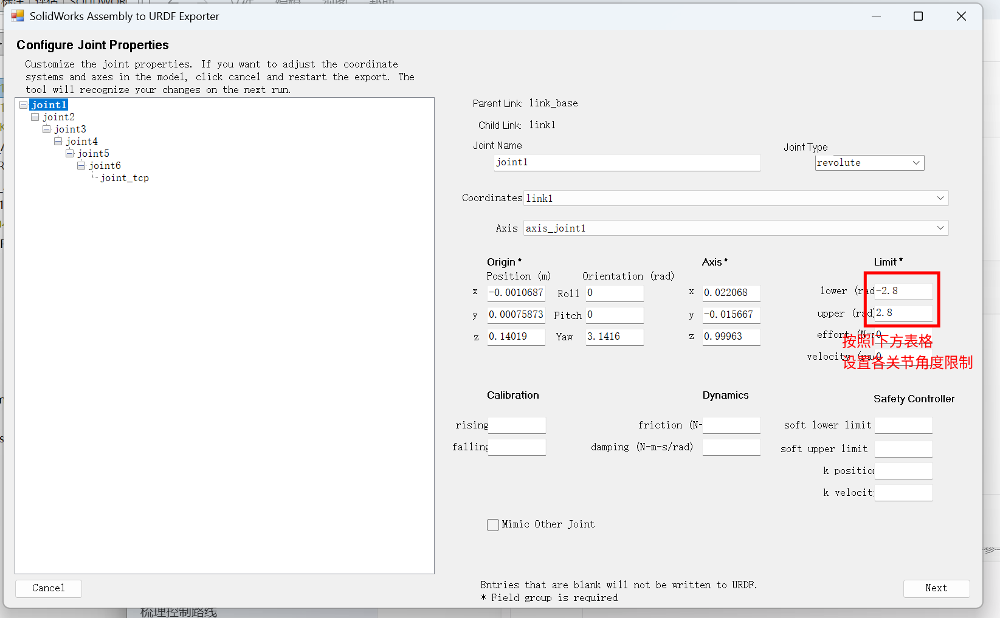 |
| 2. 检查连杆属性 | 检查各 link 的可视网格、碰撞网格、质量、质心和惯性张量，确认零件分组与 CAD 材料设置正确。 | 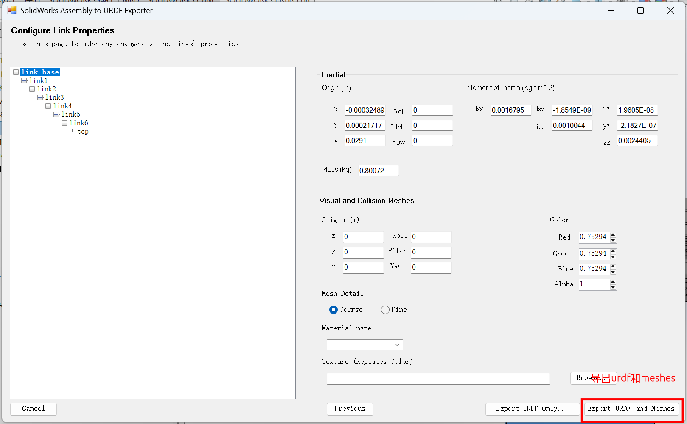 |
| 3. 导出模型 | 点击保存，等待 URDF、网格文件和相关配置生成完成。 | 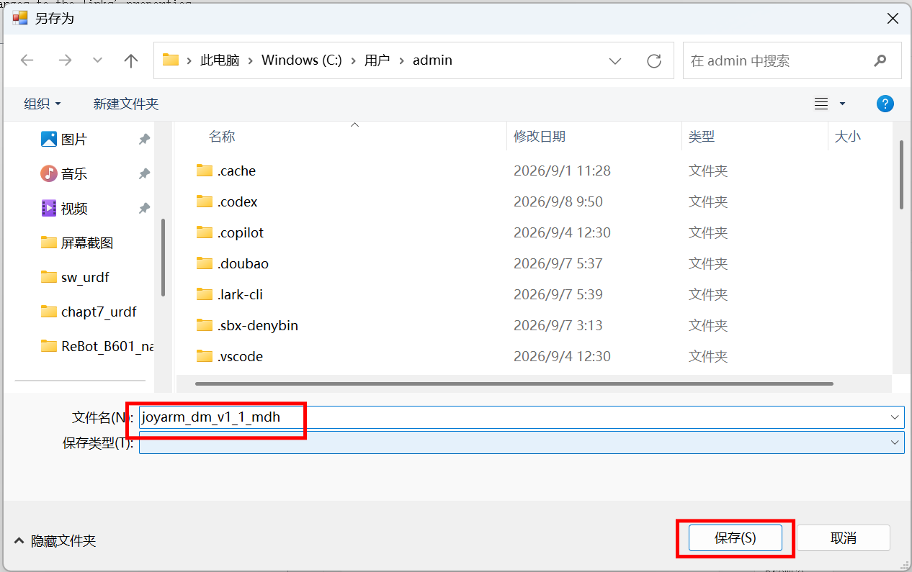 |

JoyArm 六个关节的角度限位如下，数值按可视化界面截图记录，保留两位小数；`lower` 和 `upper` 分别对应 URDF 中的角度下限和上限。

| 关节 | 下限 `lower`（rad） | 上限 `upper`（rad） |
|:---:|:---:|:---:|
| `joint1` | -2.80 | 2.80 |
| `joint2` | -3.14 | 0.00 |
| `joint3` | 0.00 | 3.14 |
| `joint4` | -1.87 | 1.87 |
| `joint5` | -1.57 | 1.57 |
| `joint6` | -3.14 | 3.14 |

速度上限和力矩上限：*待补充经确认的参数*。

导出后的典型目录如下，实际结构以插件生成结果为准：

```text
JoyArm_dm_v1_1_mdh_description/
├── urdf/
│   └── JoyArm_dm_v1_1_mdh.urdf
└── meshes/
    ├── link_base.STL
    ├── link1.STL
    └── ...
```

导出后打开 URDF 文件，确认连杆和关节名称完整、父子关系正确，并检查网格引用路径能否找到对应文件。移动模型时，应整体移动导出目录，避免 URDF 与网格文件失去路径关系。


### 5.5 验收导出结果

导出完成后，不要只检查模型能否打开。应从基座到末端逐级验收：

1. 用 URDF 检查工具确认 XML、link 数量、joint 数量和运动树能够正确解析。
2. 将六个关节设为 0，对照 SolidWorks 检查零位外观和总体尺寸。
3. 每次只给一个关节增加小角度，检查转轴位置、电机反馈角增大对应的实际转动方向和带动的下游零件。
4. 检查六组角度限位，并确认 \`effort\`、\`velocity\` 的真实数据仍待补充。
5. 确认 \`tcp\` 位于夹持中心，且在教学版中没有网格、碰撞体和惯性。
6. 选择多组非零关节角，对照第二章的 MDH 正运动学结果。

| 异常现象 | 优先检查内容 |
|:---:|:---:|
| 零位下连杆错位 | CAD 导出姿态、关节 \`origin\` 和父子关系 |
| 关节绕错位置旋转 | Reference Axis 与关节原点 |
| 正方向与预期相反 | 参考轴相对关节坐标系的方向、导出 axis 和电机反馈角增大的实际转向 |
| 网格缺失 | \`package://\` 路径及 meshes 目录 |
| TCP 带有实体属性 | SW2URDF 零件分组及导出后的 \`tcp\` 标签 |
| URDF 与 MDH 逐渐偏离 | 基座、零位、角度符号和固定安装角 |

对应验证脚本位于 \`joyarm_code/chapt/chapt7_urdf_demo.py\`，待最终教学版 URDF 和参数确认后补充运行结果。


<!-- 原文备份：清理出的可见评审批注
///leader说：如果这个章节光看目录不能让读者非常明白这个章节的作用，那么就需要在这个位置详细介绍，让读者能很快找到自己需要看的内容
///简略一些，leader说两句话能放到一句话里说完就放到一句话里面，观看者是一个小白，他不会想看到大段文字，也不会想看到太详细的内容
///已经确定，这里不需要大范围涉及其他类型的机械臂，科普第一章已经科普过了，这里就是带大家确定机械臂构型，选择串联还是并联or其他，因为我们需要机械臂运动的范围比较大（或者其他原因）故选择6r机器人会更好之类的，说一下优点（大致思路就是过一遍选型思路，后面因为什么什么，所以选择6r/7r串联机械臂（因为我们的教程也都是基于JoyArm这个本体的）
-->
