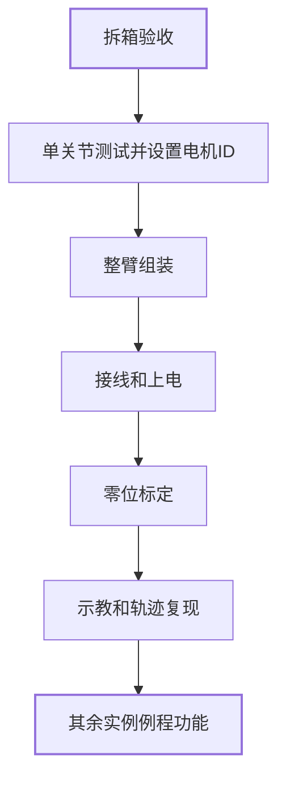

# 快速上手

> 📌 **本章定位**：面向"想立刻用起来"的读者。**无需任何理论基础**，按下面流程操作即可让 JoyArm 机械臂动起来。想深入了解原理，请前往[基础篇](chapter2_1.md)、[进阶篇](chapter3_1.md)和[应用篇](chapter4_1.md)。

## 🔒 操作安全须知（首次上电必读）

> ⚠️ **请在第一次上电前完整阅读本节，操作不当可能损坏机械臂或造成人身伤害。**

| # | 安全要求 | 说明 |
|:---:|:---:|:---:|
| 1 | **保持工作空间清空** | 机械臂工作半径内不得有人员与障碍物 |
| 2 | **先就位再上电** | 先将机械臂调至安全姿态（零位）再上电 |
| 3 | **上电后禁止强行扳动** | 上电后切勿手动强行扳动关节，会损坏电机减速器 |
| 4 | **紧急情况立即断电** | 出现异常立即按下急停按钮或断开电源 |

---

## JoyArm 基本信息

### 物理参数

> 🖼️ **图片占位**：JoyArm 机械臂整体外观图 + 坐标系标注图

| 参数 | 数值 | 说明 |
|:---:|:---:|:---:|
| 自由度 | 6 DOF | 六旋转关节 |
| 臂展长度 | *待补充* | 末端可达最大水平距离 |
| 极限负载 | *待补充* | 末端可承载最大重量 |
| 工作空间范围 | *待补充* | 末端可达空间包络 |
| 自身重量 | *待补充* | 不含末端执行器 |
| MDH 参数表 | 详见本页底部"附件与参考" | 改进 D-H 参数 |

### 电机参数

> 🖼️ **图片占位**：关节电机实物图 + 接口标注图

| 参数 | 数值 | 说明 |
|:---:|:---:|:---:|
| 峰值扭矩 | *待补充* | 瞬时最大输出力矩 |
| 额定扭矩 | *待补充* | 长期稳定输出力矩 |
| 额定电压 | *待补充* | 供电电压 |
| 单电机重量 | *待补充* | 含减速器 |
| 通信接口 | CAN | 详见[关节电机](chapter1_2.md) |

---

## 物料清单（BOM）

> 🖼️ **图片占位**：全部零部件全家福照片

| 类别 | 名称 | 数量 | 获取方式 | 备注 |
|:---:|:---:|:---:|:---:|:---:|
| 结构件 | 底座 | 1 | *购买/打印链接* | *参数* |
| 结构件 | 连杆 x6 | 6 | *购买/打印链接* | *参数* |
| 执行器 | 关节电机 | 6 | *购买链接* | 见电机参数表 |
| 末端执行器 | 两指夹爪 | 1 | *购买链接* | 详见[两指夹爪](chapter1_4.md) |
| 线缆 | USB 转 CAN 线 | 1 | *购买链接* | 上位机通信 |
| 电源 | 直流电源 | 1 | *购买链接* | *规格* |

---

## 快速上手流程

---

## 单电机测试

### 测试流程

| 测试项 | 出厂默认值 | 测试方法 |
|:---:|:---:|:---:|
| 电机 ID 读写 | *ID = ?* | 通过 CAN 读写确认 |
| 位置控制 | *待补充* | 下发目标角度，观察到位 |
| 速度控制 | *待补充* | 下发目标速度，观察运转 |
| 力矩反馈 | *待补充* | 读取实时力矩值 |

---

## 整臂组装

> 🖼️ **图片占位**：组装前全部零部件拍摄图 + 组装步骤分步图

### 组装步骤

| 步骤 | 操作 | 图示 |
|:---:|:---:|:---:|
| 1 | 安装底座并固定 | *待补充* |
| 2 | 依次连接 6 个关节连杆 | *待补充* |
| 3 | 理线并固定线缆 | *待补充* |
| 4 | 安装末端执行器 | *待补充* |

---

## 初始化

### 上电与零位标定

> 🖼️ **图片占位**：机械臂安全姿态示意图

| 项目 | 出厂默认值 |
|:---:|:---:|
| 安全姿态（零位） | *待补充* |
| 标定方法 | *待补充* |

### 示教和轨迹复现

---

## 实例例程

| 例程名 | 功能 | 代码位置 |
|:---:|:---:|:---:|
| 例程 1 | *待补充* | *仓库链接* |
| 例程 2 | *待补充* | *仓库链接* |

---

## 初学者 FAQ

> 📚 以下问题若需深入理解原理，可点击跳转至对应篇章。

| 你的问题 | 简要回答 | 深入阅读 |
|:---:|:---:|:---:|
| 什么是机器人，机器人有哪些类别？ | 机器人是能自动执行任务的机器装置，分工业/服务、移动/固定等类别 | [基础篇：第1章](chapter2_1.md) |
| 什么是机械臂，有什么应用？为何做机械臂？ | 机械臂是模仿手臂功能的机械装置，工业/服务领域应用最广 | [基础篇：第1章](chapter2_1.md) |
| 机械臂的组件构成？核心知识概念有哪些？ | 关节、连杆、末端执行器构成；运动学/动力学/控制为核心 | [基础篇：第1章](chapter2_1.md) |
| 怎么让机械臂真正干活？我时间有限想直接用 | 看完使用篇即可上手基础操作 | [应用篇：第11章](chapter4_1.md) |
| 怎么让机械臂动起来？我想掌握原理 | 系统学习基础篇+进阶篇的运动学与控制 | [基础篇：第1章](chapter2_1.md) |

---

## 篇章内容速览

> 全教程共 4 篇：使用篇（操作上手）、基础篇（机器人学必备）、进阶篇（专业进阶）、应用篇（实机应用）。

<table>
  <thead>
    <tr>
      <th>篇标题</th>
      <th>章标题</th>
      <th>本章主要内容概览</th>
      <th>目录跳转</th>
    </tr>
  </thead>
  <tbody>
    <tr>
      <td rowspan="4" align="center"><strong>使用篇</strong></td>
      <td align="center">快速上手</td>
      <td align="center">让机械臂快速动起来的操作流程</td>
      <td align="center"><a href="chapter1_1.md">本章</a></td>
    </tr>
    <tr>
      <td align="center">关节电机</td>
      <td align="center">通过 Python/C++ 程序控制单关节电机</td>
      <td align="center"><a href="chapter1_2.md">第1章</a></td>
    </tr>
    <tr>
      <td align="center">六轴整臂</td>
      <td align="center">整臂上电、关节与位置控制、示教复现</td>
      <td align="center"><a href="chapter1_3.md">第2章</a></td>
    </tr>
    <tr>
      <td align="center">两指夹爪</td>
      <td align="center">夹爪接线、位置与力度控制（仅操作）</td>
      <td align="center"><a href="chapter1_4.md">第3章</a></td>
    </tr>
    <tr>
      <td rowspan="6" align="center"><strong>基础篇</strong></td>
      <td align="center">第1章 机器人与机械臂初识</td>
      <td align="center">机器人发展历史、分类与核心概念速扫盲</td>
      <td align="center"><a href="chapter2_1.md">第1章</a></td>
    </tr>
    <tr>
      <td align="center">第2章 空间位姿与位置正运动学</td>
      <td align="center">位姿矩阵表示、MDH 建系、正运动学求解</td>
      <td align="center"><a href="chapter2_2.md">第2章</a></td>
    </tr>
    <tr>
      <td align="center">第3章 位置逆运动学</td>
      <td align="center">逆解可解性、代数/几何/数值解法</td>
      <td align="center"><a href="chapter2_3.md">第3章</a></td>
    </tr>
    <tr>
      <td align="center">第4章 速度运动学与静力学</td>
      <td align="center">速度传递、雅可比、奇异性、静力学</td>
      <td align="center"><a href="chapter2_4.md">第4章</a></td>
    </tr>
    <tr>
      <td align="center">第5章 轨迹生成</td>
      <td align="center">关节空间与笛卡尔空间轨迹规划</td>
      <td align="center"><a href="chapter2_5.md">第5章</a></td>
    </tr>
    <tr>
      <td align="center">第6章 运动控制</td>
      <td align="center">单关节电机控制、整机位置/速度控制</td>
      <td align="center"><a href="chapter2_6.md">第6章</a></td>
    </tr>
    <tr>
      <td rowspan="4" align="center"><strong>进阶篇</strong></td>
      <td align="center">第7章 构型与结构设计、关节选型、装配体URDF导出</td>
      <td align="center">构型设计、结构设计、电机选型、URDF 导出</td>
      <td align="center"><a href="chapter3_1.md">第7章</a></td>
    </tr>
    <tr>
      <td align="center">第8章 动力学及控制实现</td>
      <td align="center">牛顿欧拉递推、动力学方程、基于动力学的控制</td>
      <td align="center"><a href="chapter3_2.md">第8章</a></td>
    </tr>
    <tr>
      <td align="center">第9章 力控制</td>
      <td align="center">纯力控、力位混合、阻抗、导纳控制</td>
      <td align="center"><a href="chapter3_3.md">第9章</a></td>
    </tr>
    <tr>
      <td align="center">第10章 ROS2</td>
      <td align="center">工作空间、话题/服务通信、moveit2 集成</td>
      <td align="center"><a href="chapter3_4.md">第10章</a></td>
    </tr>
    <tr>
      <td rowspan="5" align="center"><strong>应用篇</strong></td>
      <td align="center">第11章 状态监测与安全软防护</td>
      <td align="center">关节层/末端层/整机层状态监测与防护</td>
      <td align="center"><a href="chapter4_1.md">第11章</a></td>
    </tr>
    <tr>
      <td align="center">第12章 示教和遥操作</td>
      <td align="center">同臂/主从同构/主从异构示教、VR 遥操作</td>
      <td align="center"><a href="chapter4_2.md">第12章</a></td>
    </tr>
    <tr>
      <td align="center">第13章 末端执行器统一接口与自识别</td>
      <td align="center">夹爪/灵巧手/吸附等各类末端原理与接口</td>
      <td align="center"><a href="chapter4_3.md">第13章</a></td>
    </tr>
    <tr>
      <td align="center">第14章 用户接口</td>
      <td align="center">UI、语音、视觉、NFC、UWB、体感</td>
      <td align="center"><a href="chapter4_4.md">第14章</a></td>
    </tr>
    <tr>
      <td align="center">第15章 JoyArm 综合项目实践</td>
      <td align="center">感知/规划/控制/交互全栈综合项目</td>
      <td align="center"><a href="chapter4_5.md">第15章</a></td>
    </tr>
  </tbody>
</table>

---

## 附件与参考

| 附件 | 说明 | 链接 |
|:---:|:---:|:---:|
| MDH 参数表与关节限位限幅 | 改进 D-H 参数 + 关节范围 | *待补充* |
| 《机器人学导论》 | 理论参考书（第4版） | *仓库内 PDF* |
| 第三方工具 | 相关开源工具 | *待补充* |
