# 第一章 机器人与机械臂初识

> 📌 **本章定位**：完成零基础初学者对机器人及机械臂的初识，回答三个问题——**什么是机器人、机器人有哪些类别、为什么要先学机械臂**；然后带初学者认识本教程（机械臂领域）后续章节会用到的核心概念术语。读完后，你将能看懂任何机械臂资料的目录。

## 1 发展历史与分类方式

### 1.1 什么是机器人：从科幻到现实

"机器人（Robot）"一词最早出自 1920 年捷克作家卡雷尔·恰佩克的剧本《罗素姆的万能机器人》，词根源自 *robota*（意为"劳役、苦工"）。但真正让机器人从科幻走向现实，是**工业机器人**的诞生：

- **1954 年**，美国人乔治·戴沃尔申请了第一台可编程机械手专利，奠定了"用程序代替人手"的工业机器人思路。
- **1961 年**，**Unimate** 机械臂在美国通用汽车的装配线上岗，成为世界上**第一台真正投入生产的工业机器人**，负责压铸件搬运。

此后，机器人技术沿**两个方向**演进：一个方向追求**工业精度与负载**（焊接、喷涂、装配等制造场景）；另一个方向追求**自主性与适应性**（移动、感知、决策等非结构化场景）。今天我们见到的各类机器人，本质上都来自这两个方向的延伸与融合。

#### 如何判断"是不是机器人"

会动 ≠ 机器，一个被广泛接受的判断标准是：**机器人是一种能够通过感知、决策、执行，自主或半自主地完成物理任务的机器**。它必须同时具备**可编程（动作可改）、可运动（产生物理位移或操作）、有感知（获取环境/自身反馈）**三项特征。即：**会按程序"感知—决策—执行"地动**才是机器人，"按固定流程动作"的叫自动化机器。

| 设备 | 是不是机器人 | 关键判断 |
|:---:|:---:|:---|
| 机械臂 | 是 ✅ | 可编程、能运动、有位置反馈，三者齐全 |
| 家用扫地机器人 | 是 ✅ | 可编程、能移动、有传感器（防跌落、寻路） |
| 自动取款机（ATM） | 否 ❌ | 动作固定、不可编程改变运动逻辑，属于自动化设备 |
| 普通洗衣机 | 否 ❌ | 只有定时循环，无环境感知、无运动机构 |

> 💡 **一句话概括**：人。

### 1.2 机器人的分类方式

机器人种类繁多，没有唯一正确的分类法。常见的三个分类视角为：**看它干什么（应用领域）、看它怎么走（运动方式）、看它长什么样（构型与仿生）**。

#### 1.2.1 按应用领域分

按机器人服务的行业和场景划分，是最贴近"用途"的分类视角。参照国际机器人联合会（IFR）的口径，可分为工业、农业、服务（个人家用 + 专业服务）、特种四大类。

| 类别 | 主要特点 | 优点 | 缺点 | 实例 |
|:---:|:---:|:---:|:---:|:---:|
| 工业机器人 | 面向制造业，结构化环境、重复精度高 | 速度快、精度高、可 24 小时作业 | 环境适应性差，需安全防护 | 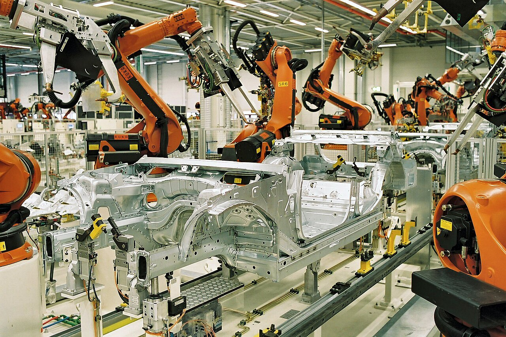 |
| 农业机器人 | 面向农田/温室，半结构化、户外作业 | 缓解劳动力短缺，作业标准化 | 受天气与作物多样性影响大 | 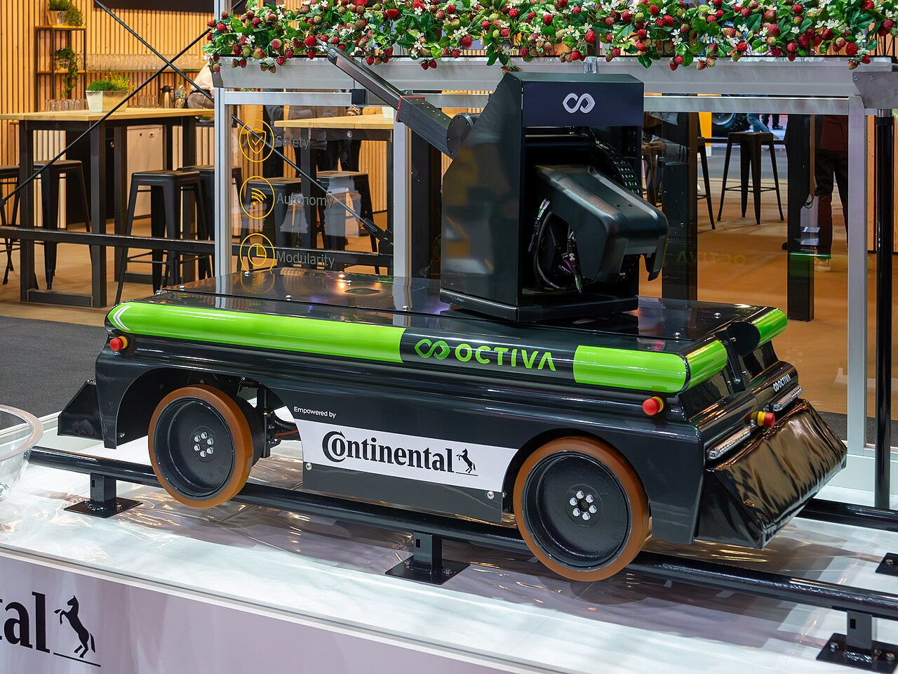 |
| 服务机器人 | 直接服务于人，强调安全与交互 | 与人共事，应用场景广 | 安全与合规要求高 | 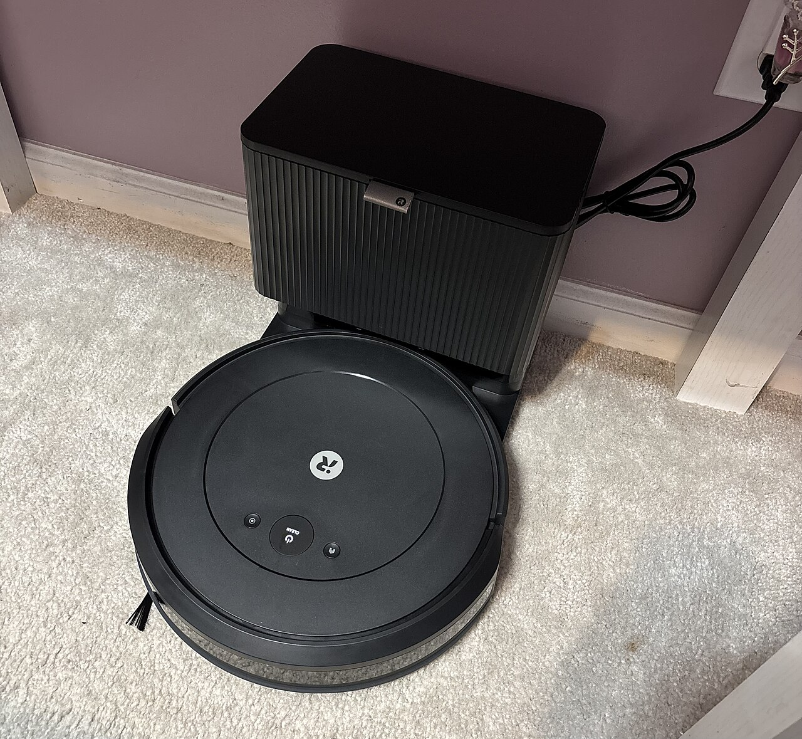 |
| 特种机器人 | 替人进入危险/极端环境作业 | 替代人做高危工作 | 成本高、定制化程度高 |  |

> 💡 其中"服务机器人"按服务对象又细分为**个人/家用**（如扫地机、陪伴机器人）和**专业服务**（如手术机器人、物流配送）。本教程后续涉及的 JoyArm 机械臂既可用于个人/家用，亦可用于专业服务。

#### 1.2.2 按移动方式分

按机器人的基座是否移动、以及怎么移动来划分。这一视角直接体现了机器人"在不在原地干活"以及"怎么去到目标位置"。

| 类别 | 主要特点 | 优点 | 缺点 | 实例 |
|:---:|:---:|:---:|:---:|:---:|
| 固定式 | 基座固定不动，只有臂在动 | 精度高、负载大、易控制 | 工作范围受限 |  |
| 轮式 | 靠轮子在地面上行驶 | 速度快、效率高、结构简单 | 仅适于平整地面，越障差 | 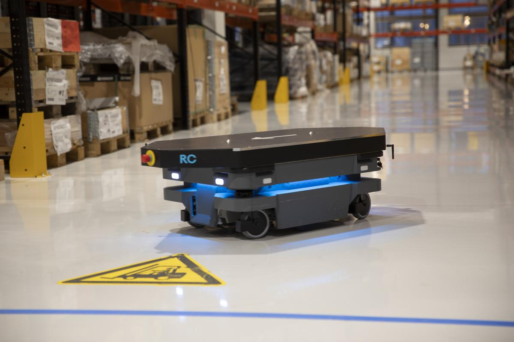 |
| 履带式 | 靠履带行驶，附着力强 | 越野与越障能力强、接地面积大 | 速度慢、能耗高、易损地面 | 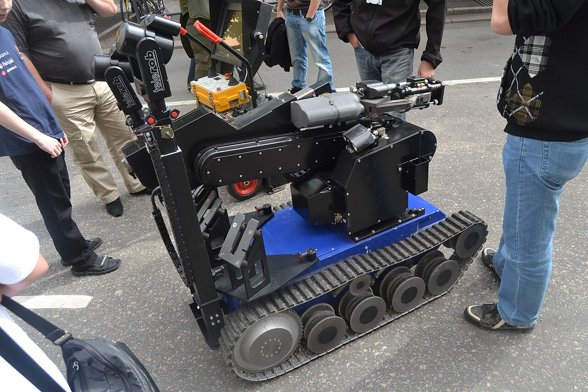 |
| 足腿式 | 仿生多腿行走（双足/四足/多足） | 越障与地形适应性最好 | 控制复杂、能耗高、负载有限 | 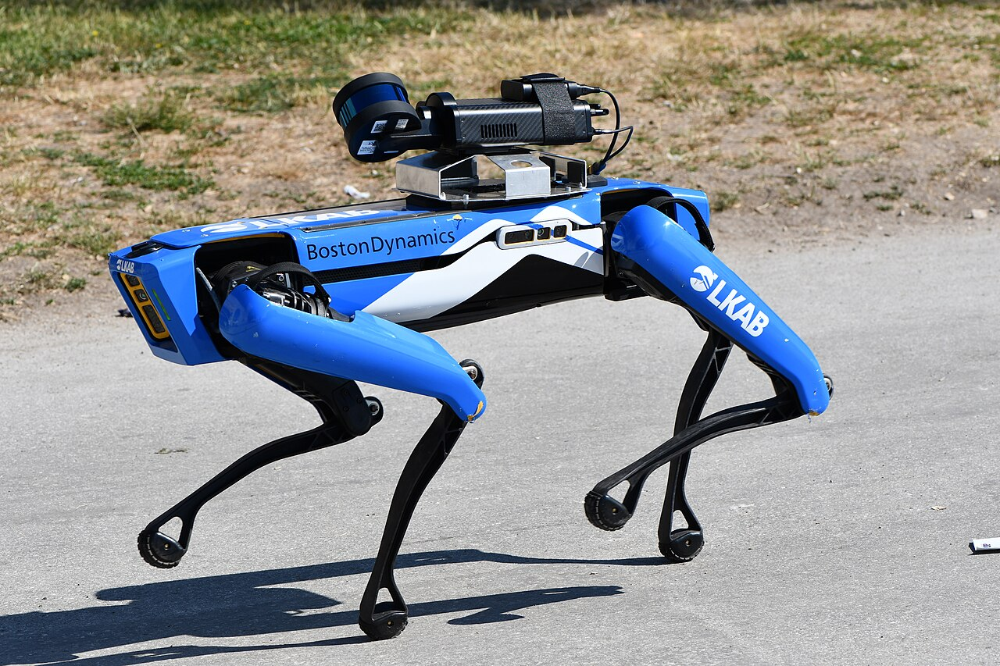 |
| 复合式 | 轮、腿、履等两种以上方式组合 | 兼顾速度与越障，适应面广 | 机械与控制复杂度高 | 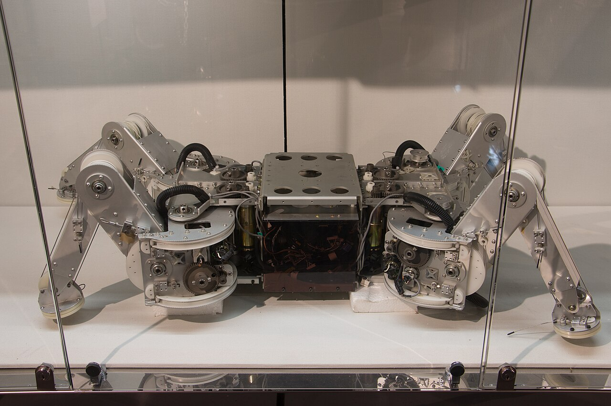 |
| 飞行式 | 借助旋翼/固定翼在空中飞行 | 三维机动、覆盖范围大、无视地形 | 续航与负载受限、受气象影响 | 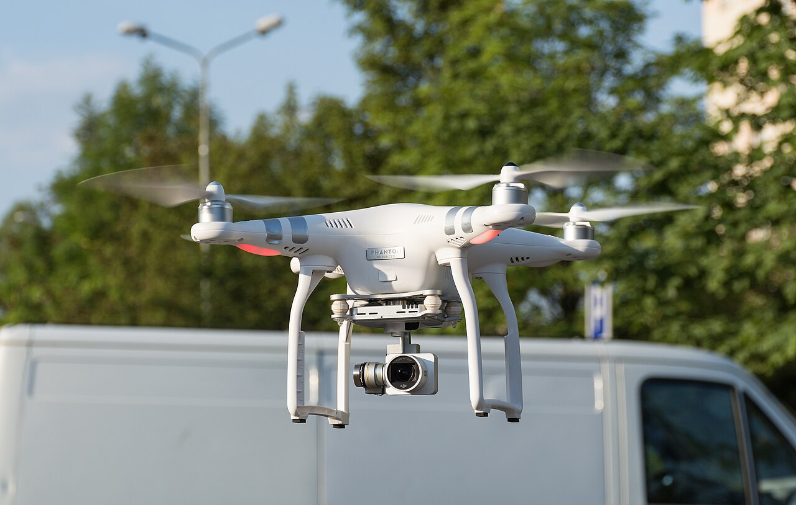 |
| 水下式 | 在水下作业，耐压密封（含螺旋桨推进与仿生鱼摆尾） | 可到达人难以涉足的深海 | 通信与定位困难、维护成本高 | 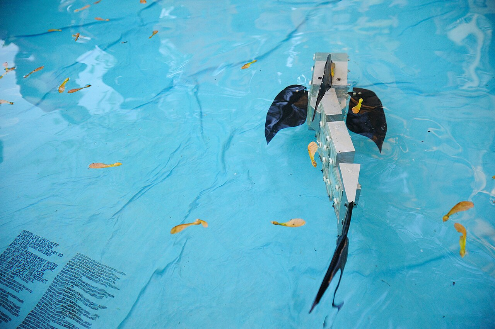 |
| 空间式 | 在太空/外星环境运行 | 承担行星探测等极端任务 | 研制成本极高、不可维修 |  |
| 其他（爬行/攀爬/蠕动/跳跃/扑翼/滚动等） | 上述之外的小众移动方式：贴地爬行、立面攀爬、身体蠕动、弹跳、扑翼飞行、整体滚动等 | 各自适配特殊场景（管道/废墟/碎片地形/空中等） | 通用性差、载荷续航受限，多为定制 | 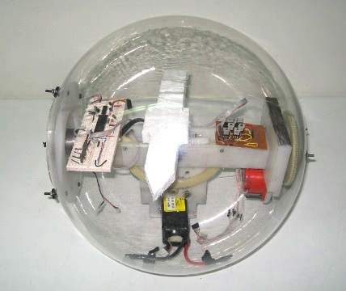 |

#### 1.2.3 按构型与仿生特点分

按机械结构的拓扑（关节如何串联/并联）以及是否模仿生物形态来划分。这一视角最贴近"机器人本体长什么样"。

| 类别 | 主要特点 | 优点 | 缺点 | 实例 |
|:---:|:---:|:---:|:---:|:---:|
| 串联机器人 | 多个关节首尾依次串联，像人的手臂 | 工作空间大、灵活 | 累积误差大、刚度较低 |  |
| 并联机器人 | 多条支链共同驱动末端平台 | 刚度高、速度快、无累积误差 | 工作空间小、控制复杂 | 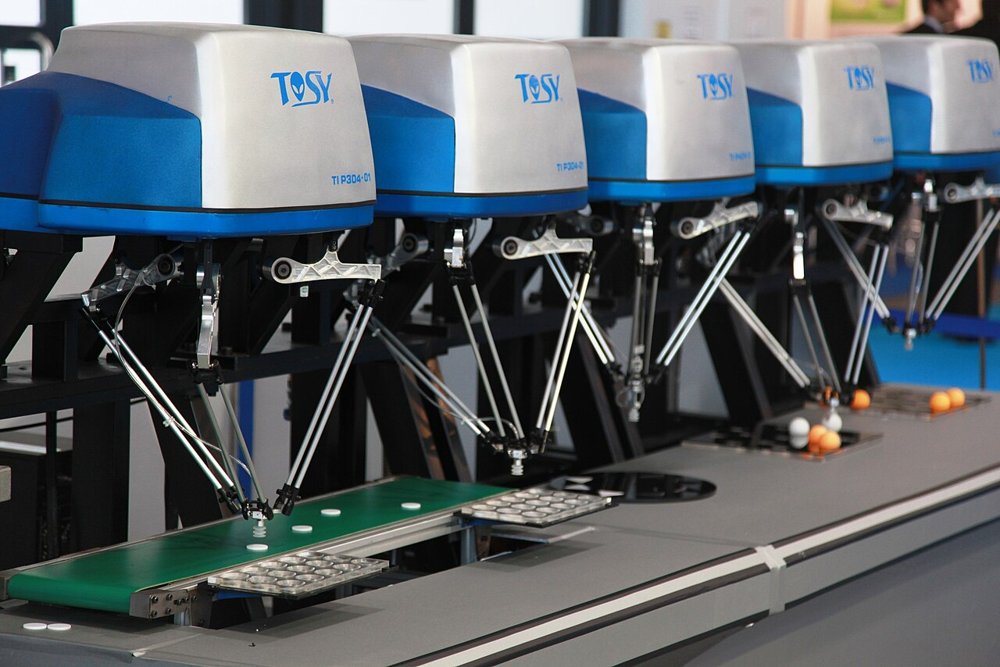 |
| 人形机器人 | 仿人形，双足 + 双臂 + 头部 | 适配人类环境与工具 | 平衡与控制极难、成本高 | 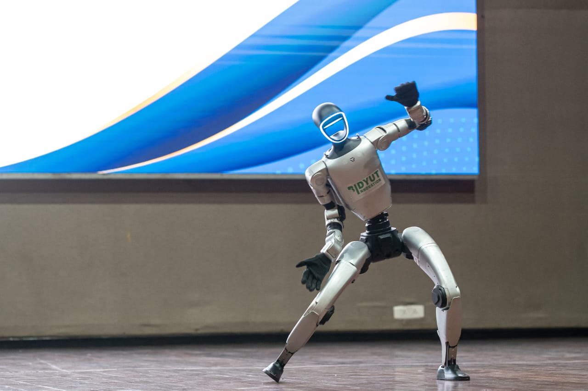 |
| 四足机器人 | 仿四足动物，四条腿行走 | 比双足稳、比轮式更能越障 | 负载与续航仍受限 |  |
| 蛇形机器人 | 仿蛇，多节串联细长体 | 能钻入狭窄/废墟空间 | 推进效率低、难以精确定位 | 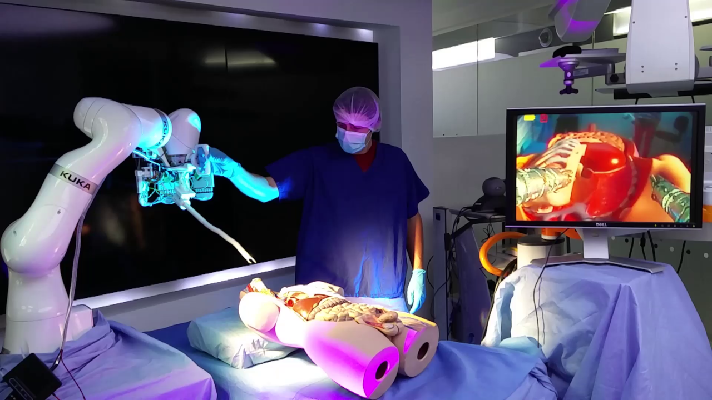 |
| …… | 还有球形、柔性、仿生鱼等众多构型 | — | — | — |

> 📌 一台机器人往往同时属于多个类别：例如一台带轮子、会送货、与人交互的酒店派送机器人，既属于"服务机器人"又属于"移动机器人"。

掌握机器人的基本分类是必要的，便于进行一些基本的快速判断，如：面对轮式机器人常会联想到“建图、定位、导航”、“简单可靠”、“成本低”、“地面清洁”；需要设计一个野外巡检机器人时常会先去考虑履带机器人和足腿机器人

### 1.3 为什么从机械臂开始入门

在所有机器人类别中，**机械臂（Robotic Arm / Manipulator）是实用性最高、应用最广泛、最经典的一类**。理由有三：

1. **应用最广**：从工厂的焊接、装配、喷涂，到医院里的手术辅助（如达芬奇手术机器人），再到生活中的分拣、抓取，机械臂无处不在。
2. **理论最完整**：机械臂涉及的运动学、动力学、轨迹、控制，是整个机器人学的核心骨架，体系成熟、教材丰富。
3. **是其他机器人的前置基础**：人形机器人的手臂、四足机器人的腿部，本质都是"安装在可移动基座上的机械臂"。先掌握固定机械臂，再扩展到移动与人形，路径最顺。

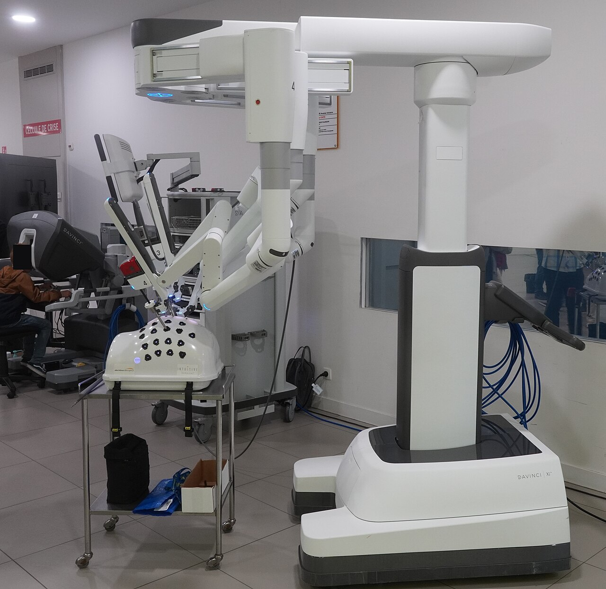

> 🎯 **结论**：本教程选择**机械臂**作为学习对象——它既能立刻做有用的事，又能带你打通机器人学的理论主干，并为日后学习人形、四足等更复杂形态打好地基。

---

## 2 基础概念速扫盲

机器人学有大量专有名词，初学者常被中英文混用和抽象定义劝退。本节按类别整理一张**中英对照术语表**，每个词都给出"直观理解 + 作用"，目标是让你**建立整体认知地图**，而不是死记定义。

> 💡 **使用建议**：不必现在就背下来。通读一遍留个印象，后续章节用到时再回查即可。

### 2.1 机械结构与几何类

这一类描述机械臂"长什么样、能怎么动"，是后续所有章节的物理基础。

#### 基本组成：关节、连杆、末端执行器

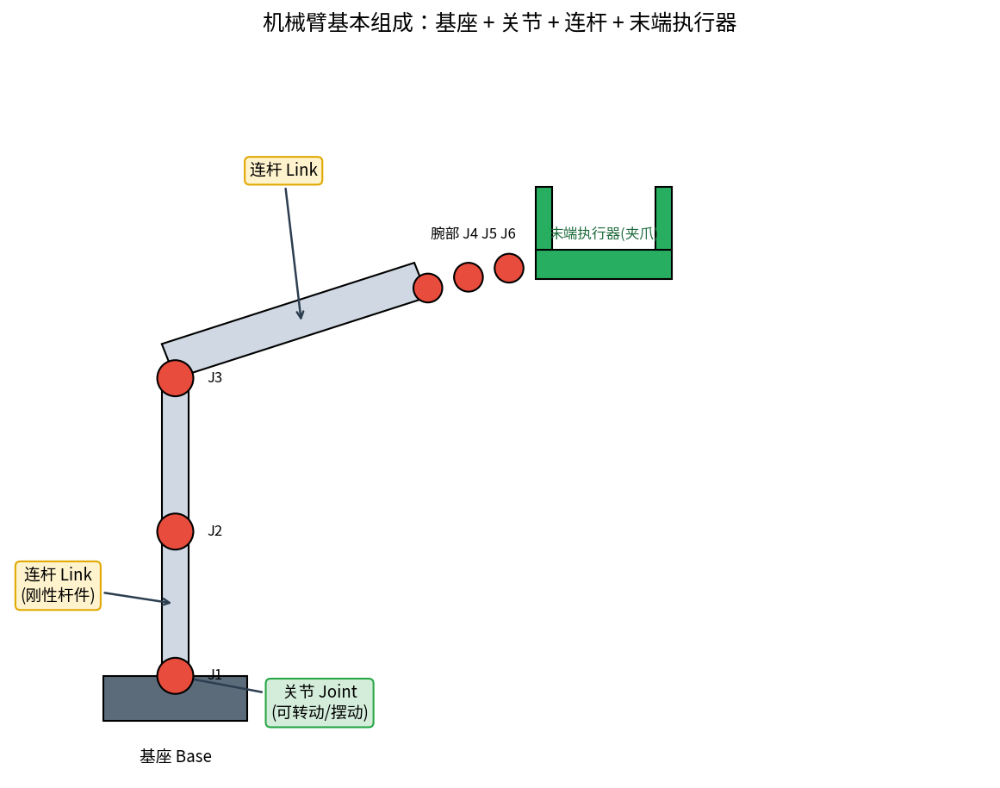

| 中文名词 | 英文 | 直观理解 | 作用 |
|:---:|:---:|:---:|:---:|
| 机械臂 | Robotic Arm / Manipulator | 模仿人手臂功能的串联机械结构 | 完成抓取、搬运、操作等任务 |
| 关节 | Joint | 像人的肘、腕，可转动的连接处 | 提供运动自由度，是动作来源 |
| 连杆 | Link | 像人的上臂、前臂，连接关节的刚性杆 | 把关节的运动传递、叠加到末端 |
| 末端执行器 | End-Effector | 装在机械臂最末端的"工具"，如夹爪、吸盘 | 直接与工件/环境接触，完成任务 |
| 基座 | Base | 机械臂固定或支撑在最下方的部分 | 承重并作为整机的安装与参考基准 |

> 💡 **口诀**：**关节负责"动"，连杆负责"传"，末端负责"干"，基座负责"站"**。

#### 关键参数：自由度、负载、工作半径

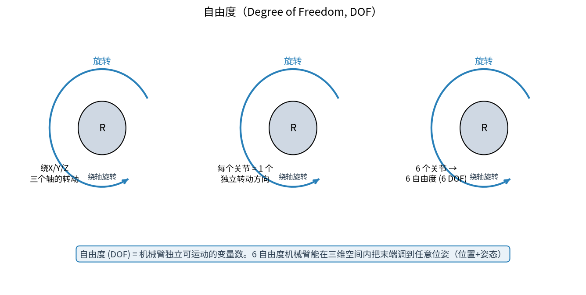

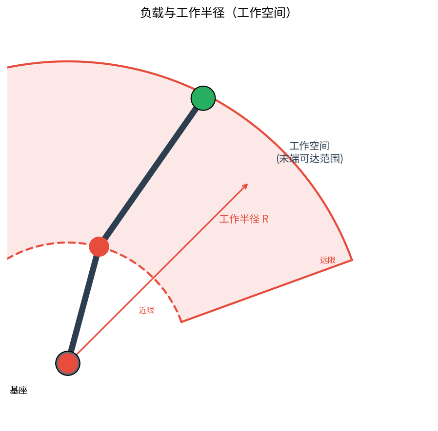

| 中文名词 | 英文 | 直观理解 | 作用 |
|:---:|:---:|:---:|:---:|
| 自由度 | Degree of Freedom (DOF) | 机械臂**独立可运动的变量数**；6 关节 = 6 自由度 | 决定末端能达到的位姿丰富程度 |
| 负载 | Payload | 末端能稳定承载的最大重量（如 2 kg） | 决定能搬多重的物体 |
| 工作半径 | Reach / Working Radius | 末端从基座能伸到的**最大水平距离** | 描述机械臂的"臂展" |
| 工作空间 | Workspace | 末端**所有可达位置**构成的空间范围 | 判断任务点是否够得到 |

#### 标准坐标系体系

要让机械臂精确地把末端送到某点，必须先有一套"统一语言"来描述位置和姿态，这就是**坐标系**。一台机械臂常用到以下几套坐标系：

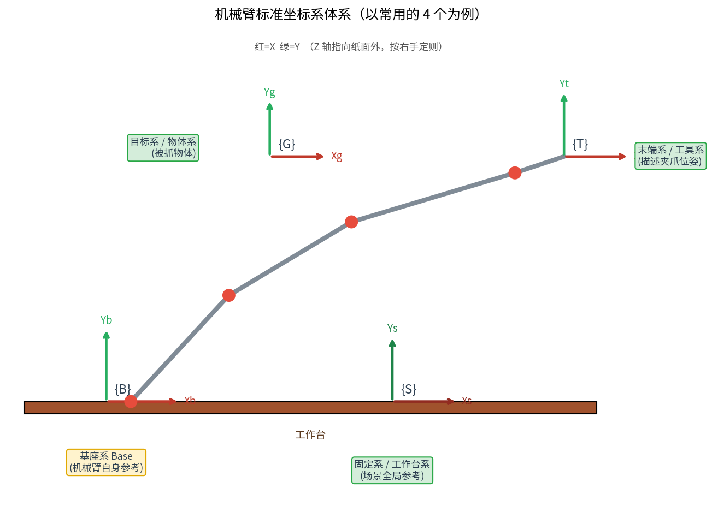

| 中文名词 | 英文 | 定义 | 直观理解 |
|:---:|:---:|:---|:---:|
| 基座系 | Base Frame {B} | 固结在机械臂基座的坐标系 | 机械臂"自己的家"，描述自身运动用 |
| 连杆系 | Link Frame | 固结在每个连杆上的坐标系 | 给每个零件一个局部坐标，便于建模 |
| 腕部系 | Wrist Frame | 固结在腕部（末三轴交汇处）的坐标系 | 把"位置"和"姿态"解耦的关键 |
| 末端系 / 工具系 | Tool Frame {T} | 固结在末端执行器（工具尖端）的坐标系 | 描述"工具现在指到哪里、朝哪个方向" |
| 固定系 / 工作台系 | Station Frame {S} | 描述整个工作场景的全局坐标系 | "整个世界的家"，多设备协同时用 |
| 目标系 / 物体系 | Goal / Object Frame {G} | 固结在被操作物体上的坐标系 | 告诉机械臂"物体在哪、朝向如何" |

> 📌 **为什么需要这么多坐标系？** 因为不同人关心不同事：电机控制关心**基座系**，操作员关心**工具系**，视觉感知关心**工作台系**。坐标系之间的转换关系，正是[第二章](chapter2_2.md)位置正运动学的核心内容。

### 2.2 硬件与感知类

这一类描述机械臂"用什么器件动起来、用什么器件感知世界"。

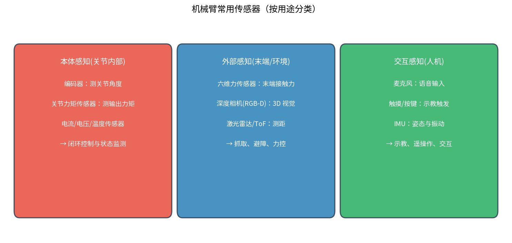

| 中文名词 | 英文 | 直观理解 | 作用 |
|:---:|:---:|:---:|:---:|
| 执行器（电机） | Actuator / Servo Motor | 机械臂的"肌肉"，把电变成力或运动 | 驱动关节转动，是动作的最终来源 |
| 编码器 | Encoder | 装在电机上的"角度尺" | 测量关节实际角度，用于位置闭环 |
| 关节力矩传感器 | Joint Torque Sensor | 测单个关节输出力矩的器件 | 力控、碰撞检测、拖动示教 |
| 六维力传感器 | 6-Axis Force/Torque Sensor | 装在末端，测三个力 + 三个力矩 | 末端接触力控制、装配 |
| 深度相机 | Depth Camera (RGB-D) | 能同时拍彩色图和距离图的相机 | 三维视觉，目标定位与避障 |

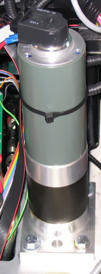

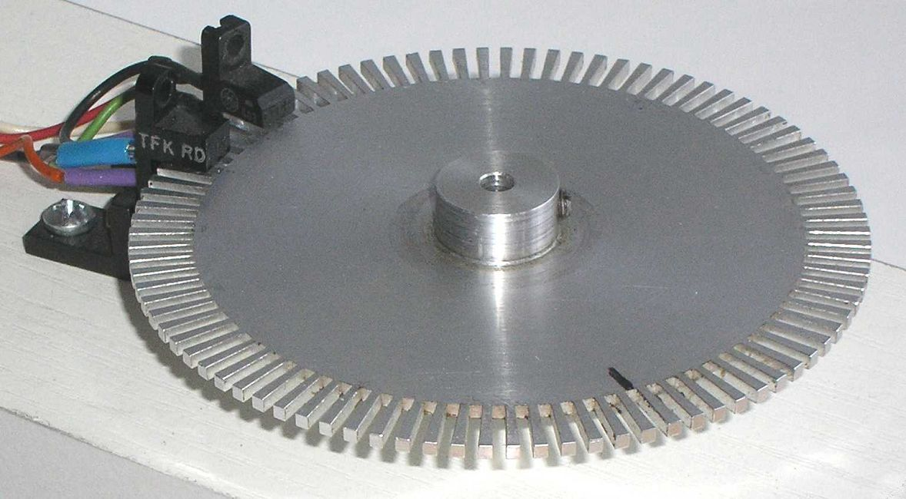

> 💡 **一句话区分**：**执行器是"出力的"，传感器是"反馈的"**。一个负责让机械臂动，一个负责告诉大脑现在动到哪了、碰没碰到东西。

### 2.3 学科方法类

这一类是本教程的**理论主线**，描述"怎么让机械臂按我们的意图精确运动"。各方法在后续章节逐步展开。

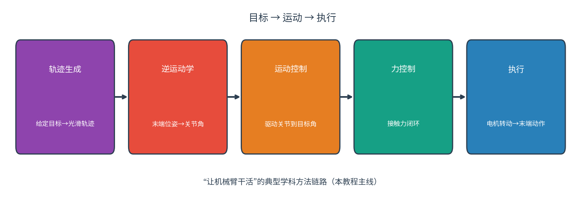

| 中文名词 | 英文 | 直观理解 | 对应章节 |
|:---:|:---:|:---:|:---:|
| 位置正运动学 | Forward Kinematics | 已知关节角 → 求末端在哪里 | [第二章](chapter2_2.md) |
| 位置逆运动学 | Inverse Kinematics | 已知末端要去哪 → 求各关节角 | [第三章](chapter2_3.md) |
| 速度运动学与雅可比 | Velocity Kinematics & Jacobian | 关节速度与末端速度的转换关系 | [第四章](chapter2_4.md) |
| 静力学 | Statics | 末端受力与关节力矩的平衡关系 | [第四章](chapter2_4.md) |
| 动力学 | Dynamics | 力/力矩如何产生运动（含惯性） | [第八章](chapter3_2.md) |
| 轨迹生成 | Trajectory Generation | 给定目标，生成光滑无冲击的运动路径 | [第五章](chapter2_5.md) |
| 运动控制 | Motion Control | 驱动各关节精确跟踪目标轨迹 | [第六章](chapter2_6.md) |
| 力控制 | Force Control | 控制末端与环境的接触力，而非仅位置 | [第九章](chapter3_3.md) |

> 📌 **怎么记**：沿着"**想去哪（逆运动学）→ 怎么过去（轨迹生成）→ 准确到那（运动控制）→ 碰到东西怎么办（力控制）**"这条任务链，就能串起整条理论主线。正运动学和速度/静力学则是其中必不可少的"计算工具"。

### 2.4 开发工具与环境

这一类描述"用什么软硬件来开发机械臂程序"。本教程给出推荐的工具组合。

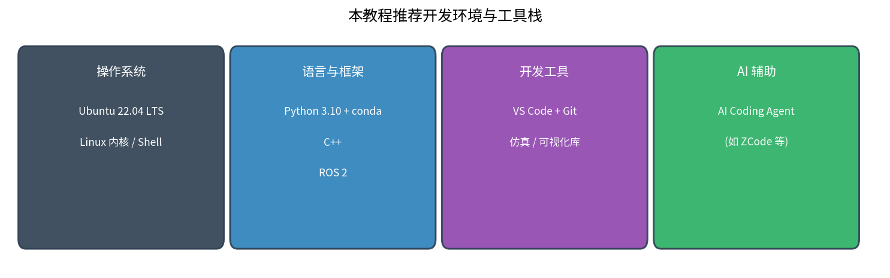

| 类别 | 推荐 | 说明 |
|:---:|:---:|:---:|
| 操作系统 | Ubuntu 22.04 LTS | 机器人生态主流系统，与 ROS 2 兼容性最好 |
| 语言 | Python 3.10 + C++ | Python 用于快速原型与分析，C++ 用于实时控制 |
| 环境管理 | conda | 隔离不同项目的 Python 依赖，避免冲突 |
| 框架 | ROS 2 | 机器人通信与生态标准，[第十章](chapter3_4.md)详讲 |
| 开发工具 | VS Code + Git | 编辑/调试与版本管理 |
| AI 辅助 | AI Coding Agent | 加速编码、查阅文档（如本教程使用的 ZCode） |

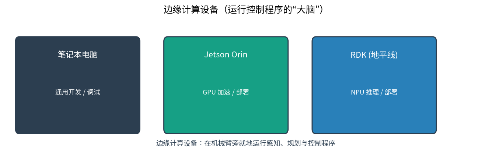

运行机械臂控制程序的"大脑"称为**边缘计算设备**，常见选择如下：

| 设备 | 特点 | 适用场景 |
|:---:|:---:|:---:|
| 笔记本电脑 | 通用、易开发调试 | 学习、原型验证 |
| Jetson 系列（NVIDIA） | 自带 GPU，AI 推理强 | 视觉 + 控制，部署到设备 |
| RDK（地平线） | 自带 NPU，低功耗推理 | 端侧 AI 部署 |

> 💡 **建议**：学习阶段直接用**笔记本电脑**即可；当需要把视觉/控制部署到机械臂上长期运行时，再考虑 Jetson 或 RDK 这类边缘设备。

---

## 本章小结

本章作为全教程的地图，回答了三个问题并建立了一张术语表：

- **是什么**：机器人 = 可编程 + 能运动 + 有感知的机器；机械臂是其最经典、最实用的一类。
- **有哪些**：可按工业/服务、固定/移动、海陆空天等维度分类——分类是视角，不是绝对。
- **为什么学机械臂**：应用最广、理论最完整、是其他形态机器人的前置基础。
- **核心词汇**：关节/连杆/末端、自由度/负载/工作空间、坐标系体系、执行器/传感器、运动学/动力学/控制——这些词将贯穿后续所有章节。

读到这里，你已经拿到了机器人学的"地图"和"字典"。下一章我们将从**空间位姿与位置正运动学**开始，正式进入原理学习：学会用矩阵精确描述机械臂末端"在哪里、朝哪指"。
