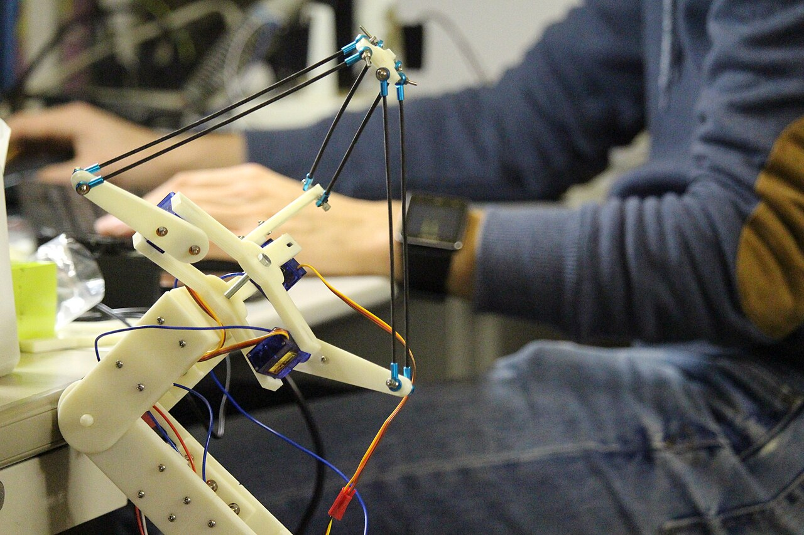
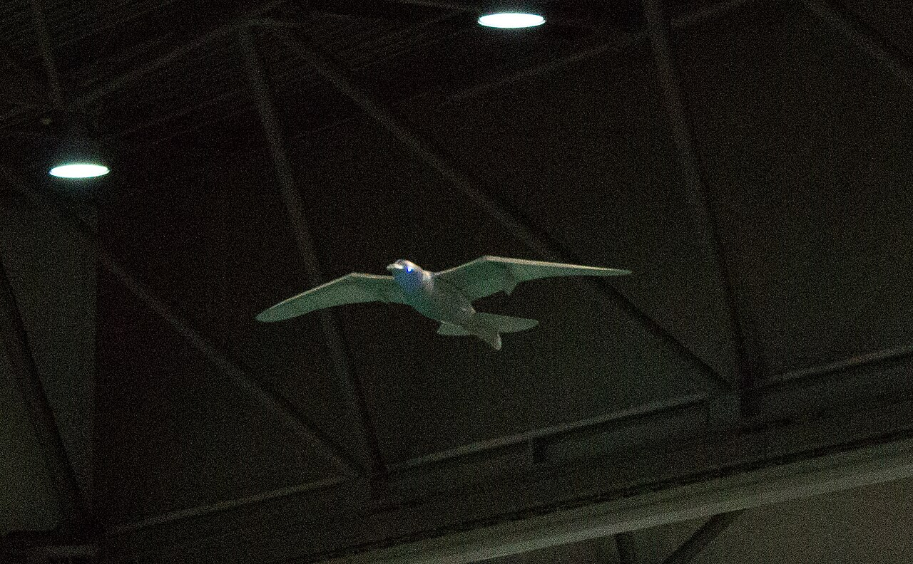
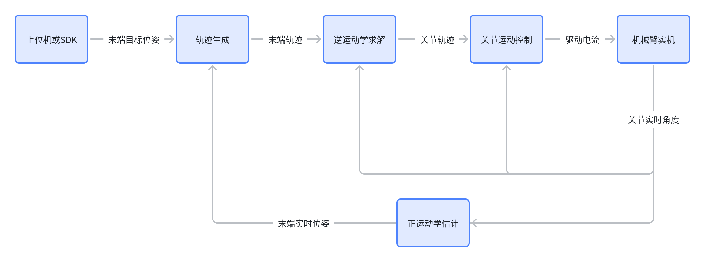

# 第一章 机器人与机械臂初识

> 📌 **概述**：本章面向零基础初学者完成对机器人与机械臂的初识。回答了“**什么是机器人**”、“**机器人类别有哪些**”和“**为什么从机械臂入门**”三个基本问题。解释了几组贯穿后续章节的机器人学术语，涵盖机械结构与几何（关节/连杆/末端、自由度/负载/工作空间、坐标系体系）、硬件（执行器与传感器）、学科方法（运动学/动力学/控制）。给出了推荐的机械臂开发工具与环境。

## 1 发展历史与分类方式

### 1.1 什么是机器人：从科幻到现实

"机器人（Robot）"一词最早出自 1920 年捷克作家卡雷尔·恰佩克的剧本《罗素姆的万能机器人》，词根源自 *robota*（意为"劳役、苦工"）。但真正让机器人从科幻走向现实，是**工业机器人**的诞生：

- **1954 年**，美国人乔治·戴沃尔申请了第一台可编程机械手专利，奠定了"用程序代替人手"的工业机器人思路。
- **1961 年**，**Unimate** 机械臂在美国通用汽车的装配线上岗，成为世界上**第一台真正投入生产的工业机器人**，负责压铸件搬运。

此后，机器人技术沿**两个方向**演进：一个方向追求**工业精度与负载**（焊接、喷涂、装配等制造场景）；另一个方向追求**自主性与适应性**（移动、感知、决策等非结构化场景）。今天我们见到的各类机器人，本质上都来自这两个方向的延伸与融合。

#### 如何判断"是不是机器人"

会动 ≠ 机器，一个被广泛接受的判断标准是：**机器人是一种能够通过感知、决策、执行，自主或半自主地完成物理任务的机器**。必须同时具备**可编程（动作可改）、可运动（产生物理位移或操作）、有感知（获取环境/自身反馈）**三项特征。即：**会按程序"感知—决策—执行"进行运动**的才是机器人，"按固定流程动作"的叫自动化机器。

| 设备类别 | 是不是机器人 | 关键判断 |
|:---:|:---:|:---|
| 机械臂 | ✅ | 可编程、能运动、有位置反馈，三者齐全 |
| 家用扫地机器人 | ✅ | 可编程、能移动、有传感器（防跌落、寻路） |
| 自动取款机（ATM） | ❌ | 动作固定、不可编程改变运动逻辑，属于自动化设备 |
| 普通洗衣机 | ❌ | 只有定时循环，无环境感知、无运动机构 |

### 1.2 机器人的分类方式

机器人种类繁多，没有唯一正确的分类法。常见的三个分类视角为：**看它干什么（应用领域）、看它怎么走（运动方式）、看它长什么样（构型与仿生）**。

> 💡 掌握这些分类，不是为了背概念，更是为了在遇到机器人时能快速做出判断。比如看到一台**轮式机器人**，就能联想到它能够"建图、定位、导航"，优势是"简单可靠、成本低"，常见于地面清洁、物流配送等场景；反过来，要设计一台**野外巡检机器人**，则会优先考虑**履带式**或**足腿式**——越障能力才是关键。**分类本质上是一张"机器人速查表"**。

#### 1.2.1 按应用领域分

按机器人服务的行业和场景划分，是最贴近"用途"的分类视角。参照国际机器人联合会（IFR）的口径，可分为工业、农业、服务（个人家用 + 专业服务）、特种四大类。

| 类别 | 主要特点 | 优点 | 缺点 | 实例 |
|:---:|:---:|:---:|:---:|:---:|
| 工业机器人 | 面向制造业，结构化环境、重复精度高 | 速度快、精度高、可 24 小时作业 | 环境适应性差，需安全防护 |  |
| 农业机器人 | 面向农田/温室，半结构化、户外作业 | 缓解劳动力短缺，作业标准化 | 受天气与作物多样性影响大 |  |
| 服务机器人 | 直接服务于人，强调安全与交互 | 与人共事，应用场景广 | 安全与合规要求高 |  |
| 特种机器人 | 替人进入危险/极端环境作业 | 替代人做高危工作 | 成本高、定制化程度高 |  |

> 💡 其中"服务机器人"按服务对象又细分为**个人/家用**（如扫地机、陪伴机器人）和**专业服务**（如手术机器人、物流配送）。本教程后续涉及的 JoyArm 机械臂既可用于个人/家用，亦可用于专业服务。

#### 1.2.2 按移动方式分

按机器人的基座是否移动、以及怎么移动来划分。这一视角直接体现了机器人"在不在原地干活"以及"怎么去到目标位置"。

| 类别 | 主要特点 | 优点 | 缺点 | 实例 |
|:---:|:---:|:---:|:---:|:---:|
| 固定式 | 基座固定不动，只有臂在动 | 精度高、负载大、易控制 | 工作范围受限 |  |
| 轮式 | 靠轮子在地面上行驶 | 速度快、效率高、结构简单 | 仅适于平整地面，越障差 |  |
| 履带式 | 靠履带行驶，附着力强 | 越野与越障能力强、接地面积大 | 速度慢、能耗高、易损地面 |  |
| 足腿式 | 仿生多腿行走（双足/四足/多足） | 越障与地形适应性最好 | 控制复杂、能耗高、负载有限 |  |
| 复合式 | 轮、腿、履等两种以上方式组合 | 兼顾速度与越障，适应面广 | 机械与控制复杂度高 |  |
| 飞行式 | 借助旋翼/固定翼在空中飞行 | 三维机动、覆盖范围大、无视地形 | 续航与负载受限、受气象影响 |  |
| 水下式 | 在水下作业，耐压密封（含螺旋桨推进与仿生鱼摆尾） | 可到达人难以涉足的深海 | 通信与定位困难、维护成本高 |  |
| 空间式 | 在太空/外星环境运行 | 承担行星探测等极端任务 | 研制成本极高、不可维修 |  |
| 其他移动方式（爬行/攀爬/蠕动/跳跃/扑翼/滚动等） | 上述之外的小众移动方式：贴地爬行、立面攀爬、身体蠕动、弹跳、扑翼飞行、整体滚动等 | 各自适配特殊场景（管道/废墟/碎片地形/空中等） | 通用性差、载荷续航受限，多为定制 |  |

#### 1.2.3 按构型与仿生特点分

按机械结构的拓扑（关节如何串联/并联/混联）以及是否模仿生物形态来划分。这一视角最贴近"机器人本体长什么样"。

| 类别 | 主要特点 | 优点 | 缺点 | 实例 |
|:---:|:---:|:---:|:---:|:---:|
| 串联机器人 | 多个关节首尾依次串联，像人的手臂；常见变体有**直角坐标、圆柱坐标、SCARA**（平面关节）等 | 工作空间大、灵活、结构简单 | 累积误差大、刚度较低 |  |
| 并联机器人 | 多条支链共同驱动末端平台；代表有 **Delta**（高速拾放）和 **Stewart** 平台（六自由度） | 刚度高、速度快、无累积误差 | 工作空间小、控制复杂 |  |
| 混联机器人 | 串联与并联机构组合，取两者之长（如 Tricept、Exechon，并联主结构 + 串联腕） | 兼顾大工作空间与高刚度 | 结构与建模复杂 |  |
| 人形机器人 | 仿人形，双足 + 双臂 + 头部 | 适配人类环境与工具 | 平衡与控制极难、成本高 |  |
| 四足机器人 | 仿四足动物，四条腿行走 | 比双足稳、比轮式更能越障 | 负载与续航仍受限 |  |
| 其他仿生 | 仿鸟类（扑翼）、鱼类（摆尾）、昆虫节肢动物（六足/八足）、爬行（蛇形）、植物等众多仿生形态 | 各自适配特殊场景（空中/水下/狭窄空间/侦察等） | 通用性差、多为定制 |  |

> 📌 一台机器人往往同时属于多个类别：例如一台带轮子、会送货、与人交互的酒店派送机器人，既属于"服务机器人"又属于"移动机器人"。

### 1.3 为什么从机械臂开始入门

**机械臂（Robotic Arm / Manipulator）**几乎是贯穿各类别的"最大公约数"：它既是工业机器人的代表，又是固定式机器人的典型，还是串联构型的基础形态。它是最经典、也最适合作为入门的一类机器人：

1. **应用最广，值得学**：从工厂的焊接、装配、喷涂，到医院里的手术辅助（如达芬奇手术机器人），再到生活中的分拣、抓取，机械臂几乎无处不在。这意味着学完就能直接对接真实场景，立刻解决实际问题。
2. **理论最完整，好上手**：机械臂涉及的运动学、动力学、轨迹规划、运动控制，正是整个机器人学的核心骨架，体系最成熟、教材最丰富，初学者能沿着一条清晰的主线稳步推进。
3. **其他机器人前置基础，能进阶**：人形机器人的手臂、四足机器人的腿部，本质都是"安装在可移动基座上的机械臂"。先掌握固定机械臂，再扩展到移动与人形，是最自然的进阶路径。

> 🎯 本教程以**JoyArm 机械臂**作为实机对象展开机械臂的入门学习 —— 既能立刻做有用的事，又能打通机器人学理论主干，还能为后续学习人形、四足等更复杂形态打好基础。

---

## 2 基础概念速扫盲

机器人学有大量专有术语，初学者易理解不清而被劝退。本节按类别对每个术语进行 “直观解释+作用说明”，在开启正式学习前先建立一个直观认识。

> 💡 不必立刻背下来。通读一遍留个直观印象，后续回查即可。

### 2.1 机械结构与几何类

描述机械臂"长什么样、能怎么动"，是后续所有章节的物理基础。

#### 2.2.1 基本组成：基座、关节、连杆、末端执行器

把一台机械臂的"外衣"剥掉，剩下的是一条由**基座 → 关节 → 连杆 → 关节 → … → 末端执行器**串起来的运动链。下图为 JoyArm 的组件构成：

| 中文 | 英文 | 直观解释 | 功能作用 |
|:---:|:---:|:---:|:---:|
| 机械臂 | Robotic Arm / Manipulator | 由关节和连杆串联而成的可编程运动链 | 在工作空间内把末端执行器送到指定位置与姿态 |
| 基座 | Base | 机械臂的"根"，固定在地基或移动平台上 | 承载全部重量、定义机械臂的位置，是基座坐标系的起点 |
| 关节 | Joint | 连接两根连杆、能转动的"铰链"（旋转关节 R 或移动关节 P） | 提供自由度，决定机械臂能往哪些方向运动 |
| 连杆 | Link | 连接相邻关节的刚性杆件，类似人的骨头 | 把关节的运动传递、放大到末端，决定机械臂的臂展 |
| 末端执行器 | End-Effector | 装在机械臂最前端、直接干活的工具（夹爪、吸盘、焊枪等） | 与外界发生物理交互，完成抓取、装配、喷涂等任务 |

> 💡 **口诀**：**关节负责"动"，连杆负责"传"，末端负责"干"，基座负责"站"**。

一台机械臂的"关节—连杆"重复了几段，往往决定它有几个自由度。

#### 2.2.2 关键参数：自由度、负载、工作半径、工作空间

认识完"长什么样"，还要看一组描述机械臂"能干什么、能伸多远"的关键参数。它们是机械臂选型与性能评估的基本指标：

| 中文 | 英文 | 直观解释 | 功能作用 |
|:---:|:---:|:---:|:---:|
| 自由度 | Degree of Freedom（DOF） | 机械臂**独立运动方式**的个数，等于能自由控制的"变量数"；通常一个关节贡献 1 个自由度 | 决定末端能以多少种方式调整位置与姿态，是机械臂灵活性的核心指标 |
| 负载 | Payload | 机械臂末端**最多能稳稳举起多重**的物体，常用单位 kg | 决定能搬多重的工件，选型或设计时必须大于实际工件 + 末端执行器重量 |
| 工作半径 | Reach | 机械臂从基座到末端的**最大伸展距离**，常用单位 mm | 决定机械臂"一伸手能多远"，是臂展尺寸的直接体现 |
| 工作空间 | Workspace | 机械臂末端**能到达的所有位置**构成的体积范围 | 决定能作业的区域大小；目标点必须落在工作空间内才能被执行 |

> 💡 **三者的关系**：**自由度**回答"灵活不灵活"，**负载**回答"举得动多重"，**工作半径 / 工作空间**回答"够得到吗"。三者要同时满足 —— 再灵活的手臂，够不到、举不动也白搭。

#### 2.2.3 坐标系体系

要让机械臂精确地把末端送到某点，必须先有一套"统一语言"来描述位置和姿态，这就是**参考坐标系**体系。机械臂常用到以下坐标系：

| 中文 | 英文 | 直观解释 | 功能作用 |
|:---:|:---:|:---:|:---:|
| 基座系 | Base Frame | 固结在基座上的坐标系，是整条机械臂的"原点" | 作为机械臂运动的统一参考基准，运动学、动力学求解通常都在此系下进行 |
| 连杆系 | Link Frame | 固结在每根连杆上的坐标系，每个关节处都有一个 | 描述相邻连杆之间的相对位置与姿态，是运动学建模的基本工具 |
| 腕部系 | Wrist Frame | 固结在手腕处（末端三个关节）的坐标系 | 分离"位置由手臂决定、姿态由手腕决定"，简化逆运动学求解 |
| 末端系 / 工具系 | End / Tool Frame | 固结在末端执行器（如夹爪指尖）上的坐标系 | 描述工具本身的位置与朝向，操作员最关心此系下的目标 |
| 固定系 / 工作台系 | World / Station Frame | 固结在工作台或车间的全局坐标系 | 当有多台机械臂或外部设备协作时，提供统一的世界坐标 |
| 目标系 / 物体系 | Object Frame | 固结在工件或目标物体上的坐标系 | 描述"工件在哪里、朝哪放"，夹爪执行器系与其重合时才能抓到物体 |

> 📌 **为什么这么多坐标系？** 因为不同人关心不同事：运动控制关心**基座系**和**执行器系**，操作员关心**工具系**，视觉感知关心**工作台系**。[第二章](chapter2_2.md)位置正运动学的原理便是多个坐标系间的位姿关系求解。

### 2.2 感知执行硬件类

描述机械臂"用什么器件动起来、用什么器件感知世界"。表格为机械臂（轻小型桌面级）通常会用到的硬件，下图中为 JoyArm 用到的硬件：

| 中文 | 英文 | 直观解释 | 功能作用 | 实物图 |
|:---:|:---:|:---:|:---:|:---:|
| 电源 | Power Supply | 给整套系统供电的"心脏"，把市电或电池转换为所需电压 | 为电机、控制器、传感器提供稳定能量，决定系统能否长时间运行 | - |
| 电机 | Motor | 把电能转换为机械转动的"肌肉"，是关节的动力来源 | 驱动关节转动，是机械臂运动的最终执行机构 | - |
| 驱动器 | Driver / Amplifier | 接收控制器指令、向电机精准输出电流的"放大器" | 按目标位置/速度/力矩驱动电机，是控制器与电机之间的功率桥梁 | - |
| 编码器 | Encoder | 装在电机轴上的"角度尺"，实时读出转到了哪里 | 把实际关节角反馈给控制器，构成闭环控制，是实现精确定位的关键 | - |
| 一体化关节 | Integrated Joint Module | 把电机 + 减速器 + 编码器 + 驱动器打包成一体的关节 | 集成度高、走线简洁，是现代模块化机械臂（如 JoyArm）的标准单元 | — |
| 关节力矩传感器 | Joint Torque Sensor | 装在关节处、测量输出力矩的"电子手腕" | 反馈关节实际出力大小，用于力控与碰撞检测 | - |
| 六维力传感器 | 6-Axis Force/Torque Sensor | 装在手腕处、同时测三个力 + 三个力矩的传感器 | 感知末端与外界接触的力，是精密装配、柔顺控制的核心器件 | — |
| RGB 相机 | RGB Camera | 普通彩色摄像头，输出二维彩色图像 | 识别物体的颜色、纹理、轮廓，用于目标检测与视觉定位 | - |
| RGB-D 相机 | RGB-D Camera | 能同时输出彩色图 + 深度图的相机（如 RealSense） | 直接获取物体距离，比单 RGB 更适合机械臂的三维抓取 | - |
| 雷达 | LiDAR | 用激光测距、扫出周围三维点云的传感器 | 大范围感知环境与障碍物，多用于移动机械臂的建图与避障 | - |

> 💡 **一句话区分**：**执行器是"出力的"，传感器是"反馈的"**。一个负责让机械臂动，一个负责告诉大脑现在动到哪了、碰没碰到东西。

### 2.3 学科方法类

本教程的**理论主线**，解决"怎么让机械臂按我们的意图精确运动"的问题，后续章节将逐步展开。

| 中文 | 英文 | 直观解释 | 功能作用 |
|:---:|:---:|:---:|:---:|
| 位置正运动学 | Forward Kinematics | 已知各关节角，**推算末端在哪**（正向求解） | 由"关节状态"算出"末端位姿"，是建模与分析的基础 |
| 位置逆运动学 | Inverse Kinematics | 已知末端目标位姿，**反求各关节角**（逆向求解） | "伸手去够"问题的核心：给目标求关节指令，是规划的前提 |
| 速度运动学 | Velocity Kinematics | 描述**关节速度与末端速度**之间的映射关系 | 用于平滑的速度控制与雅可比分析 |
| 雅可比 | Jacobian | 末端速度与关节速度之间的**线性变换矩阵** | 速度运动学和静力学关系的关键，揭示机械臂在各姿态下的运动灵敏度，也是奇异性分析的工具 |
| 静力学 | Statics | 研究机械臂在**静止平衡**状态下力与力矩的传递 | 由末端受力反推各关节应输出多大的力矩，是力控与结构校核的基础 |
| 动力学 | Dynamics | 研究关节力矩与**运动（加速度）**之间的关系，考虑质量与惯量 | 用于高动态场景下的精确前馈控制与仿真，是进阶篇[第八章](chapter3_2.md)的核心 |
| 轨迹生成 | Trajectory Generation | 在时间轴上**规划末端或关节的运动路径**（位置随时间变化） | 让机械臂"平滑、连续、不越界"地从 A 点到 B 点 |
| 运动控制 | Motion Control | 让各关节**实际运动跟踪**规划好的轨迹 | 消除误差、抵抗干扰，保证机械臂精准执行预定动作 |
| 力控制 | Force Control | 不再只追位置，而是**控制末端与外界接触的力** | 用于装配、打磨、擦拭等需要"柔顺接触"的任务 |

机械臂实现运动规划控制的一个最基础且经典的主线为"**给目标 → 寻路径 → 求关节 → 控执行**"四步，软件结构图如下。先有**上位机或SDK调用**给出要到达目标位姿，再结合正运动学对当前位姿的估计值通过**轨迹生成**获得当前位姿至末端位姿的平滑轨迹，接着进行**逆运动学求解**得到关节的轨迹，最后由关节的**控制**让机械臂精准地跟随这条轨迹。本教程基础篇正是沿此条主线逐章展开的。

## 3 开发工具与环境

针对"用什么软硬件开发机械臂程序"的问题，本教程给出推荐的组合。下表"常见工具"列出该领域的常见选项供横向了解，"教程推荐"则是本教程实际采用和推荐的选型或方案：

| 类别 | 直观解释 | 功能作用 | 常见工具 | 教程推荐 |
|:---:|:---:|:---:|:---:|:---:|
| 计算设备 | 运行程序、跑算法的硬件载体 | 承担机械臂的运动学解算、规划控制与可视化等功能 | 笔记本、台式机、Jetson、RDK、树莓派 | 笔记本电脑（部署阶段可选 Jetson / RDK） |
| 操作系统 | 管理硬件、调度程序的底层基础 | 提供文件、进程、驱动与开发工具运行环境 | Ubuntu、Windows、macOS | [Ubuntu 2204 LTS](https://releases.ubuntu.com/jammy/)（Linux 发行版） |
| 编程语言 | 人与机械臂"对话"的语言 | 编写运动学、控制、通信与可视化代码 | Python、C++、MATLAB | Python（科学计算与原型验证）+ C++（性能敏感模块） |
| 环境管理 | 隔离不同项目依赖的工具 | 防止库版本冲突，让代码可复现、易迁移 | conda、pip、venv、Docker | [conda](https://www.anaconda.com/download) / [mamba](https://mamba.readthedocs.io/en/latest/installation/mamba-installation.html)（Python 虚拟环境） |
| 编辑器 | 写代码、调试、看运行的"工作台" | 提供文件阅读编辑、语法高亮、自动补全、断点调试与终端等 | VS Code、PyCharm、CLion、Jupyter | [VS Code](https://code.visualstudio.com/Download?_exp_download=fb315fc982)（GitHub生态 + 丰富的插件） |
| AI 编程辅助 | 帮你写、读、改代码的智能码农助手 | 加速学习与排错，尤其适合初学者理解陌生 API | Cursor、Copilot、ChatGPT、Claude、ZCode、Kimi Code | 按需选择 |
| 其他工具 | 串口调试、版本管理、仿真等辅助软件 | 解决通信联调、代码备份、离线仿真等具体需求 | Git、URDF Studio、Serial Studio、RViz、Gazebo、MATLAB/Simulink | [Git（版本管理）](https://git-scm.com/book/zh/v2/%E8%B5%B7%E6%AD%A5-%E5%AE%89%E8%A3%85-Git)、[URDF Studio](https://urdf.d-robotics.cc/)等，按需选择 |

> 📌 **最小化起步组合推荐**：一台 JoyArm 机械臂 + 一台装有 **Ubuntu 2204 LTS** 系统的笔记本电脑 + **VS Code** + **conda** 管理的 **Python** 环境 + 一个熟悉的 **AI Agent 工具**。对于其他工具，无需过度了解，学习实践的过程中再逐步丰富工具栈即可。
